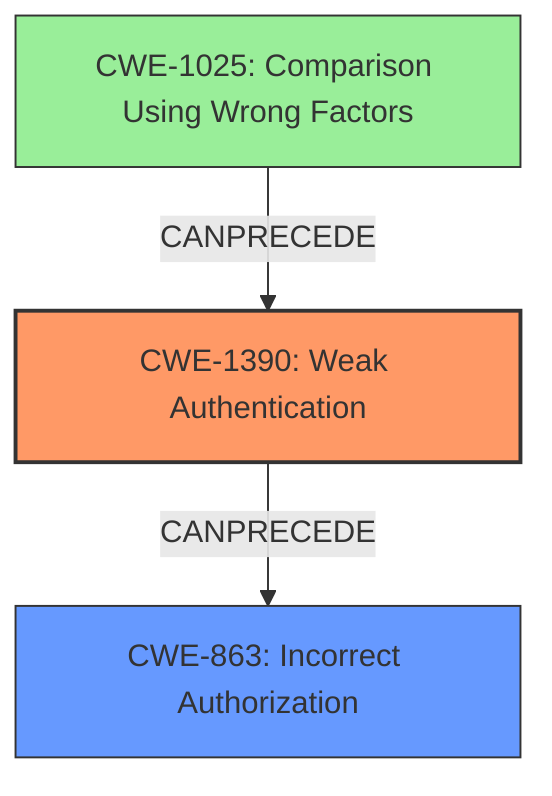

# Final Resolution for CVE-2021-29487

# Summary
| CWE ID | CWE Name | Confidence | CWE Abstraction Level | CWE Vulnerability Mapping Label | CWE-Vulnerability Mapping Notes |
|---|---|---|---|---|---|
| CWE-1390 | Weak Authentication | 0.90 | Class | Primary | The primary weakness lies in the application's failure to properly authenticate users due to type juggling issues. |
| CWE-863 | Incorrect Authorization | 0.80 | Class | Secondary | An attacker can gain unauthorized access to other user accounts due to flawed authentication leading to incorrect authorization checks. |
| CWE-1025 | Comparison Using Wrong Factors | 0.70 | Base | Tertiary | The code performs a comparison between two entities, but the comparison examines the wrong factors (data types) during the comparison, leading to incorrect permission checks. |

## Evidence and Confidence

*   **Confidence Score:** 0.85
*   **Evidence Strength:** HIGH

## Relationship Analysis
The classification was impacted by the following CWE relationships:
  - Parent-child hierarchical relationships: CWE-1390 is a class-level CWE related to authentication issues. CWE-863 is a class-level CWE that represents authorization failures. CWE-1025 is a base-level CWE representing the type juggling.
  - Chain relationships showing progression of vulnerability: The vulnerability chain starts with **CWE-1025 (Comparison Using Wrong Factors)**, which leads to **CWE-1390 (Weak Authentication)**, which then leads to **CWE-863 (Incorrect Authorization)**.
  - Peer relationships that offered alternative classifications: Several peer relationships were considered, including other authentication and authorization-related CWEs.
  - How abstraction levels influenced your selection: The selection of CWE-1390 as primary reflects a balance between specificity and broad applicability to the authentication failure. CWE-1025 is included due to the explicit type juggling issue.

## Vulnerability Chain
The vulnerability chain consists of the following sequence of weaknesses:
  - Root Cause: **CWE-1025 (Comparison Using Wrong Factors)**: Type juggling issues due to loose comparison operators.
  - Weakness 1: **CWE-1390 (Weak Authentication)**: Authentication bypass due to the type juggling flaw, allowing attackers to craft malicious cookies.
  - Weakness 2: **CWE-863 (Incorrect Authorization)**: The bypassed authentication leads to incorrect authorization checks, allowing unauthorized access to other user accounts.
  - Impact: Account takeover.

## Summary of Analysis
The initial analysis correctly identified the high-level weaknesses, but the criticism provided valuable insights for refining the CWE mappings.

The decision to switch the primary CWE to **CWE-1390 (Weak Authentication)** is based on the fact that the application attempts authentication but fails due to the type juggling issue. This is supported by the vulnerability description, which states that an attacker can "bypass authentication."

The selection of **CWE-863 (Incorrect Authorization)** as a secondary CWE is based on the understanding that the authentication bypass leads to unauthorized access to other user accounts and resources. This is supported by the CVE summary, which indicates that the vulnerability enables an attacker to "take over any user account."

The inclusion of **CWE-1025 (Comparison Using Wrong Factors)** is based on the CVE Reference Links Content Summary, which mentions "type juggling" caused by using loose comparison operators.

The retriever results were considered, particularly the suggestions for CWE-79 and CWE-1336. However, these CWEs were deemed not directly relevant to the authentication bypass itself.

The graph relationships influenced the final selection by highlighting the chain of weaknesses from the root cause (type juggling) to the final impact (account takeover).

The selected CWEs are at the optimal level of specificity because they accurately represent the core issues and contributing factors of the vulnerability, while also adhering to the CWE mapping guidance.