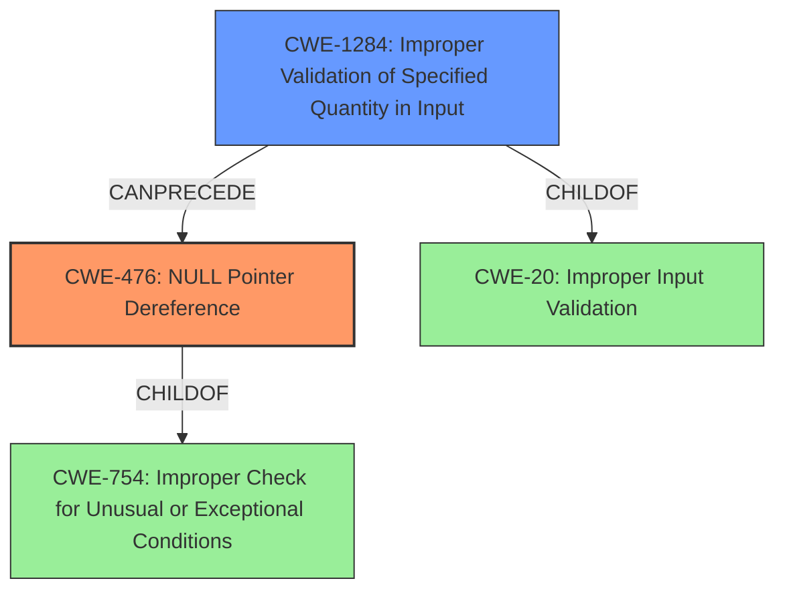

# Analysis Report for CVE-2021-29568

# Vulnerability Analysis Report: CVE-2021-29568

## Description

TensorFlow is an end-to-end open source platform for machine learning. An attacker can trigger undefined behavior by binding to null pointer in `tf.raw_ops.ParameterizedTruncatedNormal`. This is because the implementation(https//github.com/tensorflow/tensorflow/blob/3f6fe4dfef6f57e768260b48166c27d148f3015f/tensorflow/core/kernels/parameterized_truncated_normal_op.cc#L630) does not validate input arguments before accessing the first element of `shape`. If `shape` argument is empty, then `shape_tensor.flat()` is an empty array. The fix will be included in TensorFlow 2.5.0. We will also cherrypick this commit on TensorFlow 2.4.2, TensorFlow 2.3.3, TensorFlow 2.2.3 and TensorFlow 2.1.4, as these are also affected and still in supported range.

## Vulnerability Description Key Phrases

**Rootcause:** does not validate input arguments before accessing the first element of shape
**Weakness:** null pointer dereference
**Impact:** undefined behavior
**Attacker:** attacker
**Product:** TensorFlow
**Version:** before 2.5.0
**Component:** tf.raw_ops.ParameterizedTruncatedNormal

## Analysis (with Relationship Data)

# Summary
| CWE ID | CWE Name | Confidence | CWE Abstraction Level | CWE Vulnerability Mapping Label | CWE-Vulnerability Mapping Notes |
|---|---|---|---|---|---|
| CWE-476 | NULL Pointer Dereference | 0.95 | Base | Primary | Allowed |
| CWE-20 | Improper Input Validation | 0.6 | Class | Secondary | Discouraged |

## Evidence and Confidence

*   **Confidence Score:** 0.85
*   **Evidence Strength:** HIGH

- **Analysis and Justification:**
  - *Explanation:* The vulnerability is a **null pointer dereference** in TensorFlow's `tf.raw_ops.ParameterizedTruncatedNormal` operation. The code **does not validate input arguments before accessing the first element of `shape`**. If the `shape` argument is empty, accessing the first element leads to a **crash**. This aligns precisely with CWE-476, which describes dereferencing a pointer that is expected to be valid but is NULL. The CVE Reference Links Content Summary also explicitly states **"Null Pointer Dereference: When an empty shape tensor is provided as input, `shape_tensor.flat<int32>()` results in an empty array, leading to access of index 0 on empty data which causes a crash, which is undefined behavior."** The Retriever Results also lists CWE-476 as a possible CWE with a high score. CWE-476 is at the Base level of abstraction and the mapping guidance indicates that it is ALLOWED. CWE-20 could be considered since the input is not validated. However, CWE-476 is more specific and directly related to the vulnerability, so it is the primary CWE.

  - *Relationship Analysis:* CWE-476 is a child of CWE-754 (Improper Check for Unusual or Exceptional Conditions). CWE-476 can precede CWE-789 (Uncontrolled Memory Allocation) because a null pointer dereference could lead to memory allocation issues.

- **Confidence Score:**
  - Confidence: 0.95 (High evidence from vulnerability description and CVE reference materials)

---

## Criticism of Analysis

Okay, I've reviewed the provided analysis and the full CWE specifications. Here's my critique:

**Overall Assessment:**

The analysis is generally good, and the primary CWE selection of **CWE-476: NULL Pointer Dereference** is accurate and well-justified. The inclusion of **CWE-20: Improper Input Validation** as a secondary CWE is also understandable, but less precise. The confidence level of 0.95 for CWE-476 seems justified given the evidence.

**Detailed Critique:**

*   **CWE-476: NULL Pointer Dereference**

    *   **Strengths:** The analysis clearly explains how the lack of input validation leads to a potential null pointer dereference. The description highlights the direct connection between an empty `shape` argument and the crash that occurs when the code attempts to access the first element. It correctly acknowledges that CWE-476 is a base-level CWE, which is preferred.
    *   **Considerations:** The analysis mentions CWE-754 as a parent of CWE-476. While technically correct, it doesn't add significant value to the analysis. CWE-754 is a very general class, and the focus should remain on the more specific CWE-476.
    *   **Mitigations:** The analysis does not include mitigations. In this specific case the ideal mitigation would be to perform adequate input validation and reject the request if the `shape` argument is empty.

*   **CWE-20: Improper Input Validation**

    *   **Strengths:** The analysis acknowledges that the root cause is the lack of validation.
    *   **Weaknesses:** As the analysis notes, CWE-20 is a broad, high-level CWE, and its usage is *discouraged* according to the CWE specifications. The analysis mentions that it's less specific than CWE-476, which is the correct assessment. A more specific child of CWE-20 is warranted, if possible. Based on the Retriever Results, a possible CWE that is a child of CWE-20 is CWE-1284. CWE-1284 is **Improper Validation of Specified Quantity in Input**. The shape can be interpreted as a quantity and validation is not performed.
    *   **Recommendation:** Replace CWE-20 with **CWE-1284: Improper Validation of Specified Quantity in Input** as the secondary CWE. This is more precise because it directly addresses the lack of validation on the `shape` argument, which represents a *quantity* (size/length of the tensor). This also aligns well with the "accept known good" mitigation strategy, which suggests ensuring that all relevant properties such as length are validated.

*   **Missed CWEs (Potential):**

    *   **CWE-617: Reachable Assertion**. Although the vulnerability results in undefined behavior, if the code used an `assert()` to confirm the size of the shape, and this `assert()` was triggered, this CWE would be applicable. It is possible that the undefined behavior could trigger an assertion, but there isn't enough context to make this decision.
    *   **CWE-789: Memory Allocation with Excessive Size Value:** This CWE is valid if the size were large, but since the shape is specifically empty, this isn't applicable.

*   **Confidence Scores:** The confidence score of 0.95 for CWE-476 is appropriate. If CWE-20 were replaced with CWE-1284, a score of 0.5 would be reasonable.

*   **Relationships:** The analysis of relationships between CWEs is accurate. The relationships to other CWEs are accurately described.

**Revised Summary**

| CWE ID    | CWE Name                                      | Confidence | CWE Abstraction Level | CWE Vulnerability Mapping Label | CWE-Vulnerability Mapping Notes |
| :-------- | :-------------------------------------------- | :--------- | :-------------------- | :---------------------------- | :------------------------------ |
| CWE-476   | NULL Pointer Dereference                      | 0.95       | Base                  | Primary                      | Allowed                       |
| CWE-1284 | Improper Validation of Specified Quantity in Input  | 0.6        | Base                  | Secondary                    | Discouraged                     |

**Revised Analysis and Justification:**

The vulnerability is a **null pointer dereference** in TensorFlow's `tf.raw_ops.ParameterizedTruncatedNormal` operation. The code **does not validate input arguments before accessing the first element of `shape`**. If the `shape` argument is empty, accessing the first element leads to a **crash**. This aligns precisely with CWE-476, which describes dereferencing a pointer that is expected to be valid but is NULL. The CVE Reference Links Content Summary also explicitly states **"Null Pointer Dereference: When an empty shape tensor is provided as input, `shape_tensor.flat<int32>()` results in an empty array, leading to access of index 0 on empty data which causes a crash, which is undefined behavior."** The Retriever Results also lists CWE-476 as a possible CWE with a high score. CWE-476 is at the Base level of abstraction and the mapping guidance indicates that it is ALLOWED. The code **does not validate input arguments before accessing the first element of shape**. If the `shape` argument is empty, accessing the first element leads to a crash. The lack of input validation can be described as **CWE-1284: Improper Validation of Specified Quantity in Input** since the shape is a tensor that defines the dimensions and size.

**Revised Recommendations:**

1.  **Replace CWE-20 with CWE-1284.**
2.  **Add the mitigations described above, i.e. validate that the input is not empty.**

## Final Resolution

# Summary
| CWE ID | CWE Name | Confidence | CWE Abstraction Level | CWE Vulnerability Mapping Label | CWE-Vulnerability Mapping Notes |
|---|---|---|---|---|---|
| CWE-476 | **NULL Pointer Dereference** | 0.95 | Base | Primary | Allowed |
| CWE-1284 | **Improper Validation of Specified Quantity in Input** | 0.6 | Base | Secondary | Allowed |

## Evidence and Confidence

*   **Confidence Score:** 0.85
*   **Evidence Strength:** HIGH

## Relationship Analysis
The primary weakness is **CWE-476: NULL Pointer Dereference**, which occurs because the code dereferences a pointer that is expected to be valid but is NULL. This happens due to a missing input validation. **CWE-1284: Improper Validation of Specified Quantity in Input**, is selected as the secondary weakness since the shape is not validated and the shape is expected to specify a quantity.

## Vulnerability Chain
The vulnerability chain starts with the **ROOTCAUSE** of missing input validation (**CWE-1284: Improper Validation of Specified Quantity in Input**). This leads to the **WEAKNESS** of dereferencing a null pointer (**CWE-476: NULL Pointer Dereference**), which results in a crash (undefined behavior).

## Summary of Analysis
The initial analysis correctly identified **CWE-476: NULL Pointer Dereference** as the primary **WEAKNESS**. The criticism suggested replacing **CWE-20: Improper Input Validation** with **CWE-1284: Improper Validation of Specified Quantity in Input** as the secondary **WEAKNESS**, which is more precise since the shape is a tensor that defines the dimensions and size.

The vulnerability description states: "This is because the implementation does not validate input arguments before accessing the first element of `shape`. If `shape` argument is empty, then `shape_tensor.flat()` is an empty array." This provides direct evidence for both **CWE-476 (NULL Pointer Dereference)** and **CWE-1284 (Improper Validation of Specified Quantity in Input)**.

The relationship analysis shows that **CWE-476** is a child of **CWE-754**, and **CWE-1284** is a child of **CWE-20**. **CWE-1284** can precede **CWE-476**.

The selected CWEs are at the optimal level of specificity because they directly address the root cause (**improper input validation of shape**) and the resulting error (**null pointer dereference**).

*Report generated on 2025-03-17 23:40:07*
