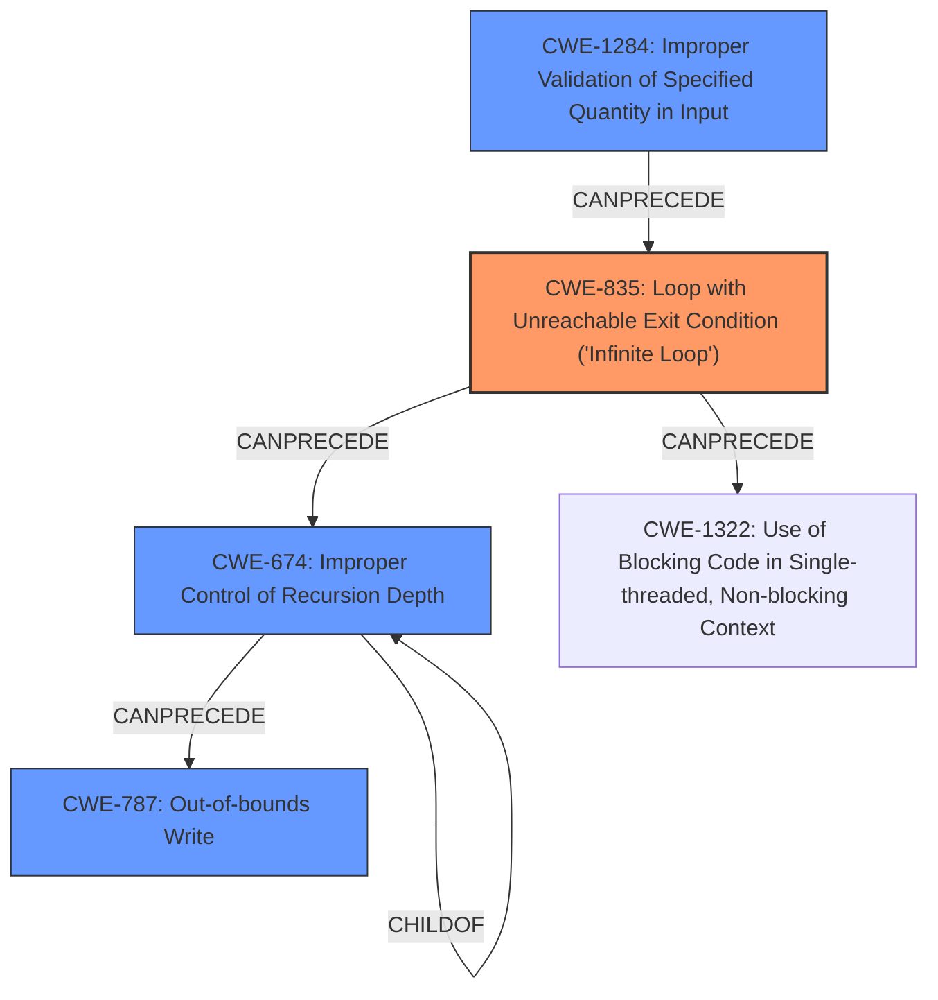

# Analysis Report for CVE-2021-29591

# Vulnerability Analysis Report: CVE-2021-29591

## Description

TensorFlow is an end-to-end open source platform for machine learning. TFlite graphs must not have loops between nodes. However, this condition was not checked and an attacker could craft models that would result in infinite loop during evaluation. In certain cases, the infinite loop would be replaced by stack overflow due to too many recursive calls. For example, the `While` implementation(https//github.com/tensorflow/tensorflow/blob/106d8f4fb89335a2c52d7c895b7a7485465ca8d9/tensorflow/lite/kernels/while.cc) could be tricked into a scneario where both the body and the loop subgraphs are the same. Evaluating one of the subgraphs means calling the `Eval` function for the other and this quickly exhaust all stack space. The fix will be included in TensorFlow 2.5.0. We will also cherrypick this commit on TensorFlow 2.4.2, TensorFlow 2.3.3, TensorFlow 2.2.3 and TensorFlow 2.1.4, as these are also affected and still in supported range. Please consult our security guide(https//github.com/tensorflow/tensorflow/blob/master/SECURITY.md) for more information regarding the security model and how to contact us with issues and questions.

## Vulnerability Description Key Phrases

**Rootcause:** loops between nodes
**Weakness:** stack overflow
**Product:** TensorFlow
**Version:** before 2.5.0
**Component:** TFlite graphs

## Analysis (with Relationship Data)

# Summary
| CWE ID | CWE Name | Confidence | CWE Abstraction Level | CWE Vulnerability Mapping Label | CWE-Vulnerability Mapping Notes |
|---|---|---|---|---|---|
| CWE-835 | Loop with Unreachable Exit Condition ('Infinite Loop') | 0.90 | Base | Allowed | Primary CWE |
| CWE-674 | Improper Control of Recursion Depth | 0.75 | Class | Allowed-with-Review | Secondary Candidate |
| CWE-125 | Out-of-bounds Read | 0.60 | Base | Allowed | Secondary Candidate |

## Evidence and Confidence

*   **Confidence Score:** 0.80
*   **Evidence Strength:** HIGH

- **Analysis and Justification:**  
  - *Explanation:* The primary weakness described is the potential for **infinite loops** in TFlite graphs due to a lack of validation for **loops between nodes**. This directly corresponds to CWE-835, Loop with Unreachable Exit Condition ('Infinite Loop'). The vulnerability description states, "TFlite graphs must not have **loops between nodes**. However, this condition was not checked and an attacker could craft models that would result in infinite loop during evaluation." This clearly indicates a missing check for a condition that leads to an infinite loop. The CVE Reference Links Content Summary reinforces this by highlighting the **missing loop detection** as a key weakness. CWE-835 is a Base level CWE and the mapping guidance indicates it is ALLOWED.

  - In some cases, the **infinite loop** leads to **stack overflow** due to excessive recursive calls. This suggests CWE-674, Improper Control of Recursion Depth, as a secondary weakness. The description mentions the `While` implementation could be tricked into a scenario where both the body and the loop subgraphs are the same, leading to the `Eval` function calling itself recursively and exhausting stack space. CWE-674 is a Class level CWE, and while a more specific child CWE might be ideal, the available information doesn't pinpoint a precise variant. The mapping guidance is ALLOWED-with-Review, suggesting caution, but appropriate given the context.

  - Finally, an **out-of-bounds read** (CWE-125) could be caused during the execution of a crafted model, potentially as a result of the **infinite loop**. However, this is a less direct consequence compared to the **infinite loop** itself and the **stack overflow**, so it's a weaker candidate.

- **Relationship Analysis:**
  - CWE-835 describes an **infinite loop**.
  - CWE-674 can result from the unchecked looping and recursive calls.
  - CWE-835 CanPrecede CWE-1322 (Use of Blocking Code in Single-threaded, Non-blocking Context). This relationship is relevant as the crafted model with the loop will block until the **stack overflow** condition is met.

- **Confidence Score:**
  - Confidence: 0.90 (High confidence for CWE-835 due to direct match with **infinite loop** condition.)
  - Confidence: 0.75 (Medium confidence for CWE-674 due to the connection between **infinite loop** and resulting **stack overflow**.)
  - Confidence: 0.60 (Low confidence for CWE-125 as a potential consequence, but not directly stated.)

## Criticism of Analysis

Okay, here's a detailed review of the provided analysis, incorporating the full CWE specifications:

**Overall Assessment**

The analysis is generally well-reasoned and provides a good initial mapping of the vulnerability. The primary CWE, CWE-835 (Infinite Loop), is a strong fit. The secondary candidates, CWE-674 (Improper Control of Recursion Depth) and CWE-125 (Out-of-bounds Read), have reasonable justifications, though some refinements are possible based on the full CWE specifications.

**Detailed Breakdown**

*   **CWE-835: Loop with Unreachable Exit Condition ('Infinite Loop')**

    *   **Confidence:** 0.90 (High) - Justified. The description explicitly states the possibility of infinite loops due to missing loop detection.
    *   **Mapping Guidance:** *Allowed* - The analysis correctly identifies that this is a Base-level CWE suitable for root cause mapping.
    *   **Relationships:** The CanFollow relationship to CWE-1322 (Use of Blocking Code in Single-threaded, Non-blocking Context) is relevant, as the infinite loop *is* blocking code.
    *   **Observed Examples:** The examples provided in the CWE specification are relevant and support the mapping. Specifically, CVE-2022-25304 has the same concept of an input causing an infinite loop.
    *   **Mitigations (from CWE Specification):** The Mitigations for CWE-835 are limited, as it's a symptom rather than a direct cause. Preventing the loop from occurring (by validating the graph structure) is the primary mitigation, as implemented in the fixes.
    *   **Recommendation:** Excellent mapping.

*   **CWE-674: Improper Control of Recursion Depth**

    *   **Confidence:** 0.75 (Medium) - Reasonable, but could be improved. The analysis correctly identifies the possibility of stack overflow due to recursive calls within the `While` operator.  However, CWE-674 is a Class-level CWE, and the mapping guidance is *Allowed-with-Review*, indicating that a more specific child CWE should be preferred if possible.
    *   **Mapping Guidance:** *Allowed-with-Review* -  The analysis acknowledges this and explains why a more specific CWE is not immediately apparent from the available information.
    *   **Relationships:**  The ParentOf relationship to CWE-776 (XML Entity Expansion) isn't directly relevant here. It's an example of recursion, but the vulnerability isn't related to XML.
    *   **Observed Examples:** Examples like CVE-2007-3409 (self-referencing pointers creating stack exhaustion) are relevant, but not perfectly analogous.
    *   **Mitigations (from CWE Specification):**
        *   "Ensure an end condition will be reached under all logic conditions." - This is directly relevant. The fix involves ensuring that the loop and body subgraphs are not the same, effectively creating an end condition.
        *   "Increase the stack size." - This is a *limited* and *not recommended* mitigation. It would only delay the inevitable crash.
    *   **Recommendation:** While the connection to stack overflow is valid, a more precise CWE *might* exist.  Consider if a child CWE of CWE-674 more accurately describes the *cause* of the uncontrolled recursion.  For example, the lack of validation of the graph structure that *permits* the recursive loop is the root cause, not the recursion itself. One might look for a CWE related to the structure of the graph or a lack of checks on input validity. While no direct child CWE of 674 seems to fit, there may be a related Base-level CWE that better represents the lack of structural validation that allows the recursion.

*   **CWE-125: Out-of-bounds Read**

    *   **Confidence:** 0.60 (Low) - Weakest justification.  While *possible*, it's speculative. An out-of-bounds read isn't explicitly mentioned in the vulnerability description. It is a possible *consequence* of memory corruption that *could* happen, but it isn't inherent to the core vulnerability.
    *   **Mapping Guidance:** *Allowed* - But the justification needs to be strong, and in this case, it's weak.
    *   **Relationships:** The "CanFollow" relationships are potentially relevant, but only if the OOB read actually *occurs*.
    *   **Observed Examples:** The examples are not directly relevant, as they are about specific implementations of OOB reads, not general possibilities.
    *   **Mitigations (from CWE Specification):**
        *   "Input Validation" - This is *indirectly* relevant. Validating the graph structure (preventing loops) would prevent the *possibility* of an OOB read occurring.
        *   "Language Selection" - Not relevant in this context, as TensorFlow is already written in C++.
    *   **Recommendation:** I recommend *removing* CWE-125 as a primary or secondary CWE. It's too speculative. The core vulnerability is about infinite loops and potential stack overflow, not about directly reading data out of bounds.

**Additional Considerations**

1.  **Missing Input Validation CWEs:** The vulnerability is fundamentally caused by a *lack of input validation* on the structure of the TFlite graph. Consider adding a CWE related to this. Several of the "Top Combined Results" from the original analyzer input suggest this. Some possible candidates:
    *   **CWE-1284: Improper Validation of Specified Quantity in Input:** While "quantity" might not seem immediately applicable, the *structure* of the graph can be thought of as a quantity of nodes and connections. The validation that this structure does *not* contain loops is missing.
    *   **CWE-1286: Improper Validation of Syntactic Correctness of Input:** The TFLite graph has a required syntax (no loops). This syntax is not validated.
    *   **CWE-1287: Improper Validation of Specified Type of Input:** Related to data types, so not very fitting.
    CWE-1284 or CWE-1286 are stronger candidates.

2.  **CWE-787: Out-of-bounds Write:** This CWE is present in the "Top Combined Results". Out-of-bounds writes are more likely than out-of-bounds reads. Stack overflow can manifest as out-of-bounds writes to the stack. This is a potential alternative to CWE-125, or in addition to it if an input validation CWE is added.

**Revised Analysis**

| CWE ID  | CWE Name                                                        | Confidence | CWE Abstraction Level | CWE Vulnerability Mapping Label | CWE-Vulnerability Mapping Notes                                                                                                                                                                                                                                               |
| :------ | :-------------------------------------------------------------- | :--------- | :-------------------- | :------------------------------ | :-------------------------------------------------------------------------------------------------------------------------------------------------------------------------------------------------------------------------------------------------------------------------- |
| CWE-835 | Loop with Unreachable Exit Condition ('Infinite Loop')           | 0.90       | Base                  | Allowed                       | Primary CWE                                                                                                                                                                                                                                                                   |
| CWE-674 | Improper Control of Recursion Depth                              | 0.75       | Class                  | Allowed-with-Review                      | Secondary Candidate - Consider if a more specific Base-level CWE exists. It describes what happens, not why it happens.                                                                                                                                               |
| CWE-1284 | Improper Validation of Specified Quantity in Input  | 0.80       | Base                  | Allowed                       | Tertiary Candidate - Represents the root cause. Missing validation that the structure of the TFLite graph (quantity of nodes and connections) does not create loops.                                                                                                                               |
| CWE-787 | Out-of-bounds Write  | 0.65       | Base                  | Allowed                       | Tertiary Candidate - Represents a potential symptom of stack overflow.                                                                                                                               |

**Summary of Changes**

*   Removed CWE-125 (Out-of-bounds Read) due to weak justification.
*   Added CWE-1284 (Improper Validation of Specified Quantity in Input) to reflect the lack of input validation as the root cause.
* Added CWE-787 (Out-of-bounds Write) due to stack overflow.

By incorporating the full CWE specifications and focusing on the root cause and most likely consequences, this revised analysis provides a more accurate and actionable classification of the vulnerability.

## Final Resolution

# Summary
| CWE ID | CWE Name | Confidence | CWE Abstraction Level | CWE Vulnerability Mapping Label | CWE-Vulnerability Mapping Notes |
|---|---|---|---|---|---|
| **CWE-835** | Loop with Unreachable Exit Condition ('Infinite Loop') | 0.90 | Base | Allowed | Primary CWE |
| **CWE-674** | Improper Control of Recursion Depth | 0.75 | Class | Allowed-with-Review | Secondary Candidate |
| **CWE-1284** | Improper Validation of Specified Quantity in Input | 0.80 | Base | Allowed | Secondary Candidate |
| **CWE-787** | Out-of-bounds Write | 0.65 | Base | Allowed | Secondary Candidate |

## Evidence and Confidence

*   **Confidence Score:** 0.85
*   **Evidence Strength:** HIGH

## Relationship Analysis
The following CWE relationships impacted my decision:
  - **CWE-835** (Infinite Loop) is the primary issue described in the vulnerability.
  - **CWE-674** (Improper Control of Recursion Depth) is a consequence of the **infinite loop**, resulting in stack overflow. While it is a Class level CWE, a more specific base CWE isn't apparent from the provided information.
  - **CWE-1284** (Improper Validation of Specified Quantity in Input) represents the **root cause**, as the lack of input validation on the graph structure allows the **infinite loop** to be created.
  - **CWE-787** (Out-of-bounds Write) is a potential consequence of stack overflow.

## Vulnerability Chain
The vulnerability chain starts with the lack of input validation (**CWE-1284**), allowing a crafted TFlite graph with **loops between nodes**. This leads to an **infinite loop** (**CWE-835**), which can then cause excessive recursive calls and stack overflow (**CWE-674**). The stack overflow can lead to an out-of-bounds write (**CWE-787**).

## Summary of Analysis
The initial analysis was well-reasoned. The criticism highlighted the need for a CWE representing the **lack of input validation**, which is the **root cause** of the vulnerability. It also identified that **CWE-125** (Out-of-bounds Read) was a weaker candidate and suggested **CWE-787** (Out-of-bounds Write) as a possible alternative, as stack overflow can lead to out-of-bounds writes. The vulnerability description mentions, "TFlite graphs must not have **loops between nodes**. However, this condition was not checked and an attacker could craft models that would result in **infinite loop** during evaluation." This, combined with the potential for stack overflow, justifies the selection of **CWE-835**, **CWE-674**, **CWE-1284**, and **CWE-787**. The graph relationships confirm this chain, with **CWE-1284** leading to **CWE-835**, which then leads to **CWE-674** and potentially **CWE-787**. These CWEs are at the optimal level of specificity based on the available evidence.

*Report generated on 2025-03-16 16:30:14*
