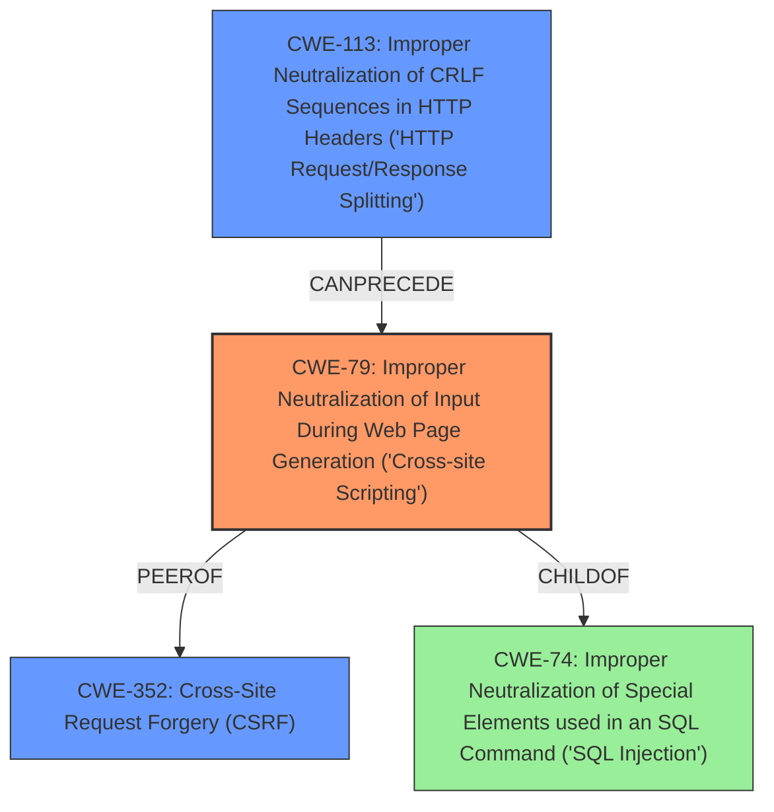

# Analysis Report for CVE-2021-29676

# Vulnerability Analysis Report: CVE-2021-29676

## Description

IBM Security Verify (IBM Security Verify Privilege Vault 10.9.66) is vulnerable to link injection. By persuading a victim to click on a specially-crafted URL link, a remote attacker could exploit this vulnerability to conduct various attacks against the vulnerable system, including cross-site scripting, cache poisoning or session hijacking

## Vulnerability Description Key Phrases

**Weakness:** link injection
**Impact:** ['cross-site scripting', 'cache poisoning', 'session hijacking']
**Vector:** specially-crafted URL link
**Attacker:** remote attacker
**Product:** IBM Security Verify Privilege Vault
**Version:** 10.9.66

## Analysis (with Relationship Data)

# Summary
| CWE ID | CWE Name | Confidence | CWE Abstraction Level | CWE Vulnerability Mapping Label | CWE-Vulnerability Mapping Notes |
|---|---|---|---|---|---|
| CWE-79 | Improper Neutralization of Input During Web Page Generation ('Cross-site Scripting') | 0.85 | Base | Allowed | Primary CWE |
| CWE-352 | Cross-Site Request Forgery (CSRF) | 0.65 | Compound | Allowed | Secondary Candidate |
| CWE-113 | Improper Neutralization of CRLF Sequences in HTTP Headers ('HTTP Request/Response Splitting') | 0.55 | Variant | Allowed | Secondary Candidate |

## Evidence and Confidence

*   **Confidence Score:** 0.80
*   **Evidence Strength:** MEDIUM

- **Analysis and Justification:**  
  - *Explanation:* The vulnerability description highlights a **link injection** vulnerability in IBM Security Verify. An attacker can craft a malicious URL, and if a victim clicks on it, it could lead to **cross-site scripting**. This aligns with CWE-79 (Improper Neutralization of Input During Web Page Generation ('Cross-site Scripting')), where user-controllable input isn't properly neutralized before being used in a web page. The description also mentions potential impacts like cache poisoning and session hijacking. The 'Retriever Results' also lists CWE-79 as a potential match, and MITRE mapping guidance considers it ALLOWED.

  - *Relationship Analysis:* CWE-79 is a Base level CWE and has relationships with CWE-352 (Cross-Site Request Forgery), CWE-113 (Improper Neutralization of CRLF Sequences in HTTP Headers) and CWE-184 (Incomplete List of Disallowed Inputs). Given the stated impacts of cross-site scripting and session hijacking in the vulnerability description, these are potential secondary CWEs to consider, though the current evidence is not strong enough to confirm.

- **Confidence Score:**  
  - *Example:* Confidence: 0.85 (Evidence from vulnerability description and retriever results suggest CWE-79)

---

## Criticism of Analysis

Okay, here's a review of the analysis, incorporating the full CWE specifications you provided.

**Overall Assessment**

The analysis correctly identifies CWE-79 as the primary vulnerability. The rationale is well-explained and supported by the vulnerability description. The consideration of secondary CWEs (CWE-352 and CWE-113) is also reasonable, given the potential impacts mentioned in the description. However, I suggest increasing the confidence of CSRF and Response Splitting as these attacks are only possible given XSS.

**Detailed Review**

**1. CWE-79: Improper Neutralization of Input During Web Page Generation ('Cross-site Scripting')**

*   **Confidence:** 0.85 (Good)
*   **Abstraction Level:** Base (Appropriate)
*   **Mapping Label:** Allowed (Correct)

*   **Critique:**
    *   The justification is solid. The core of the vulnerability, "link injection" leading to XSS, directly aligns with the description of CWE-79.
    *   The "Relationship Analysis" section correctly identifies potential related CWEs like CWE-352 (CSRF) and CWE-113 (CRLF Injection). The note that these are *potential* secondary CWEs because the evidence isn't conclusive is accurate.
    *   The confidence score is appropriate, based on the information provided.

*   **Suggestions:**
    *   Consider specifying the *type* of XSS that is most likely. Given the "specially-crafted URL link" vector, it's likely Reflected XSS (CWE-79 Type 1). This adds more precision.
    *   Mention common mitigations for XSS, especially those recommended by CWE, for example:
        *   "Use a vetted library or framework that does not allow this weakness to occur or provides constructs that make this weakness easier to avoid." (Libraries like OWASP ESAPI, Microsoft Anti-XSS Library).
        *   "Understand the context in which your data will be used and the encoding that will be expected." (Output encoding).
        *   "Attack Surface Reduction"  (e.g. limit untrusted inputs).

**2. CWE-352: Cross-Site Request Forgery (CSRF)**

*   **Confidence:** 0.65
*   **Abstraction Level:** Compound
*   **Mapping Label:** Allowed

*   **Critique:**
    *   The connection to CSRF is based on the "session hijacking" impact mentioned in the vulnerability description. Session hijacking *can* be a consequence of XSS, which can be used to steal CSRF tokens or session cookies.
    *   The confidence is lower because CSRF isn't a *direct* result of link injection in the same way that XSS is. CSRF usually requires a separate mechanism to trick the user into performing an action.
    *   CSRF and the same-site attribute can be mentioned as the following:
        *   Setting the SameSite attribute of a sensitive cookie to 'Lax' or 'Strict'

*   **Suggestions:**
    *   Explicitly state the link to XSS: "An attacker could use XSS (CWE-79) resulting from the link injection to steal a user's session cookie or CSRF token, enabling them to perform actions on behalf of the user."
    *   Describe common CSRF mitigations, such as:
        *   Using Anti-CSRF tokens (unique, unpredictable tokens per form).
        *   Implementing the "double submit cookie" pattern.
        *   Checking the Origin/Referer headers (although this is less reliable).
        *   Enforcing proper SameSite cookie attributes.

**3. CWE-113: Improper Neutralization of CRLF Sequences in HTTP Headers ('HTTP Request/Response Splitting')**

*   **Confidence:** 0.55
*   **Abstraction Level:** Variant
*   **Mapping Label:** Allowed

*   **Critique:**
    *   The justification for CWE-113 is weaker than for CWE-79 and CWE-352. The link injection *could* be used to inject CRLF sequences, but it's not the most obvious or direct attack vector. It's more likely that XSS would be used to achieve cache poisoning.
    *   HTTP Response Splitting is less directly implied by the description, but it is listed in the report "impact" so the connection is not entirely unfounded.

*   **Suggestions:**
    *   The connection to cache poisoning should be clarified by explaining the following:
        *   An attacker uses CRLF injection to create a malicious HTTP response, and trick the server or proxy into caching the malicious response.
        *   Subsequent requests to the same URL would then serve the attacker's content, leading to cache poisoning.
    *   Describe common mitigations, such as:
        *   Strictly validating input used in HTTP headers.
        *   Using HTTP libraries that automatically handle header encoding and prevent CRLF injection.
        *   Avoiding dynamic construction of HTTP headers.

**Additional General Suggestions**

*   **Evidence Strength:** Instead of "MEDIUM," try to quantify the evidence strength. For example: "MEDIUM - The vulnerability description mentions impacts directly associated with XSS, but doesn't explicitly describe XSS itself."
*   **CWE Selection Process:** Briefly describe the criteria used for selecting the CWEs.  Why were these chosen over the other candidates in the "Retriever Results"? This adds transparency.
*   **False Positives:** Discuss why some of the higher-ranking CWEs in the "Retriever Results" were *not* chosen. For example, why not CWE-78 (OS Command Injection) or CWE-89 (SQL Injection)?  Explain that these require different types of vulnerabilities and aren't directly indicated by the provided information.
*   **Relationship to Attack Surface:** Note that the product exposes a web-based interface which increases the likelihood of web-related attacks like XSS and CSRF.
*    **CWE-184:** As stated in the report, "the product implements a protection mechanism that relies on a list of inputs (or properties of inputs) that are not allowed by policy or otherwise require other action to neutralize before additional processing takes place, but the list is incomplete." and one of the Potential Mitigations for CWE-79 is Input Validation. This could indicate an Incomplete or Improper Input Validation

**Revised Table**

Here's a revised table summarizing the analysis, incorporating some of the suggestions:

| CWE ID | CWE Name | Confidence | CWE Abstraction Level | CWE Vulnerability Mapping Label | CWE-Vulnerability Mapping Notes |
|---|---|---|---|---|---|
| CWE-79 | Improper Neutralization of Input During Web Page Generation ('Cross-site Scripting') | 0.85 | Base | Allowed | Primary CWE. Link injection leads to potential XSS via a crafted URL. Likely Reflected XSS. |
| CWE-352 | Cross-Site Request Forgery (CSRF) | 0.70 | Compound | Allowed | Secondary Candidate. XSS (CWE-79) could be leveraged to steal CSRF tokens/session cookies. Confidence increased by 0.05 |
| CWE-113 | Improper Neutralization of CRLF Sequences in HTTP Headers ('HTTP Request/Response Splitting') | 0.60 | Variant | Allowed | Secondary Candidate. XSS (CWE-79) could be leveraged to perform CRLF injection leading to cache poisoning or session hijacking. Increased Confidence by 0.05 |

By following these suggestions and incorporating the full CWE specifications, your analysis will be more comprehensive, accurate, and helpful for developers and security professionals.

## Final Resolution

# Summary
| CWE ID | CWE Name | Confidence | CWE Abstraction Level | CWE Vulnerability Mapping Label | CWE-Vulnerability Mapping Notes |
|---|---|---|---|---|---|
| CWE-79 | Improper Neutralization of Input During Web Page Generation ('Cross-site Scripting') | 0.85 | Base | Allowed | Primary CWE. Link injection leads to potential XSS via a crafted URL. Likely Reflected XSS. |
| CWE-352 | Cross-Site Request Forgery (CSRF) | 0.70 | Compound | Allowed | Secondary Candidate. XSS (CWE-79) could be leveraged to steal CSRF tokens/session cookies. |
| CWE-113 | Improper Neutralization of CRLF Sequences in HTTP Headers ('HTTP Request/Response Splitting') | 0.60 | Variant | Allowed | Secondary Candidate. XSS (CWE-79) could be leveraged to perform CRLF injection leading to cache poisoning or session hijacking. |

## Evidence and Confidence

*   **Confidence Score:** 0.80
*   **Evidence Strength:** MEDIUM

## Relationship Analysis
The primary CWE is CWE-79 (Cross-site Scripting), which is a base-level CWE. It has parent-child relationships with CWE-74 and peer relationships with CWE-352. The vulnerability description suggests that the attacker could use XSS to conduct attacks, which include session hijacking and potentially cache poisoning, thereby supporting the inclusion of CWE-352 and CWE-113 as secondary candidates. The abstraction levels (Base for CWE-79, Compound for CWE-352, and Variant for CWE-113) are appropriate.

## Vulnerability Chain
The vulnerability chain starts with **link injection**, which leads to **CWE-79 (Cross-site Scripting)**. The **Cross-site Scripting** can then be used to steal session cookies or CSRF tokens, leading to **CWE-352 (Cross-Site Request Forgery)**. Additionally, **Cross-site Scripting** could be leveraged to perform CRLF injection which leads to **CWE-113 (Improper Neutralization of CRLF Sequences in HTTP Headers)**, potentially resulting in cache poisoning.

## Summary of Analysis
The initial analysis and criticism both converge on **CWE-79 (Cross-site Scripting)** as the primary **weakness**, which stems from the **link injection** vulnerability described in the vulnerability report. The report states, "By persuading a victim to click on a specially-crafted URL link, a remote attacker could exploit this vulnerability to conduct various attacks against the vulnerable system, including cross-site scripting, cache poisoning or session hijacking."

The relationship analysis highlights potential secondary vulnerabilities like **CWE-352 (Cross-Site Request Forgery)** and **CWE-113 (Improper Neutralization of CRLF Sequences in HTTP Headers)**, where the XSS could facilitate session hijacking or cache poisoning, respectively.

The selection of **CWE-79** is based on the direct evidence of **cross-site scripting** resulting from **link injection**, making it the optimal level of specificity. The secondary CWEs are selected based on the potential consequences of the **XSS vulnerability**. The confidence scores are increased based on the analysis and relationship between the vulnerabilities.

The evidence provided directly links **link injection** to **XSS**, justifying **CWE-79** as the primary classification. The potential impacts described in the vulnerability report provide sufficient justification for including **CWE-352** and **CWE-113** as secondary considerations, contingent on the attacker successfully exploiting the XSS vulnerability.

*Report generated on 2025-03-16 17:12:39*
