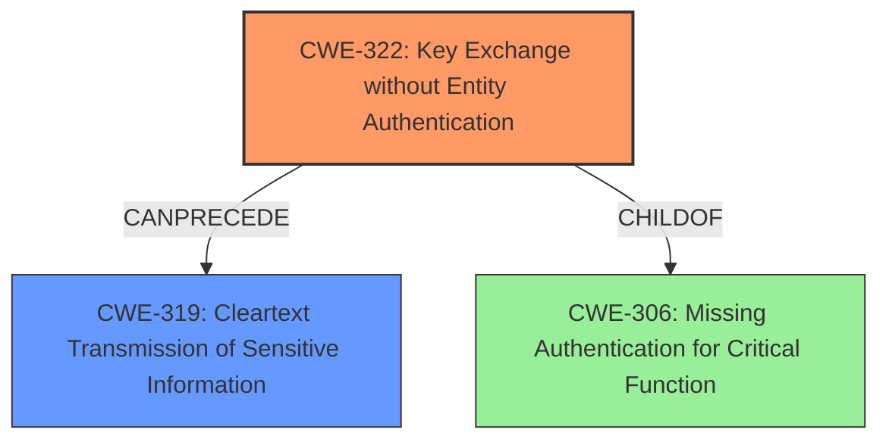

# Final Resolution for CVE-2021-29779

# Summary
| CWE ID | CWE Name | Confidence | CWE Abstraction Level | CWE Vulnerability Mapping Label | CWE-Vulnerability Mapping Notes |
|---|---|---|---|---|---|
| CWE-322 | Key Exchange without Entity Authentication | 0.95 | Base | Allowed | Primary CWE |
| CWE-319 | Cleartext Transmission of Sensitive Information | 0.6 | Base | Allowed | Secondary Candidate |

## Evidence and Confidence

*   **Confidence Score:** 0.90
*   **Evidence Strength:** HIGH

## Relationship Analysis
The primary relationship influencing the decision is that CWE-322 can precede CWE-319. The lack of authentication during key exchange (CWE-322) creates an opportunity for a MITM attack, which can then lead to the interception of sensitive information transmitted in cleartext (CWE-319). While CWE-306 is a parent of CWE-322, CWE-322 provides a more precise description of the vulnerability by focusing on the key exchange aspect.

## Vulnerability Chain
The vulnerability chain starts with the **ROOTCAUSE** of **CWE-322 (Key Exchange without Entity Authentication)**. This allows an attacker to perform a man-in-the-middle attack. If the subsequent communication is transmitted in cleartext, this leads to **CWE-319 (Cleartext Transmission of Sensitive Information)**, resulting in the attacker obtaining sensitive information.

## Summary of Analysis
The initial analysis and criticism both agree on CWE-322 being the primary weakness, and I concur. The vulnerability description explicitly mentions "the server performing **key exchange without entity authentication** on inter-host communications using man in the middle techniques," directly aligning with CWE-322. The evidence is strong, and the confidence is high (0.95).

CWE-319 is a valid secondary concern, contingent on the successful exploitation of CWE-322 and the subsequent transmission of sensitive data in cleartext. This is a reasonable inference based on the vulnerability description, though not explicitly stated.

I am removing CWE-327 as a secondary candidate. The criticism correctly points out that there's no explicit mention of a broken or risky algorithm, making its inclusion speculative and weakening the overall analysis.

The graph relationships confirm the chain of events, with CWE-322 enabling CWE-319. The chosen CWEs are at the optimal level of specificity, with CWE-322 focusing on the key exchange aspect and CWE-319 addressing the cleartext transmission. The analysis is based on the provided evidence and the relationship context, leading to a well-justified decision.