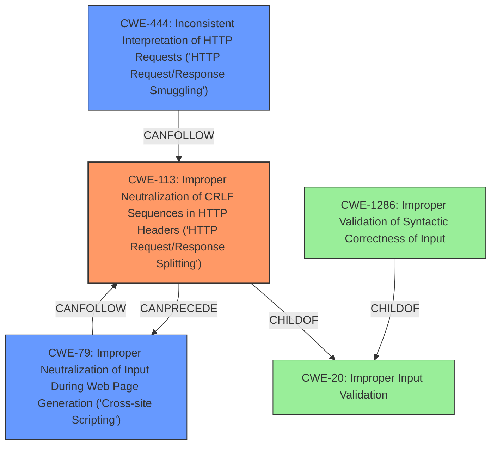

# Final Resolution for CVE-2021-29854

# Summary
| CWE ID | CWE Name | Confidence | CWE Abstraction Level | CWE Vulnerability Mapping Label | CWE-Vulnerability Mapping Notes |
|---|---|---|---|---|---|
| CWE-113 | Improper Neutralization of CRLF Sequences in HTTP Headers ('HTTP Request/Response Splitting') | 0.9 | Variant | Primary | Allowed |
| CWE-79 | Improper Neutralization of Input During Web Page Generation ('Cross-site Scripting') | 0.6 | Base | Secondary Candidate | Allowed |
| CWE-444 | Inconsistent Interpretation of HTTP Requests ('HTTP Request/Response Smuggling') | 0.5 | Base | Secondary Candidate | Allowed |
| CWE-1286 | Improper Validation of Syntactic Correctness of Input | 0.4 | Base | Related | Discouraged (Use only to show that all input has to be valid) |

## Evidence and Confidence

*   **Confidence Score:** 0.85
*   **Evidence Strength:** HIGH

## Relationship Analysis
The primary weakness is **CWE-113**, a variant of **CWE-20** and **CWE-93**. It describes the **improper neutralization of CRLF sequences** in HTTP headers, aligning directly with the vulnerability description mentioning **HTTP header injection** due to **improper input validation** of the HOST header. **CWE-79** and **CWE-444** are secondary candidates, representing potential consequences (XSS and cache poisoning, respectively) of the primary weakness. **CWE-1286** is added as related to show that the input is improperly validated.

## Vulnerability Chain
The vulnerability chain starts with **CWE-1286 (Improper Validation of Syntactic Correctness of Input)** in the HOST header. This leads to **CWE-113 (Improper Neutralization of CRLF Sequences in HTTP Headers ('HTTP Request/Response Splitting'))**, allowing an attacker to inject arbitrary HTTP headers. This can then result in **CWE-79 (Improper Neutralization of Input During Web Page Generation ('Cross-site Scripting'))** if the injected headers are reflected in a web page without proper output encoding, or **CWE-444 (Inconsistent Interpretation of HTTP Requests ('HTTP Request/Response Smuggling'))** if the injected headers cause cache poisoning.

## Summary of Analysis
The initial analysis and criticism provided a solid foundation for CWE classification. The vulnerability description explicitly mentions **improper validation** of the HOST header, leading to **HTTP header injection**. This aligns most directly with **CWE-113**, which describes the **improper neutralization of CRLF sequences** in HTTP headers. The inclusion of **CWE-79** and **CWE-444** as secondary candidates is justified by the potential for XSS and cache poisoning, respectively, as mentioned in the vulnerability description: "a remote attacker could exploit this vulnerability to inject HTTP HOST header, which will allow the attacker to conduct various attacks against the vulnerable system, including cross-site scripting, cache poisoning or session hijacking." The addition of **CWE-1286** shows that the input is improperly validated.

The graph relationships influenced the decision by highlighting the connection between input validation and potential consequences. **CWE-113** is chosen as the primary weakness because it is the most specific and directly related to the **HTTP header injection** vulnerability. **CWE-79** and **CWE-444** represent potential impacts, while **CWE-1286** shows the improper validation.

The selected CWEs are at the optimal level of specificity, with **CWE-113** being a Variant, which is a preferred abstraction level. This provides a more precise classification than a more general weakness like **CWE-20 (Improper Input Validation)**.