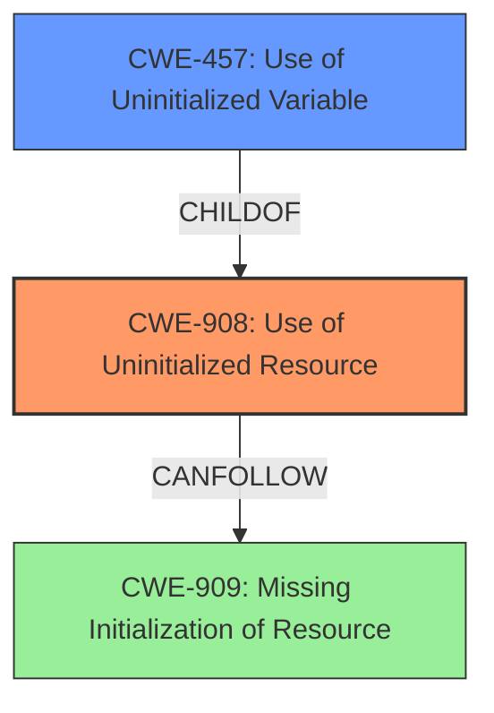

# Final Resolution for CVE-2021-29930

# Summary
| CWE ID | CWE Name | Confidence | CWE Abstraction Level | CWE Vulnerability Mapping Label | CWE-Vulnerability Mapping Notes |
|---|---|---|---|---|---|
| **CWE-908** | **Use of Uninitialized Resource** | 0.95 | Base | Allowed | Primary CWE. Matches the **uninitialized memory drop** vulnerability. |
| CWE-457 | Use of Uninitialized Variable | 0.75 | Variant | Allowed | Secondary CWE. A more specific variant of CWE-908. |

## Evidence and Confidence

*   **Confidence Score:** 0.95
*   **Evidence Strength:** HIGH

## Relationship Analysis
The primary relationship considered was the parent-child relationship between CWE-908 (Base) and CWE-457 (Variant). CWE-457 is a more specific instance of CWE-908, but both are relevant. The retriever results also pointed to CWE-909 (**Missing Initialization of Resource**), which is closely related.

## Vulnerability Chain
The vulnerability chain starts with a missing initialization of a resource, which can be represented by CWE-909 (**Missing Initialization of Resource**). This leads to the use of an uninitialized resource, represented by CWE-908 (**Use of Uninitialized Resource**). The **use of the uninitialized resource** can then result in a drop of uninitialized memory, which is the observed vulnerability. CWE-457 (**Use of Uninitialized Variable**) is a specific instance of CWE-908.

## Summary of Analysis
The initial analysis and criticism both correctly identified CWE-908 (**Use of Uninitialized Resource**) as the primary weakness. The vulnerability description explicitly states that the issue is an **uninitialized memory drop**, which directly corresponds to CWE-908. The criticism also correctly points out the relationship between CWE-908 and CWE-457 (**Use of Uninitialized Variable**), with CWE-457 being a more specific variant.

The relationship analysis highlighted the connection to CWE-909 (**Missing Initialization of Resource**), which represents the root cause of the problem (the missing initialization). However, the decision to keep CWE-908 as the primary weakness is based on the fact that the vulnerability is directly observable as the **use of the uninitialized resource/memory**.

The selected CWEs are at the optimal level of specificity. CWE-908 is a base-level CWE, which is preferred for vulnerability mapping. While CWE-457 is more specific, it is still a relevant secondary CWE. CWE-909 could be considered the root cause, but the actual observed vulnerability is the **use of the uninitialized memory**.

I am maintaining the confidence score of 0.95 for CWE-908.