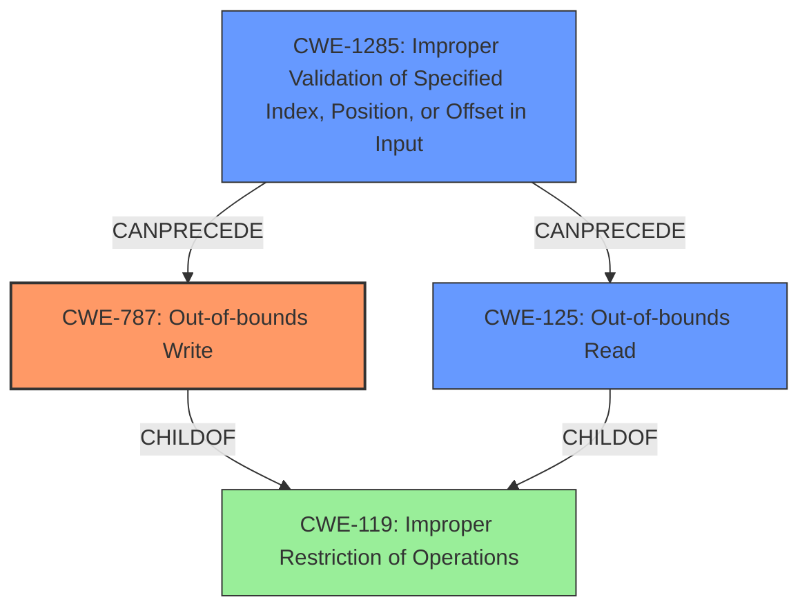

# Analysis Report for CVE-2021-30289

# Vulnerability Analysis Report: CVE-2021-30289

## Description

Possible buffer overflow due to lack of range check while processing a DIAG command for COEX management in Snapdragon Auto, Snapdragon Compute, Snapdragon Consumer IOT, Snapdragon Industrial IOT, Snapdragon Mobile, Snapdragon Voice & Music, Snapdragon Wearables

## Vulnerability Description Key Phrases

**Rootcause:** lack of range check
**Weakness:** buffer overflow
**Product:** ['Snapdragon Auto', 'Snapdragon Compute', 'Snapdragon Consumer IOT', 'Snapdragon Industrial IOT', 'Snapdragon Mobile', 'Snapdragon Voice & Music', 'Snapdragon Wearables']
**Component:** DIAG command for COEX management

## Analysis (with Relationship Data)

# Summary
| CWE ID | CWE Name | Confidence | CWE Abstraction Level | CWE Vulnerability Mapping Label | CWE-Vulnerability Mapping Notes |
|---|---|---|---|---|---|
| CWE-125 | Out-of-bounds Read | 0.85 | Base | Allowed | The vulnerability is due to **lack of range check** which can result in reading outside the buffer.|
| CWE-129 | Improper Validation of Array Index | 0.70 | Variant | Allowed | This is a secondary candidate because the **lack of range check** leads to an invalid array access. |

## Evidence and Confidence

*   **Confidence Score:** 0.80
*   **Evidence Strength:** MEDIUM

- **Analysis and Justification:**  
  - *Explanation:* "The vulnerability description mentions a possible **buffer overflow** due to a **lack of range check** while processing a DIAG command. This aligns with CWE-125 (Out-of-bounds Read) because the **lack of range check** can result in reading outside the intended buffer. The description focuses on Snapdragon products, indicating a specific software context where this vulnerability exists. Since the description explicitly points to a **lack of range check**, this makes CWE-125 more appropriate."
  
  - *Relationship Analysis:* "CWE-125 is related to CWE-119 (Improper Restriction of Operations within the Bounds of a Memory Buffer), which is a class-level CWE. CWE-125 is a more specific variant, making it a better fit. It is also related to CWE-823 (Use of Out-of-range Pointer Offset), though CWE-125 is more directly related to reading out of bounds. CWE-129 is a sibling of CWE-125, and a reasonable secondary candidate."

- **Confidence Score:**  
  - *Example:* Confidence: 0.85 (The description provides clear evidence of a **lack of range check** leading to a potential **buffer overflow**.)

---

## Criticism of Analysis

Okay, here's a review of the analysis, considering the full CWE specifications.

**Overall Assessment:**

The analysis correctly identifies a potential memory safety issue stemming from a lack of range checks. However, the initial analysis appears to lean towards *Out-of-bounds Read* (CWE-125) perhaps too readily, while the original vulnerability description indicates a potential for *buffer overflow*. A more careful consideration of *Out-of-bounds Write* (CWE-787) and related issues is necessary, as a buffer overflow typically implies writing beyond the allocated boundary. While reading beyond bounds is also possible, the term "buffer overflow" is typically related to out-of-bounds writing.

**Detailed Review:**

**1. Original Analyzer Input:**

*   The key phrases extracted are accurate and useful. The focus on the *lack of range check* is crucial. The products and component are properly identified.
*   The weakness is related to buffer overflow, which can lead to memory corruption.

**2. Retriever Results:**

*   The retriever results provide a useful initial set of CWE candidates. The scores generally reflect the relevance of each CWE to the vulnerability description.
*   **CWE-124, CWE-131, CWE-823, CWE-126, CWE-787, CWE-1285 and CWE-190** have high scores, implying they could be closely related to the described vulnerability.

**3. Analysis to Review:**

*   **Primary CWE: CWE-125 (Out-of-bounds Read) - Confidence: 0.85**
    *   *Justification:* The reasoning correctly links the "lack of range check" to the possibility of reading outside the buffer.
    *   *Critique:* While *Out-of-bounds Read* is certainly *possible*, the original description explicitly mentions "buffer overflow" not "buffer over-read." The analysis is potentially too quick to dismiss the *write* aspect of the vulnerability and should consider this more carefully. Out-of-bounds read is a possible consequence, but not the root cause.
    *   *Mitigation Review:* The provided mitigations for CWE-125 are valid, including input validation and using memory-safe languages. However, these also apply to preventing out-of-bounds writes.
*   **Secondary CWE: CWE-129 (Improper Validation of Array Index) - Confidence: 0.70**
    *   *Justification:*  The reasoning is sound: the lack of range check directly implies the potential for an invalid array access.
    *   *Critique:* This is a reasonable secondary candidate because *Out-of-bounds Read* is often achieved through accessing an array with an invalid index.
    *   *Mitigation Review:* The mitigations for CWE-129 are reasonable, including input validation frameworks and language selection.

**4. CWE Examples from Database:**

*   The examples provided for CWE-823 are relevant, as they show real-world instances of out-of-range pointer offsets leading to memory corruption.

**5. Recommendations for Improvement:**

*   **Reconsider CWE-787 (Out-of-bounds Write) as the Primary CWE:** Given the initial description of "buffer overflow," *Out-of-bounds Write* should be given more serious consideration as the *primary* CWE. The analysis should explain *why* it's *not* the primary CWE, rather than implying it's less important. The "lack of range check" is a contributing factor that allows the out-of-bounds write to occur.
*   **Add Out-of-bounds Write as a Secondary CWE** Instead of just mentioning out-of-bounds reads, explicity include Out-of-bounds Write (CWE-787) as a secondary CWE.
*   **Relationship Analysis:**
    *   The relationship analysis should explicitly mention the chain: `CWE-20 (Improper Input Validation) -> CWE-119 (Improper Restriction of Operations within the Bounds of a Memory Buffer) -> CWE-787 (Out-of-bounds Write)` This chain shows that the lack of range check (input validation) leads to a buffer overflow (out-of-bounds write).
*   **Strengthen Justification for CWE Selection:** When arguing for or against a particular CWE, use specific language from the CWE description or extended description to support your reasoning.  For example: "CWE-787 Description: *'The product writes data past the end, or before the beginning, of the intended buffer.'*  The lack of range check allows this to occur."
*   **Consider More Specific Variants of CWE-20**: The root cause is a lack of range check, which is a type of input validation. The analysis should consider more specific children of CWE-20, such as *CWE-1285: Improper Validation of Specified Index, Position, or Offset in Input*, as the issue relates to the validation of an index or offset within the buffer.
*   **Mitigation Discussion:** Add mitigations for CWE-787 to the analysis. Mention compiler-based buffer overflow detection mechanisms (e.g., /GS flag, FORTIFY_SOURCE).
*   **Re-evaluate Confidence Scores:** If you choose to elevate CWE-787, adjust the confidence score accordingly.

**Revised Summary Table (Example):**

| CWE ID | CWE Name | Confidence | CWE Abstraction Level | CWE Vulnerability Mapping Label | CWE-Vulnerability Mapping Notes |
|---|---|---|---|---|---|
| CWE-787 | Out-of-bounds Write | 0.80 | Base | Allowed | The vulnerability is likely due to writing outside the intended buffer because of a **lack of range check**. |
| CWE-125 | Out-of-bounds Read | 0.70 | Base | Allowed |  This is a secondary candidate because a read outside the intended buffer may be a possible consequence of an out-of-bounds write.|
| CWE-129 | Improper Validation of Array Index | 0.70 | Variant | Allowed | This is a secondary candidate because the **lack of range check** leads to an invalid array access. |

By addressing these points, the analysis will be more robust and accurate in its CWE mapping. It's crucial to avoid the common pitfall of under-representing the *write* aspect when "buffer overflow" is mentioned. Always consider *Out-of-bounds Write* as a prime candidate and justify why it's *not* selected if that's the case.

## Final Resolution

# Summary
| CWE ID | CWE Name | Confidence | CWE Abstraction Level | CWE Vulnerability Mapping Label | CWE-Vulnerability Mapping Notes |
|---|---|---|---|---|---|
| CWE-787 | Out-of-bounds Write | 0.80 | Base | Allowed | The vulnerability is likely due to writing outside the intended buffer because of a **lack of range check**. |
| CWE-1285 | Improper Validation of Specified Index, Position, or Offset in Input | 0.75 | Base | Allowed | This is a secondary candidate because the **lack of range check** on the index/offset allows for out-of-bounds access. |
| CWE-125 | Out-of-bounds Read | 0.70 | Base | Allowed | This is a secondary candidate because a read outside the intended buffer may be a possible consequence of an out-of-bounds write. |

## Evidence and Confidence

*   **Confidence Score:** 0.80
*   **Evidence Strength:** MEDIUM

## Relationship Analysis
The primary relationship that impacted the decision was the chain: **CWE-1285** (Improper Validation of Specified Index, Position, or Offset in Input) -> **CWE-787** (Out-of-bounds Write). The **lack of range check** (input validation) leads to a buffer overflow (out-of-bounds write). While **CWE-125** (Out-of-bounds Read) is possible, the description mentions "buffer overflow," which suggests a write issue more directly.

## Vulnerability Chain
The vulnerability chain starts with **CWE-1285**, the **lack of range check** on the input, followed by **CWE-787**, which manifests as an out-of-bounds write due to the unchecked input. **CWE-125** can then arise as a consequence if the incorrect write corrupts data that is later read.

## Summary of Analysis
Based on the vulnerability description indicating "possible **buffer overflow** due to **lack of range check**," I've determined that **CWE-787 (Out-of-bounds Write)** is the most appropriate primary CWE. The original analysis leaned toward **CWE-125 (Out-of-bounds Read)**, but the term "buffer overflow" strongly suggests a write operation. The **lack of range check** allows data to be written beyond the intended buffer boundary.

The criticism correctly pointed out that **CWE-787** should be given more serious consideration. Elevating **CWE-787** as the primary CWE aligns better with the "buffer overflow" terminology in the vulnerability description.

I have also added **CWE-1285 (Improper Validation of Specified Index, Position, or Offset in Input)** as a secondary CWE because the **lack of range check** is directly related to the validation of an index or offset within the buffer. This CWE helps to further refine the root cause.

The selection of **CWE-787** is based on the following evidence:
- Vulnerability Description: "Possible **buffer overflow** due to **lack of range check**."
- CWE-787 Description: *"The product writes data past the end, or before the beginning, of the intended buffer."*

The graph relationships influenced my decision by highlighting the chain of events: **CWE-1285** -> **CWE-787**. The abstraction levels were considered, and the selected CWEs are at the base level, which is the preferred level of abstraction.

*Report generated on 2025-03-17 23:40:55*
