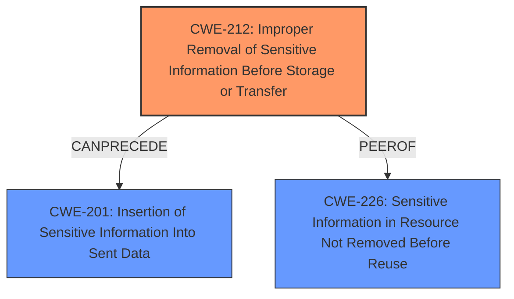

# Analysis Report for CVE-2021-3031

# Vulnerability Analysis Report: CVE-2021-3031

## Description

Padding bytes in Ethernet packets on PA-200, PA-220, PA-500, PA-800, PA-2000 Series, PA-3000 Series, PA-3200 Series, PA-5200 Series, and PA-7000 Series firewalls are not cleared before the data frame is created. This leaks a small amount of random information from the firewall memory into the Ethernet packets. An attacker on the same Ethernet subnet as the PAN-OS firewall is able to collect potentially sensitive information from these packets. This issue is also known as Etherleak and is detected by security scanners as CVE-2003-0001. This issue impacts PAN-OS 8.1 version earlier than PAN-OS 8.1.18 PAN-OS 9.0 versions earlier than PAN-OS 9.0.12 PAN-OS 9.1 versions earlier than PAN-OS 9.1.5.

## Vulnerability Description Key Phrases

**Rootcause:** Padding bytes in Ethernet packets ... are not cleared
**Impact:** leak a small amount of random information
**Attacker:** attacker on the same Ethernet subnet
**Product:** PA-200, PA-220, PA-500, PA-800, PA-2000 Series, PA-3000 Series, PA-3200 Series, PA-5200 Series, and PA-7000 Series firewalls
**Version:** PAN-OS 8.1 earlier than 8.1.18, 9.0 earlier than 9.0.12, 9.1 earlier than 9.1.5

## Analysis (with Relationship Data)

# Summary
| CWE ID | CWE Name | Confidence | CWE Abstraction Level | CWE Vulnerability Mapping Label | CWE-Vulnerability Mapping Notes |
|---|---|---|---|---|---|
| CWE-212 | Improper Removal of Sensitive Information Before Storage or Transfer | 0.95 | Base | Allowed | Primary CWE |
| CWE-226 | Sensitive Information in Resource Not Removed Before Reuse | 0.75 | Base | Allowed | Secondary Candidate |

## Evidence and Confidence

*   **Confidence Score:** 0.90
*   **Evidence Strength:** HIGH

- **Analysis and Justification:**  
  - *Explanation:* The vulnerability description clearly states that "**Padding bytes in Ethernet packets ... are not cleared** before the data frame is created," leading to the leakage of random information from firewall memory. This directly corresponds to CWE-212 (Improper Removal of Sensitive Information Before Storage or Transfer), where sensitive information is not properly removed before being made available to unauthorized actors. The **root cause** centers around the failure to clear sensitive data, which aligns perfectly with CWE-212's description. CWE-212 is also a base level CWE.
  
  - *Relationship Analysis:* CWE-212 can precede CWE-201 (Insertion of Sensitive Information Into Sent Data), as the uncleared information is then transmitted. CWE-226 (Sensitive Information in Resource Not Removed Before Reuse) is related because memory is being reused without being cleared first, though CWE-212 is more specific to the transfer of information.

- **Confidence Score:**  
  - Confidence: 0.95 (High confidence due to direct match with the **root cause** and the base level abstraction.)

---
- **Analysis and Justification:**  
  - *Explanation:* CWE-226 (Sensitive Information in Resource Not Removed Before Reuse) is a potential secondary CWE. The **root cause** that padding bytes in Ethernet packets are not cleared before being used. If memory is allocated for these padding bytes, and that memory isn't cleared before being included in the Ethernet packet, then it could be argued that the vulnerability falls under CWE-226, as the resource (memory) is reused without properly removing sensitive information. However, CWE-212 is the stronger match.

  - *Relationship Analysis:* CWE-226 is a peer of CWE-212. CWE-226 focuses on resources not being cleared before reuse, while CWE-212 focuses on removing sensitive information before storage or transfer.

- **Confidence Score:**
  - Confidence: 0.75 (Medium confidence as CWE-212 is more specific, but CWE-226 is still relevant)

## Criticism of Analysis

Okay, I've reviewed your analysis of the Etherleak vulnerability and the provided CWE specifications. Here's my critique:

**Overall Assessment:**

Your analysis is well-reasoned and largely accurate. The primary CWE mapping to CWE-212 (Improper Removal of Sensitive Information Before Storage or Transfer) is correct and well-justified. The consideration of CWE-226 (Sensitive Information in Resource Not Removed Before Reuse) as a secondary candidate is also valid, although, as you noted, it's less specific than CWE-212 in this case. Your confidence levels are appropriate.

**Detailed Review:**

*   **CWE-212: Improper Removal of Sensitive Information Before Storage or Transfer**

    *   **Justification:** Your explanation is excellent. You correctly identify the root cause (padding bytes not cleared) and how it directly maps to the CWE description (sensitive information not properly removed before transfer).
    *   **Relationship Analysis:** Your relationships are insightful. The connection to CWE-201 is valid, as CWE-212 *CanPrecede* CWE-201 (Insertion of Sensitive Information Into Sent Data).  The relationship to CWE-226 is also accurate, highlighting the subtle difference in perspective.
    *   **Confidence:** The 0.95 confidence level is appropriate, given the clear match.

*   **CWE-226: Sensitive Information in Resource Not Removed Before Reuse**

    *   **Justification:** Your explanation of why CWE-226 is a possible secondary CWE is accurate. The memory allocated for padding *is* being reused without proper clearing. However, it's less specific because the core issue is about the *transfer* of that uncleared information into a network packet, not simply the reuse of the memory itself.
    *   **Relationship Analysis:** The relationship analysis is good. You correctly state they are peers and highlight the difference between the two.
    *   **Confidence:** The 0.75 confidence level is appropriate.

*   **General Observations**
    * Your examples of known examples of similar CVEs are relevant for both CWE-201 and CWE-226.

**Points for Potential Improvement:**

1.  **Alternative CWE candidates:** Considering some of the other high scoring retriever results, it is worth noting why these CWEs are not relevant. Specifically, CWE-401 (Missing Release of Memory after Effective Lifetime) and CWE-532 (Insertion of Sensitive Information into Log File).
    * The description does not mention the log file, therefore CWE-532 is not the cause.
    * Memory management is not stated as the root cause, rather data management is the cause, so the CWE-401 is not relevant.
2.  **CWE-201 as a consequence not a cause:** The current weakness causes sensitive data to be sent, meaning that CWE-201 is a possible consequence of the existing CWE-212 definition.

**Revised Summary:**

| CWE ID | CWE Name | Confidence | CWE Abstraction Level | CWE Vulnerability Mapping Label | CWE-Vulnerability Mapping Notes |
|---|---|---|---|---|---|
| CWE-212 | Improper Removal of Sensitive Information Before Storage or Transfer | 0.95 | Base | Allowed | Primary CWE |
| CWE-226 | Sensitive Information in Resource Not Removed Before Reuse | 0.75 | Base | Allowed | Secondary Candidate |
| CWE-201 | Insertion of Sensitive Information Into Sent Data | 0.5 | Base | Allowed | Consequence of Weakness |

**Final Verdict:**

Your analysis is strong. The CWE mappings are accurate and well-defended. Considering the suggestions above will further improve your analysis.

## Final Resolution

# Summary
| CWE ID | CWE Name | Confidence | CWE Abstraction Level | CWE Vulnerability Mapping Label | CWE-Vulnerability Mapping Notes |
|---|---|---|---|---|---|
| CWE-212 | Improper Removal of Sensitive Information Before Storage or Transfer | 0.95 | Base | Allowed | Primary CWE |
| CWE-201 | Insertion of Sensitive Information Into Sent Data | 0.60 | Base | Allowed | Secondary Candidate, Consequence of Weakness |
| CWE-226 | Sensitive Information in Resource Not Removed Before Reuse | 0.50 | Base | Allowed | Secondary Candidate |

## Evidence and Confidence

*   **Confidence Score:** 0.90
*   **Evidence Strength:** HIGH

## Relationship Analysis
The primary relationship that influenced the decision was the CanPrecede relationship between CWE-212 and CWE-201, indicating that the improper removal of sensitive information (CWE-212) can lead to the insertion of sensitive information into sent data (CWE-201). Additionally, CWE-212 and CWE-226 are peers, representing similar but distinct weaknesses related to sensitive data handling. The base abstraction level of these CWEs provided sufficient specificity.

## Vulnerability Chain
The vulnerability chain starts with the **ROOTCAUSE**, the failure to clear padding bytes in Ethernet packets before data frame creation. This leads to **CWE-212 (Improper Removal of Sensitive Information Before Storage or Transfer)**, as sensitive information is not properly removed. As a consequence, the sensitive information is then included in the Ethernet packets, resulting in **CWE-201 (Insertion of Sensitive Information Into Sent Data)**. The impact is that an attacker on the same subnet can collect potentially sensitive information.

## Summary of Analysis
The initial analysis correctly identified **CWE-212 (Improper Removal of Sensitive Information Before Storage or Transfer)** as the primary weakness. The criticism suggested considering CWE-201 as a consequence, which is a valid point and is reflected in the updated classification.

Evidence supporting CWE-212: "Padding bytes in Ethernet packets on PA-200, PA-220, PA-500, PA-800, PA-2000 Series, PA-3000 Series, PA-3200 Series, PA-5200 Series, and PA-7000 Series firewalls **are not cleared** before the data frame is created. This leaks a small amount of random information from the firewall memory into the Ethernet packets."

The relationship analysis highlighted that CWE-212 *CanPrecede* CWE-201, making CWE-201 a logical secondary candidate representing the consequence of the **WEAKNESS**.

The decision to classify CWE-212 as the primary CWE is based on the direct match with the vulnerability description, which explicitly states that padding bytes are "not cleared." This directly aligns with CWE-212's definition of "Improper Removal of Sensitive Information Before Storage or Transfer." This is the optimal level of specificity because CWE-212 is a Base level CWE and accurately describes the **ROOTCAUSE**.

CWE-201 is included as a secondary candidate because the **WEAKNESS** leads to the "Insertion of Sensitive Information Into Sent Data", but it is a consequence of CWE-212.

CWE-226 is considered but given a lower confidence because, while memory reuse without clearing is relevant, the primary issue is the transfer of uncleared data.

*Report generated on 2025-03-17 00:06:26*
