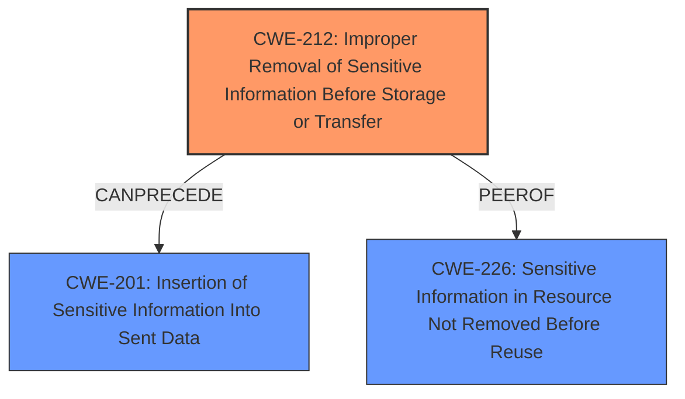

# Final Resolution for CVE-2021-3031

# Summary
| CWE ID | CWE Name | Confidence | CWE Abstraction Level | CWE Vulnerability Mapping Label | CWE-Vulnerability Mapping Notes |
|---|---|---|---|---|---|
| CWE-212 | Improper Removal of Sensitive Information Before Storage or Transfer | 0.95 | Base | Allowed | Primary CWE |
| CWE-201 | Insertion of Sensitive Information Into Sent Data | 0.60 | Base | Allowed | Secondary Candidate, Consequence of Weakness |
| CWE-226 | Sensitive Information in Resource Not Removed Before Reuse | 0.50 | Base | Allowed | Secondary Candidate |

## Evidence and Confidence

*   **Confidence Score:** 0.90
*   **Evidence Strength:** HIGH

## Relationship Analysis
The primary relationship that influenced the decision was the CanPrecede relationship between CWE-212 and CWE-201, indicating that the improper removal of sensitive information (CWE-212) can lead to the insertion of sensitive information into sent data (CWE-201). Additionally, CWE-212 and CWE-226 are peers, representing similar but distinct weaknesses related to sensitive data handling. The base abstraction level of these CWEs provided sufficient specificity.

## Vulnerability Chain
The vulnerability chain starts with the **ROOTCAUSE**, the failure to clear padding bytes in Ethernet packets before data frame creation. This leads to **CWE-212 (Improper Removal of Sensitive Information Before Storage or Transfer)**, as sensitive information is not properly removed. As a consequence, the sensitive information is then included in the Ethernet packets, resulting in **CWE-201 (Insertion of Sensitive Information Into Sent Data)**. The impact is that an attacker on the same subnet can collect potentially sensitive information.

## Summary of Analysis
The initial analysis correctly identified **CWE-212 (Improper Removal of Sensitive Information Before Storage or Transfer)** as the primary weakness. The criticism suggested considering CWE-201 as a consequence, which is a valid point and is reflected in the updated classification.

Evidence supporting CWE-212: "Padding bytes in Ethernet packets on PA-200, PA-220, PA-500, PA-800, PA-2000 Series, PA-3000 Series, PA-3200 Series, PA-5200 Series, and PA-7000 Series firewalls **are not cleared** before the data frame is created. This leaks a small amount of random information from the firewall memory into the Ethernet packets."

The relationship analysis highlighted that CWE-212 *CanPrecede* CWE-201, making CWE-201 a logical secondary candidate representing the consequence of the **WEAKNESS**.

The decision to classify CWE-212 as the primary CWE is based on the direct match with the vulnerability description, which explicitly states that padding bytes are "not cleared." This directly aligns with CWE-212's definition of "Improper Removal of Sensitive Information Before Storage or Transfer." This is the optimal level of specificity because CWE-212 is a Base level CWE and accurately describes the **ROOTCAUSE**.

CWE-201 is included as a secondary candidate because the **WEAKNESS** leads to the "Insertion of Sensitive Information Into Sent Data", but it is a consequence of CWE-212.

CWE-226 is considered but given a lower confidence because, while memory reuse without clearing is relevant, the primary issue is the transfer of uncleared data.