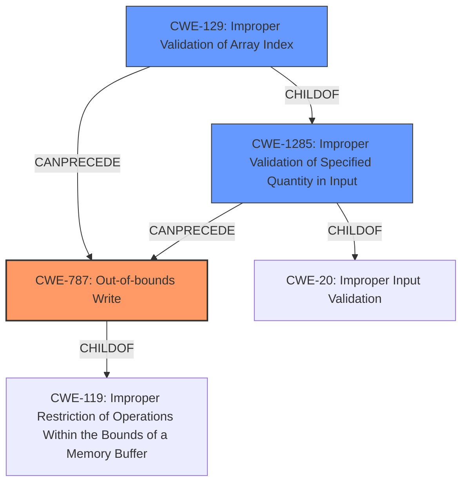

# Final Resolution for CVE-2021-30311

# Summary
| CWE ID | CWE Name | Confidence | CWE Abstraction Level | CWE Vulnerability Mapping Label | CWE-Vulnerability Mapping Notes |
|---|---|---|---|---|---|
| CWE-787 | Out-of-bounds Write | 0.95 | Base | Allowed | Primary CWE: The vulnerability results in a **heap overflow**, which is a type of out-of-bounds write. |
| CWE-1285 | Improper Validation of Specified Index, Position, or Offset in Input | 0.85 | Base | Allowed | Secondary CWE: The **lack of index validation** is the root cause, and this CWE covers improper validation of input used as an index. |
| CWE-129 | Improper Validation of Array Index | 0.75 | Variant | Allowed | Secondary CWE: This is a more specific variant of CWE-1285, applicable since the index is used to access a buffer. |

## Evidence and Confidence

*   **Confidence Score:** 0.90
*   **Evidence Strength:** HIGH

## Relationship Analysis
The decision was heavily influenced by the parent-child relationships between CWEs and the explicit mention of "heap overflow" and "**lack of index validation**" in the vulnerability description. CWE-787 is selected as the primary because it directly describes the resulting vulnerability (heap overflow), a type of out-of-bounds write. CWE-1285 is chosen as a secondary **ROOTCAUSE** because it represents the **lack of validation** of the input index. CWE-129, a variant of CWE-1285, is also included to provide a more specific classification related to array indexing.

## Vulnerability Chain
The vulnerability chain starts with the **lack of index validation** (CWE-1285), which leads to an improper array index (CWE-129), ultimately resulting in an out-of-bounds write (CWE-787), specifically a **heap overflow**.
  - Initial Flaw: **Lack of index validation** (CWE-1285)
  - Weakness: Improper array index (CWE-129)
  - Impact: Out-of-bounds write leading to **heap overflow** (CWE-787)

## Summary of Analysis
The initial analysis correctly identified CWE-131 and CWE-129 but didn't fully capture the vulnerability's impact and root cause with optimal specificity. The criticism highlighted the importance of including CWE-787 due to the "heap overflow" and prioritizing the **lack of index validation** as the primary issue.

The final decision prioritizes CWE-787 because the vulnerability description explicitly states "**heap overflow**," which is a direct consequence of an out-of-bounds write. The "**lack of index validation**" is classified using CWE-1285, providing a more accurate representation of the **ROOTCAUSE** than CWE-131. The inclusion of CWE-129 offers a more specific variant related to array indexing.

The graph relationships helped refine the classification by showing the chain of events: improper input validation leading to an improper array index and finally resulting in an out-of-bounds write. This approach ensures the classification reflects the complete vulnerability lifecycle, from **ROOTCAUSE** to impact. The selected CWEs are at the optimal level of specificity because they directly align with the vulnerability description and consider the parent-child relationships within the CWE hierarchy.