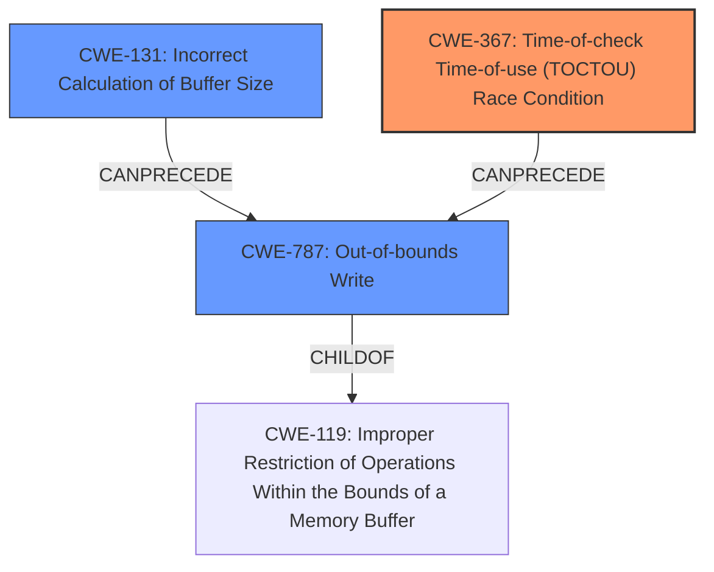

# Analysis Report for CVE-2021-30349

# Vulnerability Analysis Report: CVE-2021-30349

## Description

Improper access control sequence for AC database after memory allocation can lead to possible memory corruption in Snapdragon Auto, Snapdragon Compute, Snapdragon Connectivity, Snapdragon Consumer IOT, Snapdragon Industrial IOT, Snapdragon Voice & Music, Snapdragon Wearables, Snapdragon Wired Infrastructure and Networking

## Vulnerability Description Key Phrases

**Rootcause:** Improper access control sequence for AC database after memory allocation
**Impact:** memory corruption
**Product:** ['Snapdragon Auto', 'Snapdragon Compute', 'Snapdragon Connectivity', 'Snapdragon Consumer IOT', 'Snapdragon Industrial IOT', 'Snapdragon Voice & Music', 'Snapdragon Wearables', 'Snapdragon Wired Infrastructure and Networking']

## Analysis (with Relationship Data)

# Summary
| CWE ID | CWE Name | Confidence | CWE Abstraction Level | CWE Vulnerability Mapping Label | CWE-Vulnerability Mapping Notes |
|---|---|---|---|---|---|
| CWE-367 | Time-of-check Time-of-use (TOCTOU) Race Condition | 0.75 | Base | Allowed | Primary CWE |
| CWE-1285 | Improper Validation of Specified Index, Position, or Offset in Input | 0.65 | Base | Allowed | Secondary Candidate |
| CWE-131 | Incorrect Calculation of Buffer Size | 0.5 | Base | Allowed | Secondary Candidate |
| CWE-787 | Out-of-bounds Write | 0.4 | Base | Allowed | Secondary Candidate |

## Evidence and Confidence

*   **Confidence Score:** 0.70
*   **Evidence Strength:** MEDIUM

- **Analysis and Justification:**  
  - *Explanation:* The vulnerability description highlights an **improper access control sequence for the AC database after memory allocation**, which can lead to memory corruption. This suggests that a race condition (CWE-367) might exist where the access control is checked, but the state of the memory changes before it is used, leading to incorrect access and potential memory corruption. The description mentions memory allocation, which means an incorrect calculation of buffer size (CWE-131) can be the root cause of the memory corruption. The vulnerability might involve an **improper validation of index, position, or offset in input** (CWE-1285). Finally, memory corruption may lead to writing outside the bounds of intended memory (CWE-787).

  - *Relationship Analysis:* CWE-367 is a Base level CWE, representing the Time-of-check Time-of-use (TOCTOU) Race Condition. CWE-1285 is also Base level, representing Improper Validation of Specified Index, Position, or Offset in Input, which can potentially lead to an out-of-bounds write. CWE-131 is Base level and represents Incorrect Calculation of Buffer Size and can lead to memory corruption. CWE-787 is also Base level and represents Out-of-bounds Write.

- **Confidence Score:**  
  - *Example:* Confidence: 0.70 (Medium evidence due to the general description, more information needed for a more definitive assessment)

---

## Criticism of Analysis

Okay, here's a detailed review of the analysis, considering the full CWE specifications provided.

**Overall Assessment:**

The analysis identifies a reasonable set of potential CWEs, with a plausible explanation for each. The primary CWE, CWE-367 (TOCTOU), is a good starting point given the "improper access control sequence" mentioned in the vulnerability description. However, the confidence level could be improved by specifying the conditions that make it possible for a race condition to occur and how the code is specifically structured to make it possible.

**Detailed Review by CWE:**

**1. CWE-367: Time-of-check Time-of-use (TOCTOU) Race Condition (Primary CWE, Confidence: 0.75)**

*   **Strengths:** The analysis correctly identifies the possibility of a TOCTOU race condition due to the time gap between access control check and actual usage of the AC database. This aligns with the CWE description: "The product checks the state of a resource before using that resource, but the resource's state can change between the check and the use..."
*   **Weaknesses:**
    *   **Lack of Specificity:** The analysis is somewhat generic. It doesn't describe how the AC database's state is being checked, how it's being used, and what specific concurrent operations could lead to a change in state.
    *   **Mitigation Considerations:** The suggested mitigations in the CWE specification are relevant but not specific to the scenario. For example, the description for Implementation mitigation 1, which indicates "The most basic advice for TOCTOU vulnerabilities is to not perform a check before the use." This is a good recommendation, but it will not be feasible all of the time.
    *   **Observed Examples:** The observed examples are generic TOCTOU cases and don't directly relate to memory allocation or database access.
*   **Recommendations:**
    *   Investigate further to determine the specific check being performed, the data being protected, and the operations that could concurrently modify the AC database.
    *   Consider if resource locking (CWE-413) or improper synchronization (CWE-362) are the underlying issues that lead to the race condition. The retriever results also show CWE-413 is high. If so, the primary CWE should be CWE-362.
    *   The analysis should suggest mitigations tailored to the specific race condition scenario in the AC database. For example, if the race is due to concurrent writes, consider using atomic operations or transactional updates.

**2. CWE-1285: Improper Validation of Specified Index, Position, or Offset in Input (Secondary Candidate, Confidence: 0.65)**

*   **Strengths:** The analysis suggests that "improper validation of index, position, or offset in input" can potentially lead to an out-of-bounds write. This is reasonable since incorrect offset values can cause memory corruption.
*   **Weaknesses:**
    *   **Unclear Connection:** The connection to the overall vulnerability description is less direct than with TOCTOU. It's not immediately obvious *where* an index, position, or offset is involved in the access control sequence or memory allocation for the AC database.
    *   **Mitigation Inapplicability:** The primary mitigation suggested by CWE-1285 is "Assume all input is malicious. Use an "accept known good" input validation strategy." It is not clear where untrusted input would be relevant in the access control sequence.
*   **Recommendations:**
    *   Determine if untrusted input influences any index, position, or offset used when accessing the AC database after memory allocation. If not, this CWE is likely incorrect.
    *   If relevant, identify the specific input and the validation that is missing or incorrect. Provide examples of how a malicious index, position, or offset could cause memory corruption.

**3. CWE-131: Incorrect Calculation of Buffer Size (Secondary Candidate, Confidence: 0.5)**

*   **Strengths:** This CWE directly relates to memory allocation, a key aspect of the vulnerability description. An incorrect calculation could lead to a buffer that's too small, resulting in memory corruption.
*   **Weaknesses:**
    *   **Limited Justification:** The analysis states "incorrect calculation of buffer size (CWE-131) can be the root cause of the memory corruption," but it doesn't explain *how* the calculation is incorrect or what inputs influence it.
    *   **Mitigation Genericness:** The mitigations are general guidance for buffer size calculations and input validation.
*   **Recommendations:**
    *   Investigate the code to identify the buffer size calculation. Explain the error in the calculation, how it could lead to an undersized buffer, and the circumstances under which this occurs.
    *   Consider if the error is a numeric truncation error (CWE-197), integer overflow (CWE-190), or an incorrect conversion between data types (CWE-681), as described in the relationships for CWE-131.
    *   Specify the type of input validation that should be performed to ensure the calculation is correct.

**4. CWE-787: Out-of-bounds Write (Secondary Candidate, Confidence: 0.4)**

*   **Strengths:** This CWE directly relates to the "memory corruption" impact mentioned in the vulnerability description. If memory corruption occurs, it's likely due to writing outside the bounds of the intended buffer.
*   **Weaknesses:**
    *   **Consequence, Not Cause:** CWE-787 is often a *consequence* of another vulnerability (e.g., CWE-131, CWE-1285, CWE-367).  It's less useful as the *primary* root cause unless there's a clear case of writing beyond a buffer's boundary without any other contributing factors.
*   **Recommendations:**
    *   Focus on identifying the *cause* of the out-of-bounds write, rather than simply stating that it happens. Link it back to the TOCTOU, incorrect buffer size calculation, or improper input validation.

**Additional Considerations:**

*   **Data Flow:** It would be helpful to trace the data flow from the point where the access control check is performed to the memory allocation and subsequent usage of the AC database. This would help identify all potential vulnerabilities.
*   **Attack Vector:** Describe the likely attack vector. How would an attacker trigger this vulnerability?  What level of access is required?
*   **Reproducibility:**  Is the race condition easily reproducible, or does it require specific timing or load conditions?

**Revised Confidence Levels (Suggested):**

*   CWE-367: 0.65 (Slightly lower until more specifics are known. If proven to be caused by one of these cases, can increase confidence)
*   CWE-1285: 0.4 (Lower unless a clear untrusted input is identified. Likely irrelevant)
*   CWE-131: 0.6 (Moderate, but requires further analysis of the buffer size calculation)
*   CWE-787: 0.3 (This is a consequence; focus on the root cause instead)

By addressing these points, the analysis can be made more specific, actionable, and ultimately more useful for developers trying to understand and fix the vulnerability. It's crucial to move beyond generic statements and provide concrete details about the code and the attack scenario.

## Final Resolution

# Summary
| CWE ID | CWE Name | Confidence | CWE Abstraction Level | CWE Vulnerability Mapping Label | CWE-Vulnerability Mapping Notes |
|---|---|---|---|---|---|
| CWE-367 | Time-of-check Time-of-use (TOCTOU) Race Condition | 0.65 | Base | Allowed | Primary CWE |
| CWE-131 | Incorrect Calculation of Buffer Size | 0.6 | Base | Allowed | Secondary Candidate |
| CWE-787 | Out-of-bounds Write | 0.3 | Base | Allowed | Secondary Candidate |

## Evidence and Confidence

*   **Confidence Score:** 0.65
*   **Evidence Strength:** MEDIUM

## Relationship Analysis
The decision to classify the vulnerability primarily as CWE-367 (Time-of-check Time-of-use Race Condition) is influenced by the vulnerability description mentioning "improper access control sequence for AC database after memory allocation." This suggests a potential race condition where the state of the database changes between the access control check and the actual use. However, the analysis acknowledges that CWE-367 might be related to other weaknesses like CWE-131 (Incorrect Calculation of Buffer Size) and CWE-787 (Out-of-bounds Write). CWE-787 is often a consequence of other root causes.

## Vulnerability Chain
The vulnerability chain starts with a **ROOTCAUSE** which may be the **CWE-131** Incorrect Calculation of Buffer Size which leads to **CWE-367** Time-of-check Time-of-use (TOCTOU) Race Condition due to improper access control sequence and results in **CWE-787** Out-of-bounds Write. The initial flaw in buffer calculation can lead to memory corruption because the TOCTOU condition allows unauthorized or incorrect access due to a timing window, eventually causing an out-of-bounds write.

## Summary of Analysis
The initial analysis correctly identifies CWE-367 as a potential primary CWE due to the "improper access control sequence" description. However, the analysis lacks specificity regarding the conditions that enable the race condition. The analysis also notes CWE-131 and CWE-787 as secondary candidates, which is reasonable given the memory allocation and corruption aspects.

The criticism provides valuable feedback by highlighting the need for more specific information about the access control check, the data being protected, and the concurrent operations involved. It also suggests considering related CWEs such as CWE-413 (Improper Locking) and CWE-362 (Concurrent Execution using Shared Resource with Improper Synchronization).

The final decision is to maintain CWE-367 as the primary CWE but with a slightly reduced confidence score (0.65) due to the lack of specific details. CWE-131 remains a secondary candidate with a confidence score of 0.6 because incorrect buffer size calculation is a common cause of memory corruption. CWE-787 is retained as a secondary candidate with a low confidence score (0.3) because it is generally a consequence rather than a root cause. The classification reflects the optimal level of specificity based on the available evidence, which is somewhat limited. More information about the specific implementation and attack scenario would be necessary for a more definitive assessment. The evidence for a race condition is present in the description "improper access control sequence for AC database after memory allocation", which suggests a timing issue.

*Report generated on 2025-03-17 23:42:24*
