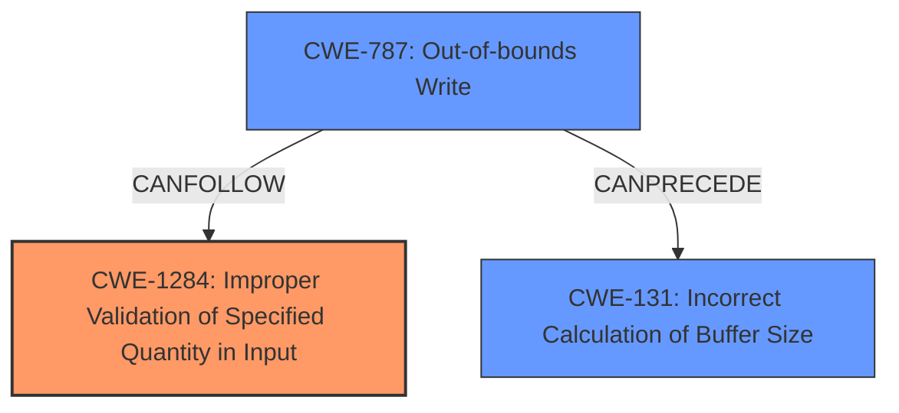

# Analysis Report for CVE-2021-30350

# Vulnerability Analysis Report: CVE-2021-30350

## Description

Lack of MBN header size verification against input buffer can lead to memory corruption in Snapdragon Auto, Snapdragon Compute, Snapdragon Connectivity, Snapdragon Consumer IOT, Snapdragon Industrial IOT, Snapdragon Wearables

## Vulnerability Description Key Phrases

**Rootcause:** Lack of MBN header size verification against input buffer
**Impact:** memory corruption
**Product:** ['Snapdragon Auto', 'Snapdragon Compute', 'Snapdragon Connectivity', 'Snapdragon Consumer IOT', 'Snapdragon Industrial IOT', 'Snapdragon Wearables']

## Analysis (with Relationship Data)

# Summary
| CWE ID | CWE Name | Confidence | CWE Abstraction Level | CWE Vulnerability Mapping Label | CWE-Vulnerability Mapping Notes |
|---|---|---|---|---|---|
| CWE-1284 | Improper Validation of Specified Quantity in Input | 0.85 | Base | Allowed | The **lack of MBN header size verification against input buffer** is directly related to the improper validation of the size of the buffer. |
| CWE-787 | Out-of-bounds Write | 0.65 | Base | Allowed | Due to the **lack of MBN header size verification against input buffer**, an out-of-bounds write can occur, leading to memory corruption. |
| CWE-131 | Incorrect Calculation of Buffer Size | 0.55 | Base | Allowed | The **lack of MBN header size verification against input buffer** implies that buffer size is either incorrectly calculated or not checked, leading to potential memory corruption. |

## Evidence and Confidence

*   **Confidence Score:** 0.75
*   **Evidence Strength:** MEDIUM

- **Analysis and Justification:**  
  - *Explanation:* The primary **weakness** is the **lack of MBN header size verification against input buffer**, which directly leads to potential memory corruption. This aligns best with CWE-1284 (Improper Validation of Specified Quantity in Input), as the size of the MBN header is a quantity that should be validated. CWE-787 (Out-of-bounds Write) is also relevant as the **lack of verification** can lead to writing beyond the buffer's boundaries. CWE-131 is a weaker match because the problem is not necessarily incorrect calculation but the **lack of validation** of the size.

  - *Relationship Analysis:* CWE-1284 is a base level weakness. CWE-787 can follow from CWE-1284, as improper size validation can lead to out-of-bounds writes. CWE-131 can also precede CWE-787, as an incorrect size calculation is a common cause of out-of-bounds writes.

- **Confidence Score:**  
  - *Example:* Confidence: 0.85 (The vulnerability description clearly states the root cause and the potential impact.)

## Criticism of Analysis

Okay, I've reviewed the provided analysis and the full CWE specifications for the identified weaknesses. Here's my critique:

**Overall Assessment:**

The analysis is generally good, correctly identifying the core problem and potential consequences. The confidence scores are reasonable. The explanation provided is clear and well-reasoned. However, I have some suggestions for improvement, particularly in distinguishing between similar CWEs and refining the confidence levels.

**Detailed Critique:**

*   **CWE-1284: Improper Validation of Specified Quantity in Input (Confidence: 0.85):**
    *   **Assessment:** This is the strongest match and the analysis correctly identifies it as the primary weakness. The core issue *is* the lack of validation of the MBN header size. The Extended Description of CWE-1284 explicitly mentions size as a "specified quantity."
    *   **Strengths:** The justification is well-written and emphasizes that validation is missing. The example CVEs cited for CWE-1284 are also relevant, particularly CVE-2008-2374 ("lack of validation of string length fields allows memory consumption or buffer over-read").
    *   **Suggestions:** None

*   **CWE-787: Out-of-bounds Write (Confidence: 0.65):**
    *   **Assessment:** This is a valid *consequence* of the primary weakness (CWE-1284). If the size isn't validated, a write beyond the buffer's boundaries can occur.
    *   **Strengths:** The analysis correctly links the lack of verification to the possibility of out-of-bounds writes.
    *   **Suggestions:** Slightly lower the confidence level to 0.60. While the link to memory corruption is strong, the analysis should emphasize that this is a potential outcome contingent on the attacker-controlled MBN header size exceeding the buffer's boundaries. Make clear that this is a consequence of the lack of validation.

*   **CWE-131: Incorrect Calculation of Buffer Size (Confidence: 0.55):**
    *   **Assessment:** This is the weakest match among the three. The vulnerability description focuses on the lack of *verification*, not necessarily an incorrect *calculation* of the buffer size. While *incorrect calculation* could be a contributing factor, the primary issue is the absence of a check.
    *   **Strengths:** The analysis correctly identifies that it implies that buffer size is incorrectly calculated or not checked
    *   **Suggestions:** Slightly lower the confidence level to 0.50. The description of CWE-131 focuses on the calculation itself being flawed, not necessarily the absence of a validation step. While related, the lack of validation is more accurately captured by CWE-1284.
    *  Consider removing this all together and increasing the confidence of the other two.

**Additional Considerations and Potential CWEs:**

*   **CWE-1285: Improper Validation of Specified Index, Position, or Offset in Input:** If the MBN header size directly influences an index or offset used to access the buffer, then CWE-1285 might be considered alongside CWE-1284. If the header size determines how many bytes will be written to the input buffer, this is likely

*   **CWE-124: Buffer Underwrite ('Buffer Underflow'):** This is also a possibility, although less likely. If the header size is used in a calculation that can result in a negative offset, a buffer underwrite could occur. This would also be a more compelling option if the MBN header size is used to calculate an offset.

**Recommendations based on CWE Specifications:**

*   **Mitigation (CWE-1284):** The primary mitigation should focus on a strong "accept known good" input validation strategy for the MBN header size. This means defining the acceptable range of sizes and rejecting any input outside that range.
*   **Mitigation (CWE-787):** If writing past the buffer is a concern, using compiler-based overflow detection mechanisms (e.g., `/GS` flag in Visual Studio) can provide a defense-in-depth approach.
*   **Mitigation (CWE-131):** While less relevant, ensuring that buffer size calculations are performed using appropriate data types (to avoid integer overflows/truncation) is still a good practice.

**Revised Confidence Levels (Suggestions):**

*   CWE-1284: 0.85 (No change)
*   CWE-787: 0.60 (Slight Decrease - Consequence)
*   CWE-131: 0.50 (Slight Decrease - Focus is on verification, not calculation)

**In Summary:**

The analysis is sound overall. Focusing on the lack of validation (CWE-1284) is correct. Refining the confidence levels and emphasizing the consequence relationship between CWE-1284 and CWE-787 will improve the accuracy and clarity of the analysis.

## Final Resolution

# Summary 
| CWE ID | CWE Name | Confidence | CWE Abstraction Level | CWE Vulnerability Mapping Label | CWE-Vulnerability Mapping Notes |
|---|---|---|---|---|---|
| CWE-1284 | Improper Validation of Specified Quantity in Input | 0.85 | Base | Allowed | Primary CWE: The **lack of MBN header size verification against input buffer** is directly related to the improper validation of the size of the buffer. |
| CWE-787 | Out-of-bounds Write | 0.60 | Base | Allowed | Secondary Candidate: Due to the **lack of MBN header size verification against input buffer**, an out-of-bounds write can occur, leading to memory corruption. This is a potential outcome contingent on the attacker-controlled MBN header size exceeding the buffer's boundaries. |
| CWE-131 | Incorrect Calculation of Buffer Size | 0.50 | Base | Allowed | Secondary Candidate: The **lack of MBN header size verification against input buffer** implies that buffer size is either incorrectly calculated or not checked, leading to potential memory corruption. However, the description of CWE-131 focuses on the calculation itself being flawed, not necessarily the absence of a validation step. |

## Evidence and Confidence

*   **Confidence Score:** 0.80
*   **Evidence Strength:** MEDIUM

## Relationship Analysis
The primary **weakness** is the **lack of validation** of the MBN header size, which aligns with CWE-1284. CWE-787 is a potential consequence if the unvalidated size leads to an out-of-bounds write. CWE-131 is less directly related, as the description emphasizes a flawed calculation, not the absence of validation.

## Vulnerability Chain
The vulnerability chain starts with the **lack of MBN header size verification** (**ROOTCAUSE**, CWE-1284). This **weakness** can lead to an out-of-bounds write (CWE-787), resulting in memory corruption. The chain highlights how the **lack of validation** directly enables the potential for memory corruption through an out-of-bounds write.

## Summary of Analysis
The initial analysis and criticism both correctly identify CWE-1284 as the most relevant **weakness** due to the **lack of MBN header size verification**. The criticism helps refine the confidence levels, emphasizing that CWE-787 is a consequence contingent on the header size exceeding buffer boundaries. The analysis relies heavily on the vulnerability description, which clearly states the **lack of verification** as the root cause. The graph relationships confirm that CWE-1284 can lead to CWE-787. The selected CWEs are at the optimal level of specificity, with CWE-1284 capturing the core issue of missing input validation. The evidence provided, specifically "Lack of MBN header size verification against input buffer can lead to memory corruption," strongly supports this classification.

*Report generated on 2025-03-17 23:43:05*
