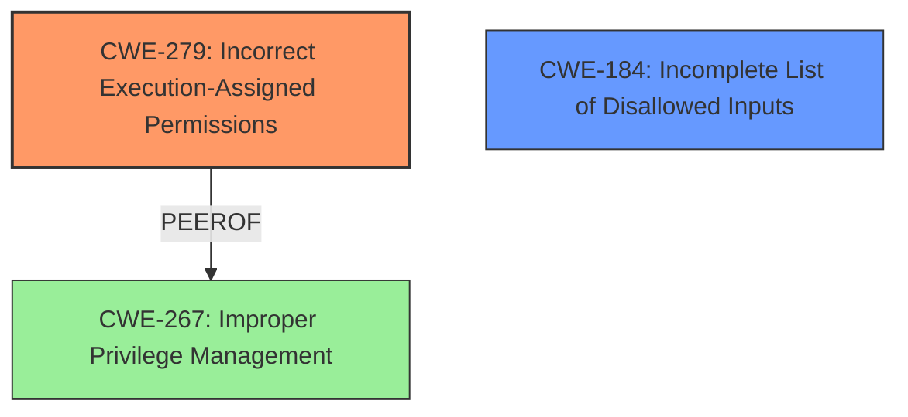

# Final Resolution for CVE-2021-30577

# Summary
| CWE ID | CWE Name | Confidence | CWE Abstraction Level | CWE Vulnerability Mapping Label | CWE-Vulnerability Mapping Notes |
|---|---|---|---|---|---|
| CWE-279 | Incorrect Execution-Assigned Permissions | 0.80 | Base | Allowed | Primary CWE |
| CWE-184 | Incomplete List of Disallowed Inputs | 0.65 | Base | Allowed | Secondary Candidate CWE |

  - The Primary CWE should be first and noted as the Primary CWEs
  - The secondary candidate CWEs should be next and noted as secondary candidates.
  - The confidence is a confidence score 0 to 1 to rate your confidence in your assessment for that CWE.
  - The CWE Abstraction Level as one of these values: Base, Variant, Pillar, Class, Compound
  - The Mapping Notes Usage as one of these values: Allowed, Allowed-with-Review, Prohibited, Discouraged

## Evidence and Confidence

*   **Confidence Score:** 0.80
*   **Evidence Strength:** MEDIUM

## Relationship Analysis
The analysis focused on identifying the root cause of the privilege escalation. Initially, CWE-267 was considered, but CWE-279 offers a more direct mapping to the vulnerability where the crafted file bypasses expected permissions, leading to incorrect execution-assigned permissions. CWE-184 remains a secondary consideration as the **insufficient policy enforcement** could stem from an incomplete list of disallowed inputs. The parent-child relationships were not directly relevant, but the abstraction levels (Base) were considered to ensure specificity.

## Vulnerability Chain
The vulnerability chain starts with a crafted file bypassing **policy enforcement** during installation. This leads to incorrect execution-assigned permissions, allowing a remote attacker to perform **local privilege escalation**. The root cause is the insufficient validation of the crafted file, resulting in the installer granting elevated privileges.

## Summary of Analysis
The initial analysis identified CWE-267 as the primary **weakness**, but the criticism highlighted the potential for a more specific classification. "Insufficient policy enforcement in Installer in Google Chrome prior to 92.0.4515.107 allowed a remote attacker to perform local privilege escalation via a crafted file." Based on the provided vulnerability description, CWE-279 (Incorrect Execution-Assigned Permissions) is now considered the primary **rootcause** as it directly addresses the privilege escalation aspect. The installer does not respect the correct execution-assigned permissions due to the crafted file. CWE-184 (Incomplete List of Disallowed Inputs) is retained as a secondary candidate, reflecting the possibility that the **insufficient policy enforcement** stems from an incomplete denylist. The decision is based on the evidence that the crafted file leads to incorrect permission assignments during execution, making CWE-279 the optimal level of specificity.