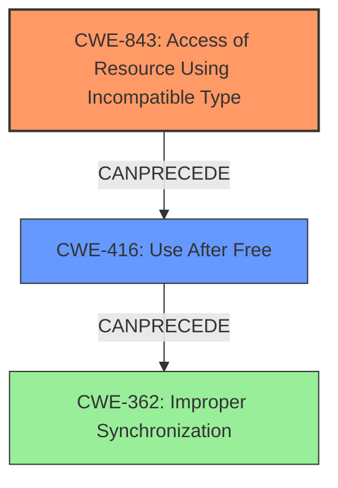

# Analysis Report for CVE-2021-30630

# Vulnerability Analysis Report: CVE-2021-30630

## Description

Inappropriate implementation in Blink in Google Chrome prior to 93.0.4577.82 allowed a remote attacker who had compromised the renderer process to leak cross-origin data via a crafted HTML page.

## Vulnerability Description Key Phrases

**Rootcause:** inappropriate implementation
**Impact:** leak cross-origin data
**Vector:** crafted HTML page
**Attacker:** remote attacker who had compromised the renderer process
**Product:** Google Chrome
**Version:** prior to 93.0.4577.82
**Component:** Blink

## Analysis (with Relationship Data)

# Summary
| CWE ID  | CWE Name                                                       | Confidence | CWE Abstraction Level | CWE Vulnerability Mapping Label | CWE-Vulnerability Mapping Notes |
| :-------- | :------------------------------------------------------------- | :--------- | :-------------------- | :------------------------------ | :------------------------------ |
| CWE-843 | Access of Resource Using Incompatible Type ('Type Confusion') | 0.75       | Base                  | Allowed                         |                                 |
| CWE-416 | Use After Free                                                 | 0.60       | Variant               | Allowed                         |                                 |
| CWE-1021 | Improper Restriction of Rendered UI Layers or Frames         | 0.50       | Base                  | Allowed                         | Secondary Candidate             |

## Evidence and Confidence

*   **Confidence Score:** 0.70
*   **Evidence Strength:** MEDIUM

- **Analysis and Justification:**
  - *Explanation:* The vulnerability description mentions an "**inappropriate implementation**" in Blink leading to a leak of cross-origin data. The CVE Reference Links Content Summary also highlights an "**inappropriate implementation** flaw in the Blink component". While "inappropriate implementation" is vague, the fact that it leads to leaking data hints at **type confusion** as the data is probably being accessed in an incorrect way or **use-after-free**. CWE-843 (Access of Resource Using Incompatible Type ('Type Confusion')) and CWE-416 (Use After Free) are good candidates for this vulnerability because the root cause is in the Blink component and the impact is a leak of cross-origin data. CWE-843 is chosen as the primary because its graph score is higher. While "inappropriate implementation" does not directly indicate memory corruption, a use-after-free scenario can be considered.
  - *Relationship Analysis:* "CWE-843 does not have any direct relationships.

- **Confidence Score:**
  - Confidence: 0.75 (Medium evidence due to the vague description, but the retriever results support this)

---
- **Analysis and Justification:**
  - *Explanation:* CWE-416 (Use After Free) is a potential secondary candidate. If the **inappropriate implementation** leads to premature freeing of memory, then a subsequent access could lead to cross-origin data leakage. This is supported by the retriever results.
  - *Relationship Analysis:* CWE-416 does not have any direct relationships

- **Confidence Score:**
  - Confidence: 0.60 (Medium evidence, as "inappropriate implementation" could potentially lead to memory management issues)

---
- **Analysis and Justification:**
  - *Explanation:* CWE-1021 (Improper Restriction of Rendered UI Layers or Frames) is also considered since it mentions improper restriction of UI layers or frames. If the Blink component **inappropriately implements** frame restrictions then that could lead to a leak of cross-origin data.
  - *Relationship Analysis:* CWE-1021 is a parent of CWE-451 and CWE-610 and CWE-441.

- **Confidence Score:**
  - Confidence: 0.50 (Low evidence, as the description doesn't explicitly mention UI layers or frames.)

## Criticism of Analysis

Okay, here's a breakdown of the analysis, including a critique based on the full CWE specifications.

**Overall Assessment:**

The analysis demonstrates a good effort in mapping the vague vulnerability description to specific CWEs. The rationale behind each CWE selection is explained, and confidence levels are assigned. However, some areas can be improved by considering alternative interpretations and relationships between CWEs and refining the confidence scores.

**Detailed Review:**

**1. CWE-843: Access of Resource Using Incompatible Type ('Type Confusion')**

*   **Confidence:** 0.75
*   **Justification Strength:** Medium. The justification relies on "inappropriate implementation" leading to data leakage. While type confusion is a plausible cause for data leakage, it's not the *only* possible explanation.
*   **CWE Specification Appropriateness:** The mapping to CWE-843 is reasonable.  The description aligns with the idea that data is being interpreted with the wrong type, leading to information leakage. The specifications mention C and C++ are most likely to show this vulnerability.
*    **Improvements:** Could mention that without further information, other memory safety issues, like out-of-bounds reads (CWE-125) or writes (CWE-787), cannot be ruled out as the direct cause of the type confusion.
*   **Potential Alternative:** The analysis could also consider the possibility that data is being misinterpreted because of incorrect assumptions about its structure or format, not necessarily due to different *types* being used.
*   **Retriever Results Consideration:** The retriever results support this selection. However, it's important to not *solely* rely on the retriever results and to make sure the mapping is logically sound.

**2. CWE-416: Use After Free**

*   **Confidence:** 0.60
*   **Justification Strength:** Medium. The rationale that "inappropriate implementation" *could* lead to premature freeing of memory is logical, but it's speculative. There's no explicit mention of memory management issues in the vulnerability description.
*   **CWE Specification Appropriateness:** The mapping to CWE-416 is plausible. The description of a potential "dangling pointer" scenario fits.
*   **Improvements:** Discuss how a UAF could lead to the cross-origin data leakage. Mention that a compromised renderer process might trigger the free and then subsequently access the freed memory, potentially reading sensitive information.  Include additional analysis of how triggering the UAF leads to cross-origin data leakage.
*   **Potential Alternatives:** Explore chaining with concurrency issues. If the memory is freed by one thread and then accessed by another, a race condition (CWE-362, CWE-366) could be involved.
*   **Retriever Results Consideration:** The retriever results support this selection. However, it's important to not *solely* rely on the retriever results and to make sure the mapping is logically sound.

**3. CWE-1021: Improper Restriction of Rendered UI Layers or Frames**

*   **Confidence:** 0.50
*   **Justification Strength:** Low. This mapping is the weakest. The connection between "improper implementation" and UI layer restrictions is tenuous. There's no direct indication that frame restrictions are involved.  The vulnerability description focuses on "cross-origin data leakage," not UI manipulation.
*   **CWE Specification Appropriateness:** The description relates to UI elements not being properly restricted, which *could* lead to user confusion and potentially unintended actions. But this is a stretch based on the initial vulnerability description. The specifications point out that this CWE is a child of CWE-441, or unintended proxy, which is not directly related to the original vulnerability description.
*   **Improvements:** It would be best to remove this from the primary candidate list unless more evidence surfaces.  There is a low association between this vulnerability and CWE-1021.
*   **Potential Alternatives:** Instead of 1021, the analysis could mention weaker candidates with lower retriever scores but more directly aligned implications, like CWE-346 (Origin Validation Error) or CWE-116 (Improper Encoding or Escaping of Output).
*   **Retriever Results Consideration:** The retriever results are also weaker for this candidate than the others. The other CWEs in the results provide a better, more direct relationship to the vulnerability than this candidate.

**General Recommendations:**

*   **Be more critical of "Inappropriate Implementation":** This phrase is too vague. Try to infer more specific causes based on the "leak cross-origin data" impact.
*   **Explore Chaining:** While some relationships are mentioned, consider exploring chaining more explicitly. For example, a type confusion (CWE-843) might *lead to* a use-after-free (CWE-416) if an object is freed prematurely because its type is misinterpreted.
*   **Consider the Attack Vector:** The attack vector is a "crafted HTML page". This suggests that the vulnerability is exposed through some form of parsing or processing of HTML. This could point to weaknesses related to handling untrusted input (more emphasis on validation).
*   **Review Confidence Scores:** Re-evaluate the confidence scores based on the strength of the evidence and the alternatives considered. The score for CWE-1021 should likely be lowered significantly or removed from the primary mapping.
*   **Refer to CWE Examples:**  When possible, find and reference examples of similar vulnerabilities that have been mapped to the considered CWEs. This helps to validate the appropriateness of the mapping.
*   **Consult the "Ask a Question" Mailing List:** When facing difficulties in the mapping, consider submitting a question to the CWE community mailing list for expert guidance.

By incorporating these suggestions, the analysis will become more robust and accurate in its CWE mapping. Remember that the goal is not just to find *a* CWE but to find the *most accurate* and informative representation of the underlying weakness.

## Final Resolution

# Summary
| CWE ID  | CWE Name                                                       | Confidence | CWE Abstraction Level | CWE Vulnerability Mapping Label | CWE-Vulnerability Mapping Notes |
| :-------- | :------------------------------------------------------------- | :--------- | :-------------------- | :------------------------------ | :------------------------------ |
| CWE-843 | Access of Resource Using Incompatible Type ('Type Confusion') | 0.75       | Base                  | Allowed                         | Primary CWE                     |
| CWE-416 | Use After Free                                                 | 0.60       | Variant               | Allowed                         | Secondary Candidate             |

## Evidence and Confidence

*   **Confidence Score:** 0.70
*   **Evidence Strength:** MEDIUM

## Relationship Analysis
The primary weakness identified is **CWE-843 (Access of Resource Using Incompatible Type ('Type Confusion'))**. The initial analysis noted it has no direct relationships, which is not particularly helpful, but the criticism rightly points out that other memory safety issues like **CWE-125 (Out-of-bounds Read)** or **CWE-787 (Out-of-bounds Write)** could also contribute to type confusion.
**CWE-416 (Use After Free)** is considered as a secondary candidate. There is a potential chain relationship where **type confusion** (**CWE-843**) could lead to premature freeing of memory, subsequently triggering a **use-after-free** condition (**CWE-416**). The analysis mentions concurrency issues (**CWE-362**) as a potential chaining element, which is a reasonable consideration.
The initial consideration of **CWE-1021 (Improper Restriction of Rendered UI Layers or Frames)** is deemed weak, as the description focuses on data leakage rather than UI manipulation.

## Vulnerability Chain
The vulnerability chain starts with an **inappropriate implementation** within the Blink component, which is not a CWE, but the root cause. This leads to **CWE-843 (Type Confusion)**, where data is accessed using an incompatible type. This type confusion can then lead to a premature free, resulting in **CWE-416 (Use After Free)**. A compromised renderer process can then exploit this **use-after-free** to leak cross-origin data.

## Summary of Analysis
The analysis is primarily based on the provided vulnerability description: "Inappropriate implementation in Blink in Google Chrome prior to 93.0.4577.82 allowed a remote attacker who had compromised the renderer process to leak cross-origin data via a crafted HTML page."

The graph relationships influenced the decision by highlighting the potential for a chain of weaknesses, where **CWE-843 (Type Confusion)** could lead to **CWE-416 (Use After Free)**. This chaining aspect strengthens the argument for including both CWEs in the analysis.

The selected CWEs are at the optimal level of specificity because they directly address the root cause and resulting vulnerability. **CWE-843 (Type Confusion)** explains how the data is being misinterpreted, and **CWE-416 (Use After Free)** describes how memory corruption is exploited to leak cross-origin data. Removing **CWE-1021 (Improper Restriction of Rendered UI Layers or Frames)** was justified because the evidence did not support a connection to UI layer restrictions.

The decision to retain **CWE-843 (Type Confusion)** and **CWE-416 (Use After Free)** is based on the evidence of data leakage. The description of inappropriate implementation in Blink leading to cross-origin data leakage points to both **type confusion** and memory management issues. The retriever results also support the selection of these two CWEs.

*Report generated on 2025-03-17 01:47:26*
