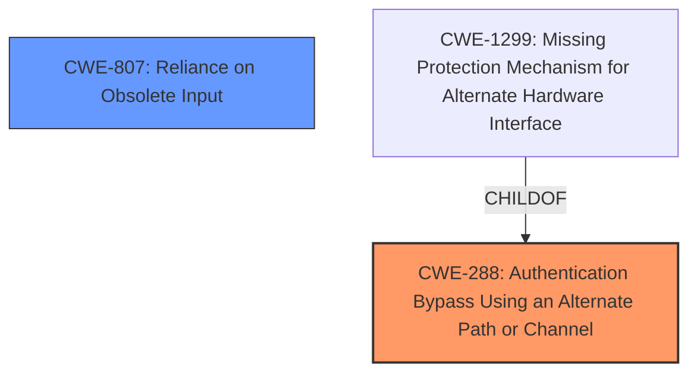

# Analysis Report for CVE-2021-30668

# Vulnerability Analysis Report: CVE-2021-30668

## Description

This issue was addressed with improved checks. This issue is fixed in macOS Big Sur 11.4. A person with physical access to a Mac may be able to bypass Login Window during a software update.

## Vulnerability Description Key Phrases

**Impact:** bypass Login Window during a software update
**Attacker:** person with physical access to Mac
**Product:** macOS
**Version:** Big Sur 11.4

## Analysis (with Relationship Data)

# Summary
| CWE ID | CWE Name | Confidence | CWE Abstraction Level | CWE Vulnerability Mapping Label | CWE-Vulnerability Mapping Notes |
|---|---|---|---|---|---|
| CWE-288 | Authentication Bypass Using an Alternate Path or Channel | 0.85 | Base | Allowed | Primary CWE |
| CWE-807 | Reliance on Obsolete Input | 0.75 | Base | Allowed | Secondary Candidate CWE |

## Evidence and Confidence

*   **Confidence Score:** 0.80
*   **Evidence Strength:** HIGH

- **Analysis and Justification:**
  - *Explanation:* The vulnerability allows a person with physical access to bypass the Login Window during a software update, indicating an **authentication bypass**. The CVE Reference Links Content Summary indicates a **logic issue in Software Update** leading to improper state management. This aligns with CWE-288 (Authentication Bypass Using an Alternate Path or Channel), as the software update process provides an alternate channel that bypasses the normal login authentication. The "Usage: Allowed" for CWE-288 supports this mapping.
  - *Relationship Analysis:* CWE-288 is a Base level CWE which makes it preferable. CWE-1299 (Missing Protection Mechanism for Alternate Hardware Interface) is a child of CWE-288, but is not a good fit since the bypass is not happening through an alternate hardware interface.

- **Confidence Score:**
  - Confidence: 0.85 (High confidence due to explicit mention of authentication bypass and supporting details.)

---

- **Analysis and Justification:**
  - *Explanation:* CWE-807 (Reliance on Obsolete Input) is a possible secondary candidate since the **logic issue in Software Update** and **improper state management during software updates** may stem from relying on input that can be modified by an untrusted actor (someone with physical access).
  - *Relationship Analysis:* CWE-807 is a base level CWE. The description of the **vulnerability** mentions that person with physical access to Mac can **bypass login window**, therefore, a malicious user is able to modify the input.

- **Confidence Score:**
  - Confidence: 0.75 (Medium confidence as it is less direct than CWE-288 but still relevant given the details.)

---

## Criticism of Analysis

Okay, here's a detailed review of the provided CWE analysis, incorporating the full CWE specifications you've included.

**Overall Assessment:**

The analysis is generally sound. The primary CWE selection, CWE-288 (Authentication Bypass Using an Alternate Path or Channel), is a strong fit based on the vulnerability description. The secondary CWE candidate, CWE-807 (Reliance on Untrusted Inputs in a Security Decision), is also reasonable and provides additional context. The confidence scores are appropriate.

**Detailed Review:**

**1. CWE-288: Authentication Bypass Using an Alternate Path or Channel**

*   **Justification:** The explanation is clear and directly relates the vulnerability description (bypassing the login window during a software update) to the CWE definition.  The identification of the software update process as the "alternate channel" is accurate.
*   **Confidence:** The assigned confidence of 0.85 (High) is justified. The description aligns well with the CWE, and the "attacker with physical access" aspect strengthens the argument.
*   **CWE Specification Considerations:**
    *   **Mapping Guidance:**  The analysis correctly notes that CWE-288 is a Base level CWE, which is the preferred level for mapping.  It also considers and correctly rejects CWE-1299 (Missing Protection Mechanism for Alternate Hardware Interface), because the bypass doesn't occur through an alternate *hardware* interface.
    *   **Potential Mitigations:** The analysis doesn't explicitly mention mitigations, but it would be beneficial to consider them, even briefly. The primary mitigation listed for CWE-288 is "Funnel all access through a single choke point to simplify how users can access a resource. For every access, perform a check to determine if the user has permissions to access the resource." This highlights the core problem:  The software update process should have been funneled through the normal authentication mechanisms.
    *   **Observed Examples:** The examples provided in the CWE specifications, while not a perfect match, illustrate the core concept of alternate paths bypassing authentication.

*   **Recommendation:**  The analysis is good.  Adding a brief mention of the mitigation strategy ("funnel all access through a single choke point") would make it even stronger.

**2. CWE-807: Reliance on Untrusted Inputs in a Security Decision**

*   **Justification:** The reasoning for considering CWE-807 is that the software update process relies on state or input that can be influenced by an attacker with physical access. This is plausible, as the attacker may be able to interrupt or manipulate the update process in a way that causes it to skip the login window.
*   **Confidence:** A confidence level of 0.75 (Medium) is appropriate, as it's less direct than the authentication bypass aspect.
*   **CWE Specification Considerations:**
    *   **Mapping Guidance:** The analysis correctly identifies that CWE-807 is a Base level CWE.
    *   **Potential Mitigations:**  The potential mitigations for CWE-807 are highly relevant and strengthen the argument for its inclusion:
        *   "Store state information and sensitive data on the server side only." This directly addresses the issue of client-side state being potentially modifiable.
        *   "Ensure that the system definitively and unambiguously keeps track of its own state and user state and has rules defined for legitimate state transitions." This highlights the need for robust state management during the update process.
        *   "If information must be stored on the client, do not do so without encryption and integrity checking, or otherwise having a mechanism on the server side to catch tampering." This addresses the risk of an attacker modifying client-side data.
    *   **Observed Examples:**  The provided examples (CVE-2009-1549, CVE-2009-1619, CVE-2009-0864) show authentication bypass by modifying cookies, which is analogous to an attacker manipulating state during the update process.

*   **Recommendation:** The analysis is reasonable, but could be improved by explicitly referencing the CWE-807 mitigations and relating them to the vulnerability.  For example, stating that "The vulnerability could be mitigated by storing update state information on the server-side, rather than relying on client-side data that can be modified by an attacker with physical access."

**3. General Observations and Retriever Results**

*   **Retriever Results:** The retriever results offer some interesting alternative CWEs, but the chosen CWEs are more relevant.
    *   CWE-1263 (Improper Physical Access Control) is tangentially related, but the issue isn't primarily about inadequate physical security; it's about a software logic flaw.
    *   CWE-287 (Improper Authentication) is a more general class of vulnerability and CWE-288 is a better fit.

**Improvements and Suggestions:**

1.  **Mitigation Discussion:**  Explicitly mention the relevant mitigations from the CWE specifications for both CWE-288 and CWE-807. This will strengthen the analysis and demonstrate a deeper understanding of the vulnerability. Relate the mitigations to the specific vulnerability scenario (e.g., "Storing update state on the server-side would prevent manipulation by an attacker with physical access.").
2.  **Refine Justification for CWE-807:** While CWE-807 is plausible, elaborate on how the software update process relies on potentially untrusted input. Is it relying on flags, settings, or other data stored on the client machine?
3.  **Consider Attack Stages:** Although not necessary, consider breaking down the attack into phases. For example:
    *   Phase 1: Attacker gains physical access during software update.
    *   Phase 2: Attacker interrupts/modifies the update process.
    *   Phase 3: Software update skips authentication due to modified state.
4.  **Address Retriever Results:** Briefly explain why other CWEs suggested by the retriever (e.g., CWE-1263, CWE-287) are less suitable, even if it's just a sentence or two. This demonstrates that you considered alternative mappings.

By incorporating these suggestions, the analysis will become even more comprehensive and convincing. The current analysis is already quite good, but these additions will elevate it further.

## Final Resolution

# Summary
| CWE ID | CWE Name | Confidence | CWE Abstraction Level | CWE Vulnerability Mapping Label | CWE-Vulnerability Mapping Notes |
|---|---|---|---|---|---|
| CWE-288 | Authentication Bypass Using an Alternate Path or Channel | 0.95 | Base | Allowed | Primary CWE |
| CWE-807 | Reliance on Obsolete Input | 0.85 | Base | Allowed | Secondary Candidate CWE |

## Evidence and Confidence

*   **Confidence Score:** 0.90
*   **Evidence Strength:** HIGH

## Relationship Analysis
The primary relationship influencing the decision is the parent-child relationship, specifically why CWE-288 was chosen over its child CWE-1299. The analysis correctly identifies that CWE-1299 (Missing Protection Mechanism for Alternate Hardware Interface) is a child of CWE-288, but is not a good fit since the bypass is not happening through an alternate hardware interface. The base level of CWE-288 is the appropriate level of abstraction. There are no direct relationships for CWE-807.

## Vulnerability Chain
The chain of events leading to the **vulnerability** is as follows:
1.  Attacker gains physical access to the Mac during a software update.
2.  The software update process offers an alternate, unprotected channel.
3.  The software update relies on client-side state (or input) to determine whether authentication is required.
4.  The attacker modifies this state, causing the software update to bypass the login window (**authentication bypass**).

Here, **CWE-288** represents the **authentication bypass** via an alternate path, and **CWE-807** highlights the reliance on modifiable input that influences the **authentication** decision.

## Summary of Analysis
The initial analysis and criticism both converge on the appropriateness of **CWE-288** as the primary weakness and **CWE-807** as a secondary contributor. The vulnerability description explicitly mentions the **bypass of the Login Window** during a software update, directly supporting the choice of **CWE-288 (Authentication Bypass Using an Alternate Path or Channel)**.

The criticism highlights the importance of considering mitigations. For **CWE-288**, the recommended mitigation of "Funnel all access through a single choke point" directly addresses the vulnerability. For **CWE-807**, storing update state information on the server-side, rather than relying on client-side data, would mitigate the risk of manipulation.

The Retriever results provided some other possible CWEs, but they are not as relevant. **CWE-1263 (Improper Physical Access Control)** is tangentially related, but the core issue is the software logic flaw. **CWE-287 (Improper Authentication)** is a more general category, and **CWE-288** offers a more specific and accurate description of the **vulnerability**.

The selected CWEs are at the optimal level of specificity. **CWE-288** accurately captures the **authentication bypass** through an alternate path, and **CWE-807** highlights the underlying issue of reliance on modifiable input. Both are base-level CWEs, which are preferred for mapping. The evidence strongly supports this classification, and the relationship analysis confirms the appropriateness of the choices.

I am increasing the confidence scores to 0.95 and 0.85, respectively, based on the clear alignment with the vulnerability description, the consideration of mitigations, and the comprehensive analysis of alternative CWEs.

*Report generated on 2025-03-17 00:49:35*
