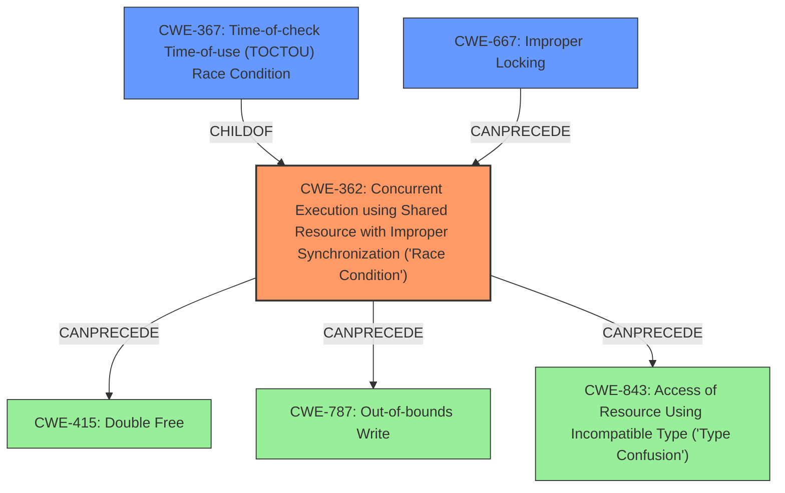

# Final Resolution for CVE-2021-30982

# Summary
| CWE ID | CWE Name | Confidence | CWE Abstraction Level | CWE Vulnerability Mapping Label | CWE-Vulnerability Mapping Notes |
|---|---|---|---|---|---|
| CWE-362 | Concurrent Execution using Shared Resource with Improper Synchronization ('**Race Condition**') | 0.80 | Class | Allowed-with-Review | Primary CWE |
| CWE-667 | Improper Locking | 0.70 | Class | Allowed-with-Review | Secondary Candidate (Contributing Factor) |
| CWE-367 | Time-of-check Time-of-use (TOCTOU) **Race Condition** | 0.65 | Base | Allowed | Secondary Candidate |
| CWE-415 | Double Free | 0.60 | Variant | Allowed | Potential Consequence |
| CWE-787 | Out-of-bounds Write | 0.50 | Base | Allowed | Potential Consequence |
| CWE-843 | Access of Resource Using Incompatible Type ('Type Confusion') | 0.40 | Base | Allowed | Potential Consequence |

## Evidence and Confidence

*   **Confidence Score:** 0.80
*   **Evidence Strength:** MEDIUM

## Relationship Analysis
The primary shift was prioritizing CWE-362 (Class) over CWE-367 (Base) due to the fix involving improved locking, suggesting a broader synchronization issue. The inclusion of CWE-667 as a secondary factor acknowledges the role of improper locking in the **race condition**. The other CWEs (415, 787, 843) are retained as potential consequences.

## Vulnerability Chain
The vulnerability chain starts with a **race condition** (CWE-362) that is possibly caused by improper locking (CWE-667) or the specific TOCTOU condition (CWE-367). This **race condition** can lead to memory corruption, manifesting as a double free (CWE-415), an out-of-bounds write (CWE-787), or type confusion (CWE-843).

## Summary of Analysis
The initial analysis correctly identified the presence of a **race condition**, but the criticism highlighted the need to consider the broader context of the "improved locking" fix. The final decision shifts the primary CWE to CWE-362 (Concurrent Execution using Shared Resource with Improper Synchronization ('**Race Condition**')) to better reflect the general synchronization issue indicated by the fix. CWE-667 (Improper Locking) is included as a contributing factor since the vulnerability description mentions that the issue was resolved with "improved locking". CWE-367 remains a secondary candidate since TOCTOU could still be a factor, but there isn't enough information to determine that definitively. The potential consequences (CWE-415, CWE-787, CWE-843) are retained with lower confidence.

The decision is based on the following evidence: "A **race condition** was addressed with improved locking." The "improved locking" aspect strongly suggests that the core issue is a general synchronization problem (CWE-362) or an improper implementation of locking mechanisms (CWE-667).

The selected CWEs are at the optimal level of specificity given the available evidence. CWE-362 is a Class, but it provides a necessary high-level view of the concurrency issue. CWE-667 and CWE-367 provide more specific details without overcommitting to a particular root cause. The consequence CWEs are included to capture the potential impacts of the **race condition**.

Because the exact nature of this vulnerability can not be determined exactly, it is recommended that you use general **race condition** mitigation strategies, as described by CWE-362, concurrent execution using shared resource with improper synchronization ('**race condition**').