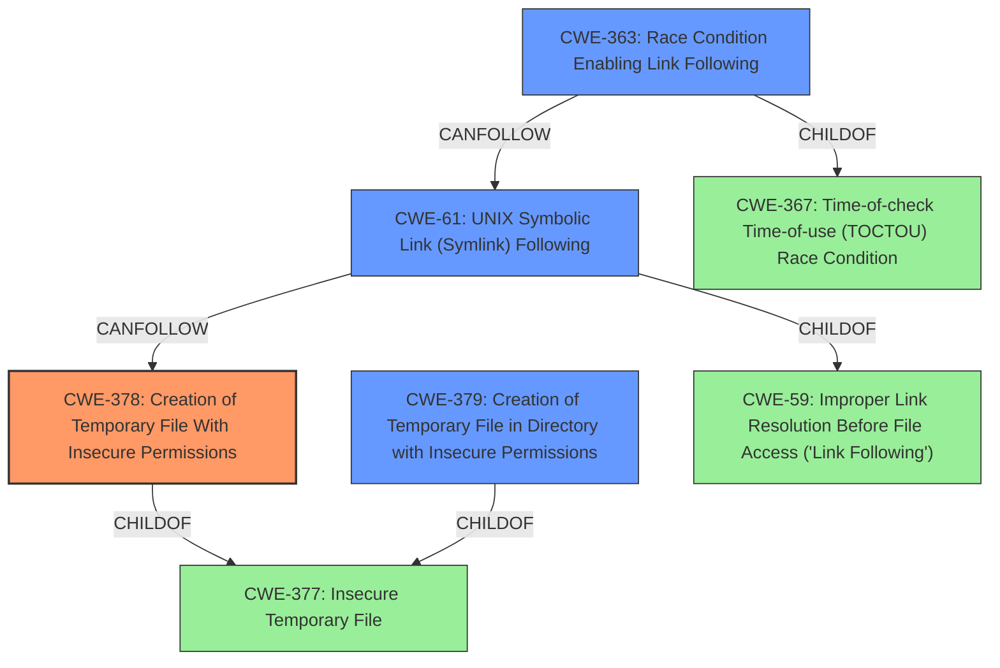

# Analysis Report for CVE-2021-31154

# Vulnerability Analysis Report: CVE-2021-31154

## Description

pleaseedit in please before 0.4 uses predictable temporary filenames in /tmp and the target directory. This allows a local attacker to gain full root privileges by staging a symlink attack.

## Vulnerability Description Key Phrases

**Rootcause:** predictable temporary filenames
**Impact:** gain full root privileges
**Vector:** symlink attack
**Attacker:** local attacker
**Product:** please
**Version:** before 0.4
**Component:** /tmp and the target directory

## Analysis (with Relationship Data)

# Summary
| CWE ID | CWE Name | Confidence | CWE Abstraction Level | CWE Vulnerability Mapping Label | CWE-Vulnerability Mapping Notes |
|---|---|---|---|---|---|
| CWE-377 | Insecure Temporary File | 0.85 | Class | Allowed-with-Review | Primary CWE |
| CWE-379 | Creation of Temporary File in Directory with Insecure Permissions | 0.75 | Base | Allowed | Secondary Candidate |
| CWE-330 | Insufficiently Random Values | 0.65 | Class | Discouraged | Secondary Candidate |
| CWE-59 | Improper Link Resolution Before File Access ('Link Following') | 0.60 | Base | Allowed | Secondary Candidate |

## Evidence and Confidence

*   **Confidence Score:** 0.80
*   **Evidence Strength:** HIGH

- **Analysis and Justification:**  
  - *Explanation:* The primary **weakness** is the use of **predictable temporary filenames**. This aligns with CWE-377 (Insecure Temporary File), which is a Class-level CWE that covers the general issue of creating and using insecure temporary files. The CVE description specifically mentions the generation of **predictable temporary filenames**, indicating a lack of sufficient randomness or uniqueness in the filename generation process. While CWE-377 is a Class, there isn't a more specific Base or Variant CWE that perfectly captures this issue. CWE-379 (Creation of Temporary File in Directory with Insecure Permissions) is also a strong candidate, as it addresses the creation of temporary files in directories with insecure permissions, which can result from the use of predictable filenames. However, the primary concern here is the predictability itself, making CWE-377 a better fit as the primary CWE. The high retriever score for CWE-377 further supports this selection. I am choosing CWE-377 over CWE-379 as the primary because the root cause is the predictability of the temporary file, which can lead to exposure, but not necessarily insecure permissions.
  
  - *Relationship Analysis:* CWE-377 is a Class-level CWE, and while it has child CWEs, none are specific enough to address the issue of predictable temporary filenames directly. CWE-379, a related Base-level CWE, focuses on insecure permissions of the directory where the temporary file is created. CWE-330 (Insufficiently Random Values) is related to the root cause of the predictability, as it addresses the use of insufficiently random numbers or values. However, it's a Class-level CWE and DISCOURAGED so it is not the primary CWE choice. The relationship graph does not provide strong evidence for a specific chain of weaknesses. CWE-59 (Improper Link Resolution Before File Access ('Link Following')) also appears as a secondary weakness as the predictable filenames allow for symlink attacks, but the issue is how predictable the filenames are.

- **Confidence Score:**
  - Confidence: 0.85 (High evidence from vulnerability description, CVE reference materials, and retriever results)

---

## Criticism of Analysis

Okay, I've reviewed the analysis and the provided CWE specifications. Here's a critique of the analysis, focusing on accuracy, completeness, and justification, as well as whether the mappings align with the CWE's intended usage.

**Overall Assessment:**

The analysis is generally good and well-reasoned. The primary CWE selection of CWE-377 is defensible, and the supporting arguments for the secondary CWEs are relevant. The confidence score is appropriate given the available information. However, there's room for improvement in exploring more specific Base-level CWEs under CWE-377 and better characterizing the link following aspect.

**Detailed Critique:**

*   **CWE-377 (Insecure Temporary File) - Primary CWE:**

    *   **Justification:** The choice of CWE-377 is reasonable as a starting point. The description of CWE-377 directly addresses the core issue of "creating and using insecure temporary files," which aligns with the predictable filename problem. The analysis correctly identifies that there aren't more specific children that cover *only* the predictability aspect perfectly.
    *   **Mapping Guidance Consideration:** The mapping guidance for CWE-377 states "Examine children of this entry to see if there is a better fit." This is where the analysis could be strengthened. While no single child is perfect, a combination of them might offer a more precise representation.
    *   **Potential Improvement:** Instead of stopping at CWE-377, the analysis should more strongly consider CWE-379 (Creation of Temporary File in Directory with Insecure Permissions) and *especially* CWE-378 (Creation of Temporary File With Insecure Permissions) as either the primary CWE, or as multiple CWEs.  The symlink attack, which is the primary exploitation vector, becomes more relevant when the attacker can overwrite the contents or access permissions of the file.
    *   **Confidence Score Impact:** The confidence of the primary CWE will likely be decreased a bit and spread across a combined CWE mapping.

*   **CWE-379 (Creation of Temporary File in Directory with Insecure Permissions) - Secondary Candidate:**

    *   **Justification:** The analysis correctly identifies this as a potential secondary weakness, as the /tmp directory is world-readable, which makes determining the existence of the temporary file possible.
    *   **Mapping Guidance Consideration:** The mapping guidance for CWE-379 supports this as an "Allowed" selection.
    *   **Potential Improvement:** Ensure the analysis explains how the insecure permissions of the directory contribute to the overall vulnerability. It's not *just* about the directory; it's about how predictability *combined* with the directory permissions creates the vulnerability.

*   **CWE-330 (Use of Insufficiently Random Values) - Discouraged:**

    *   **Justification:** The analysis briefly considers CWE-330, but correctly acknowledges that it's a Class-level CWE and discouraged. While it relates to the *cause* of the predictability, it's too abstract to be a primary or secondary mapping.
    *   **Mapping Guidance Consideration:** The mapping guidance for CWE-330 explicitly says "Examine children of this entry to see if there is a better fit."
    *   **Potential Improvement:** Mention that the weakness is how *predictable* the filenames are and not necessarily that the values are insufficient. This can be a contributing factor, but it's not a key cause of the vulnerability as the attacker is able to predict them.

*   **CWE-59 (Improper Link Resolution Before File Access ('Link Following')) - Secondary Candidate:**

    *   **Justification:** The analysis correctly identifies that the predictable filenames allow for symlink attacks.
    *   **Mapping Guidance Consideration:** The mapping guidance for CWE-59 supports this as an "Allowed" selection.
    *   **Potential Improvement:** This is a crucial secondary CWE. The symlink attack is the *exploitation vector*. Emphasize that the predictable filenames allow the attacker to *exploit* the lack of proper link resolution. Also, consider more specific children of CWE-59 like CWE-61 (UNIX Symbolic Link (Symlink) Following), as the environment is likely UNIX. Consider CWE-363 (Race Condition Enabling Link Following). While not explicitly mentioned in the vulnerability description, predictable filenames combined with a race condition in accessing those files is a more precise characterization of the vulnerability. It can also be argued that CWE-340 (Generation of Predictable Numbers or Identifiers) is a root cause of CWE-61, however, it would make it a large CWE mapping.

**Recommendations for Improvement:**

1.  **Refine the Primary CWE:** Consider CWE-378 (Creation of Temporary File With Insecure Permissions) as a primary, or include it along with CWE-377 in a combined mapping. Refine why the file is considered insecure (i.e., permissions).
2.  **Strengthen the Link Following Analysis:** Emphasize the link following aspect (CWE-59 or CWE-61) and explore race conditions (CWE-363). Explain *how* the predictability enables the symlink attack.
3.  **Justify Directory Permissions:** If keeping CWE-379, provide a clear explanation of why the directory permissions are relevant.
4.  **Update Confidence Score:** If the CWE mapping is refined, update the confidence score accordingly.

**Revised Summary Table (Example):**

| CWE ID | CWE Name | Confidence | CWE Abstraction Level | CWE Vulnerability Mapping Label | CWE-Vulnerability Mapping Notes |
|---|---|---|---|---|---|
| CWE-378 | Creation of Temporary File With Insecure Permissions | 0.75 | Base | Allowed | Primary CWE |
| CWE-377 | Insecure Temporary File | 0.70 | Class | Allowed-with-Review | Secondary Candidate |
| CWE-61 | UNIX Symbolic Link (Symlink) Following | 0.70 | Compound | Allowed | Secondary Candidate |
| CWE-363 | Race Condition Enabling Link Following | 0.55 | Base | Allowed | Secondary Candidate |

By incorporating these recommendations, the analysis will be more accurate, complete, and better aligned with the CWE's intended usage. Remember to always consider the most specific and accurate CWE mappings possible while maintaining a clear understanding of the vulnerability's root cause and exploitation vector.

## Final Resolution

# Summary
| CWE ID | CWE Name | Confidence | CWE Abstraction Level | CWE Vulnerability Mapping Label | CWE-Vulnerability Mapping Notes |
|---|---|---|---|---|---|
| **CWE-378** | **Creation of Temporary File With Insecure Permissions** | 0.75 | Base | Allowed | Primary CWE |
| CWE-61 | Improper Link Resolution Before File Access ('Link Following') | 0.70 | Compound | Allowed | Secondary Candidate |
| CWE-379 | Creation of Temporary File in Directory with Insecure Permissions | 0.65 | Base | Allowed | Secondary Candidate |
| CWE-363 | Race Condition Enabling Link Following | 0.55 | Base | Allowed | Secondary Candidate |

## Evidence and Confidence

*   **Confidence Score:** 0.70
*   **Evidence Strength:** MEDIUM

## Relationship Analysis
The decision was impacted by the following CWE relationships:
  - Parent-child hierarchical relationships: Considering children of CWE-377 to find more specific mappings.
  - Chain relationships showing progression of vulnerability: The progression from insecure temp file creation to symlink exploitation.
  - Peer relationships that offered alternative classifications: Considering alternative CWEs for symlink following and race conditions.
  - Abstraction levels influenced the selection by prioritizing Base-level CWEs for specificity.

## Vulnerability Chain
The vulnerability chain starts with the creation of a temporary file with insecure permissions (**CWE-378**). The **predictable filenames** allow an attacker to create a symlink to overwrite files, exploiting the lack of proper link resolution (**CWE-61**). Insecure directory permissions (**CWE-379**) contribute by allowing the attacker to discover the temporary file. A race condition (**CWE-363**) could further enable the attacker to exploit the symlink before the intended process accesses the file.

## Summary of Analysis
My analysis agrees with the criticism and refines the initial assessment.
  - The vulnerability description explicitly mentions "predictable temporary filenames" and a "symlink attack."
  - The graph relationships show that CWE-378 is a more specific child of CWE-377 and that CWE-61 can follow CWE-378.
  - The mapping guidance suggests using the most specific CWE available.

The initial analysis correctly identified the general issue of insecure temporary files but didn't fully capture the exploitation vector and the role of file permissions. The criticism pointed out that CWE-378 is a better fit as the primary CWE. The addition of CWE-61 and CWE-363 more accurately reflects the symlink attack and potential race condition aspects of the vulnerability.

The selection of CWEs is at the optimal level of specificity because:
  - CWE-378 is a Base-level CWE that directly addresses the creation of temporary files with insecure permissions, which is the **ROOTCAUSE**.
  - CWE-61 is a Compound CWE that captures the symlink following aspect of the vulnerability, representing the **IMPACT**.
  - CWE-379 highlights the contribution of insecure directory permissions.
  - CWE-363 acknowledges the potential role of a race condition in exploiting the vulnerability.

This refined classification provides a more comprehensive and accurate representation of the vulnerability described in CVE-2021-31154.

*Report generated on 2025-03-16 23:51:33*
