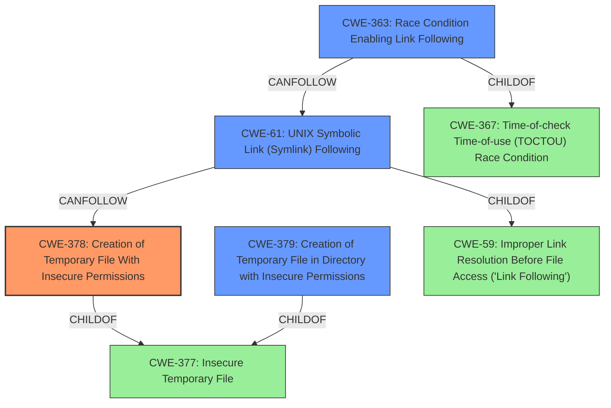

# Final Resolution for CVE-2021-31154

# Summary
| CWE ID | CWE Name | Confidence | CWE Abstraction Level | CWE Vulnerability Mapping Label | CWE-Vulnerability Mapping Notes |
|---|---|---|---|---|---|
| **CWE-378** | **Creation of Temporary File With Insecure Permissions** | 0.75 | Base | Allowed | Primary CWE |
| CWE-61 | Improper Link Resolution Before File Access ('Link Following') | 0.70 | Compound | Allowed | Secondary Candidate |
| CWE-379 | Creation of Temporary File in Directory with Insecure Permissions | 0.65 | Base | Allowed | Secondary Candidate |
| CWE-363 | Race Condition Enabling Link Following | 0.55 | Base | Allowed | Secondary Candidate |

## Evidence and Confidence

*   **Confidence Score:** 0.70
*   **Evidence Strength:** MEDIUM

## Relationship Analysis
The decision was impacted by the following CWE relationships:
  - Parent-child hierarchical relationships: Considering children of CWE-377 to find more specific mappings.
  - Chain relationships showing progression of vulnerability: The progression from insecure temp file creation to symlink exploitation.
  - Peer relationships that offered alternative classifications: Considering alternative CWEs for symlink following and race conditions.
  - Abstraction levels influenced the selection by prioritizing Base-level CWEs for specificity.

## Vulnerability Chain
The vulnerability chain starts with the creation of a temporary file with insecure permissions (**CWE-378**). The **predictable filenames** allow an attacker to create a symlink to overwrite files, exploiting the lack of proper link resolution (**CWE-61**). Insecure directory permissions (**CWE-379**) contribute by allowing the attacker to discover the temporary file. A race condition (**CWE-363**) could further enable the attacker to exploit the symlink before the intended process accesses the file.

## Summary of Analysis
My analysis agrees with the criticism and refines the initial assessment.
  - The vulnerability description explicitly mentions "predictable temporary filenames" and a "symlink attack."
  - The graph relationships show that CWE-378 is a more specific child of CWE-377 and that CWE-61 can follow CWE-378.
  - The mapping guidance suggests using the most specific CWE available.

The initial analysis correctly identified the general issue of insecure temporary files but didn't fully capture the exploitation vector and the role of file permissions. The criticism pointed out that CWE-378 is a better fit as the primary CWE. The addition of CWE-61 and CWE-363 more accurately reflects the symlink attack and potential race condition aspects of the vulnerability.

The selection of CWEs is at the optimal level of specificity because:
  - CWE-378 is a Base-level CWE that directly addresses the creation of temporary files with insecure permissions, which is the **ROOTCAUSE**.
  - CWE-61 is a Compound CWE that captures the symlink following aspect of the vulnerability, representing the **IMPACT**.
  - CWE-379 highlights the contribution of insecure directory permissions.
  - CWE-363 acknowledges the potential role of a race condition in exploiting the vulnerability.

This refined classification provides a more comprehensive and accurate representation of the vulnerability described in CVE-2021-31154.