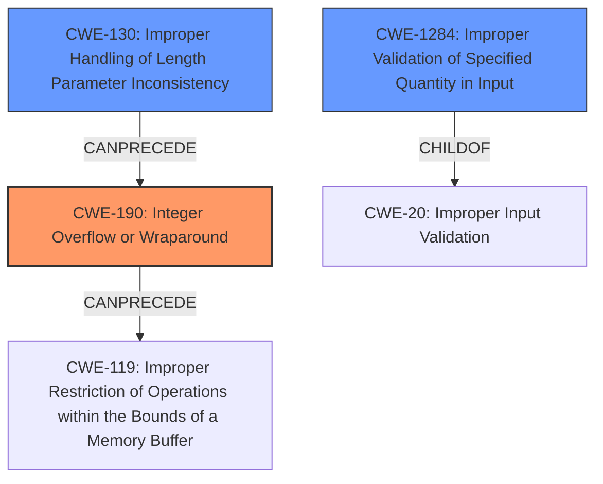

# Analysis Report for CVE-2021-31401

# Vulnerability Analysis Report: CVE-2021-31401

## Description

An issue was discovered in tcp_rcv() in nptcp.c in HCC embedded InterNiche 4.0.1. The TCP header processing code doesnt sanitize the value of the IP total length field (header length + data length). With a crafted IP packet, an integer overflow occurs whenever the value of the IP data length is calculated by subtracting the length of the header from the total length of the IP packet.

## Vulnerability Description Key Phrases

**Weakness:** integer overflow
**Vector:** crafted IP packet
**Product:** HCC embedded InterNiche
**Version:** 4.0.1
**Component:** tcp_rcv() in nptcp.c

## Analysis (with Relationship Data)

# Summary
| CWE ID | CWE Name | Confidence | CWE Abstraction Level | CWE Vulnerability Mapping Label | CWE-Vulnerability Mapping Notes |
|---|---|---|---|---|---|
| CWE-190 | Integer Overflow or Wraparound | 0.9 | Base | Primary | Allowed |
| CWE-1284 | Improper Validation of Specified Quantity in Input | 0.7 | Base | Secondary | Allowed |

## Evidence and Confidence

*   **Confidence Score:** 0.8
*   **Evidence Strength:** HIGH

- **Analysis and Justification:**
  - *Explanation:* The vulnerability description clearly states that an **integer overflow** occurs in `tcp_rcv()` due to the lack of sanitization of the IP total length field. The `CVE Reference Links Content Summary` corroborates this, explicitly mentioning the **integer overflow** resulting from a crafted IP packet where the IP data length calculation (**header length** subtracted from the **total length**) is vulnerable because the code doesn't validate the IP length field. This aligns perfectly with CWE-190 (Integer Overflow or Wraparound), which describes a calculation producing an integer overflow because the resulting value exceeds the maximum storable value. This is the **root cause** of the vulnerability. The retriever results show CWE-190 as a candidate, and the mapping guidance states that its usage is ALLOWED.
  - *Explanation:* Additionally, the root cause also included "Improper Input Validation," according to the CVE summary. The `CVE Reference Links Content Summary` also mentions that the code doesn't validate the IP length field. This lack of validation of the "quantity" (length of the IP packet) directly corresponds to CWE-1284 (Improper Validation of Specified Quantity in Input). Although the primary weakness is the integer overflow, the lack of proper input validation is a contributing factor and should be noted. The retriever results show CWE-1284 as a candidate, and the mapping guidance states that its usage is ALLOWED.

  - *Relationship Analysis:* CWE-190 is a Base level CWE, which is appropriate for mapping to root causes. It can precede CWE-119 (Improper Restriction of Operations within the Bounds of a Memory Buffer) if the overflow leads to buffer overflows. CWE-1284 is also a Base level CWE and is a child of CWE-20 (Improper Input Validation), further solidifying its relevance as the input (IP packet length) isn't validated.

- **Confidence Score:**
  - Confidence: 0.9 (High evidence directly from vulnerability description and CVE reference materials)

---

## Criticism of Analysis

## Critique of the Analysis

The analysis correctly identifies CWE-190 (Integer Overflow or Wraparound) as the primary weakness. It also identifies CWE-1284 (Improper Validation of Specified Quantity in Input) as a secondary weakness, contributing to the root cause. The evidence provided is solid and well-explained. The confidence scores are reasonable.

Here's a breakdown of the strengths and potential areas for improvement:

**Strengths:**

*   **Accurate Identification of Primary Weakness:** The analysis clearly identifies and justifies the selection of CWE-190 as the primary weakness, providing strong evidence from both the vulnerability description and the CVE reference summary. The explanation of how the integer overflow occurs during the IP data length calculation is concise and accurate.
*   **Recognition of Secondary Weakness:** The analysis also accurately recognizes the contributing role of CWE-1284, due to the lack of input validation on the IP length field. This demonstrates a good understanding of the vulnerability's multiple facets.
*   **Clear Justification:** The reasoning for selecting each CWE is well-articulated, explaining the link between the vulnerability's characteristics and the CWE descriptions.
*   **Appropriate Abstraction Levels:**  Both CWE-190 and CWE-1284 are at the Base level of abstraction, which aligns with the guidance for identifying root causes.
*   **Relationship Analysis:** The analysis appropriately discusses potential relationships and chains involving the chosen CWEs and other related CWEs, such as CWE-119, further demonstrating a strong understanding of the vulnerability.
*   **Consideration of Mapping Guidance:** The analysis mentions that both CWE-190 and CWE-1284's usage is ALLOWED per CWE specifications.
*   **Inclusion of Observed Examples:** The analysis includes a good selection of observed examples of CWE-190 and CWE-1284.

**Potential Areas for Improvement:**

*   **Expanding the Chain (and Considering Other CWEs):** While CWE-190 and CWE-1284 are accurate and important, there could potentially be a more complete chain. The analysis briefly touches on how CWE-190 can precede CWE-119 (Improper Restriction of Operations within the Bounds of a Memory Buffer), but it could explore this connection in more detail, even if it doesn't definitively confirm it. Given that the overflow relates to length calculation, it might be worth explicitly considering CWE-130 (Improper Handling of Length Parameter Inconsistency) as potentially preceding the integer overflow, since the crafted IP packet introduces a length inconsistency. Also, CWE-805 (Buffer Access with Incorrect Length Value) could be considered.

    *   **CWE-130 Rationale:** A crafted IP packet with an inconsistent total length field could directly lead to the integer overflow. The analyzer input mentions, "The TCP header processing code doesnt sanitize the value of the IP total length field... With a crafted IP packet, an integer overflow occurs whenever the value of the IP data length is calculated...".
    *   **CWE-805 Rationale:** The integer overflow results in the code utilizing an incorrect length value when accessing the buffer which means CWE-805 is a plausible candidate.

*   **Mitigation Strategies Discussion:** The analysis could be strengthened by briefly referencing potential mitigation strategies based on the CWE specifications. This would demonstrate a more comprehensive understanding of the implications of the identified weaknesses. For example:

    *   **CWE-190 Mitigations:**  Mention that mitigation includes using languages with automatic bounds checking or safe integer handling libraries.
    *   **CWE-1284 Mitigations:** Highlight the importance of an "accept known good" input validation strategy.

*   **Considering CWE-119 as a Potential Consequence:** The analysis notes that CWE-190 can precede CWE-119. It would be beneficial to state more explicitly, even with a caveat, that *if* the integer overflow leads to incorrect memory allocation or out-of-bounds access, CWE-119 (or one of its children, such as CWE-787 or CWE-125) would be relevant as a *consequence* of the integer overflow, rather than the root cause. This could help improve the clarity of the analysis by emphasizing that the root cause is the integer overflow, and the out-of-bounds write/read is a *potential* effect.

**Revised Summary Table:**

| CWE ID | CWE Name | Confidence | CWE Abstraction Level | CWE Vulnerability Mapping Label | CWE-Vulnerability Mapping Notes |
|---|---|---|---|---|---|
| CWE-190 | Integer Overflow or Wraparound | 0.9 | Base | Primary | Allowed |
| CWE-1284 | Improper Validation of Specified Quantity in Input | 0.7 | Base | Secondary | Allowed |
| CWE-130 | Improper Handling of Length Parameter Inconsistency | 0.5 | Base | Contributing | Allowed |

**Overall:**

The analysis is strong and demonstrates a good understanding of the vulnerability and its associated CWEs. The suggestions for improvement are primarily aimed at providing a more complete picture of the potential weakness chain and considering mitigation strategies. By incorporating these suggestions, the analysis would be even more comprehensive and useful.

## Final Resolution

# Summary
| CWE ID | CWE Name | Confidence | CWE Abstraction Level | CWE Vulnerability Mapping Label | CWE-Vulnerability Mapping Notes |
|---|---|---|---|---|---|
| CWE-190 | Integer Overflow or Wraparound | 0.9 | Base | Primary | Allowed |
| CWE-1284 | Improper Validation of Specified Quantity in Input | 0.7 | Base | Secondary | Allowed |
| CWE-130 | Improper Handling of Length Parameter Inconsistency | 0.5 | Base | Contributing | Allowed |

## Evidence and Confidence

*   **Confidence Score:** 0.85
*   **Evidence Strength:** HIGH

## Relationship Analysis
The decision was influenced by the following CWE relationships:
  - Parent-child hierarchical relationships: CWE-1284 is a child of CWE-20 (Improper Input Validation). This reinforces the idea that the lack of input validation is a contributing factor.
  - Chain relationships: CWE-130 CanPrecede CWE-190, since an inconsistent length parameter could lead to an integer overflow. CWE-190 CanPrecede CWE-119, potentially leading to out-of-bounds access.
  - Abstraction levels: All selected CWEs are at the Base level, which is preferred for root causes.

## Vulnerability Chain
The vulnerability chain starts with:
  - **Root Cause:** Crafted IP packet with an inconsistent total length field.
  - **Weakness 1:** CWE-130 (Improper Handling of Length Parameter Inconsistency) - The code does not properly handle the inconsistent length field.
  - **Weakness 2:** CWE-1284 (Improper Validation of Specified Quantity in Input) - The code does not validate the IP packet length.
  - **Weakness 3:** CWE-190 (**Integer Overflow** or Wraparound) - Calculating the IP data length results in an **integer overflow**.
  - **Potential Impact:** CWE-119 (Improper Restriction of Operations within the Bounds of a Memory Buffer) - This could lead to out-of-bounds memory access.

## Summary of Analysis
The initial analysis correctly identified CWE-190 (**Integer Overflow** or Wraparound) as the primary **weakness**. The vulnerability description clearly states that "an **integer overflow** occurs" due to the lack of sanitization of the IP total length field. The `CVE Reference Links Content Summary` also corroborates this.

The criticism suggested expanding the chain and considering CWE-130 (Improper Handling of Length Parameter Inconsistency). The input mentions that the "TCP header processing code doesnt sanitize the value of the IP total length field... With a crafted IP packet, an integer overflow occurs whenever the value of the IP data length is calculated...". This means CWE-130 is a plausible candidate because a crafted IP packet with an inconsistent total length field directly leads to the **integer overflow**.

I am including CWE-130 because the code doesn't properly handle the length inconsistency introduced by the crafted packet, which then leads to the **integer overflow**. This is a more complete picture of the vulnerability chain.

My assessment is primarily based on the provided evidence from the vulnerability description and CVE references. The graph relationships influenced my decision by highlighting the potential chain of events, starting with the inconsistent length field and leading to the **integer overflow**. The selected CWEs are at the optimal level of specificity (Base level) for representing the **root causes** of the vulnerability.

*Report generated on 2025-03-16 16:32:37*
