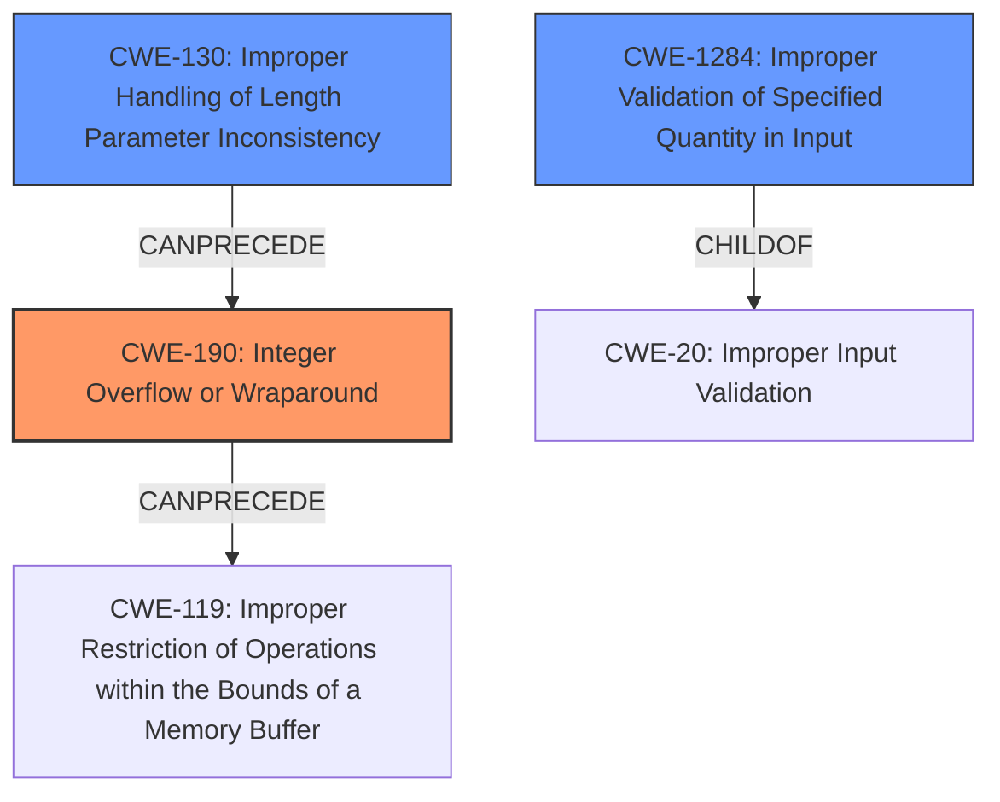

# Final Resolution for CVE-2021-31401

# Summary
| CWE ID | CWE Name | Confidence | CWE Abstraction Level | CWE Vulnerability Mapping Label | CWE-Vulnerability Mapping Notes |
|---|---|---|---|---|---|
| CWE-190 | Integer Overflow or Wraparound | 0.9 | Base | Primary | Allowed |
| CWE-1284 | Improper Validation of Specified Quantity in Input | 0.7 | Base | Secondary | Allowed |
| CWE-130 | Improper Handling of Length Parameter Inconsistency | 0.5 | Base | Contributing | Allowed |

## Evidence and Confidence

*   **Confidence Score:** 0.85
*   **Evidence Strength:** HIGH

## Relationship Analysis
The decision was influenced by the following CWE relationships:
  - Parent-child hierarchical relationships: CWE-1284 is a child of CWE-20 (Improper Input Validation). This reinforces the idea that the lack of input validation is a contributing factor.
  - Chain relationships: CWE-130 CanPrecede CWE-190, since an inconsistent length parameter could lead to an integer overflow. CWE-190 CanPrecede CWE-119, potentially leading to out-of-bounds access.
  - Abstraction levels: All selected CWEs are at the Base level, which is preferred for root causes.

## Vulnerability Chain
The vulnerability chain starts with:
  - **Root Cause:** Crafted IP packet with an inconsistent total length field.
  - **Weakness 1:** CWE-130 (Improper Handling of Length Parameter Inconsistency) - The code does not properly handle the inconsistent length field.
  - **Weakness 2:** CWE-1284 (Improper Validation of Specified Quantity in Input) - The code does not validate the IP packet length.
  - **Weakness 3:** CWE-190 (**Integer Overflow** or Wraparound) - Calculating the IP data length results in an **integer overflow**.
  - **Potential Impact:** CWE-119 (Improper Restriction of Operations within the Bounds of a Memory Buffer) - This could lead to out-of-bounds memory access.

## Summary of Analysis
The initial analysis correctly identified CWE-190 (**Integer Overflow** or Wraparound) as the primary **weakness**. The vulnerability description clearly states that "an **integer overflow** occurs" due to the lack of sanitization of the IP total length field. The `CVE Reference Links Content Summary` also corroborates this.

The criticism suggested expanding the chain and considering CWE-130 (Improper Handling of Length Parameter Inconsistency). The input mentions that the "TCP header processing code doesnt sanitize the value of the IP total length field... With a crafted IP packet, an integer overflow occurs whenever the value of the IP data length is calculated...". This means CWE-130 is a plausible candidate because a crafted IP packet with an inconsistent total length field directly leads to the **integer overflow**.

I am including CWE-130 because the code doesn't properly handle the length inconsistency introduced by the crafted packet, which then leads to the **integer overflow**. This is a more complete picture of the vulnerability chain.

My assessment is primarily based on the provided evidence from the vulnerability description and CVE references. The graph relationships influenced my decision by highlighting the potential chain of events, starting with the inconsistent length field and leading to the **integer overflow**. The selected CWEs are at the optimal level of specificity (Base level) for representing the **root causes** of the vulnerability.