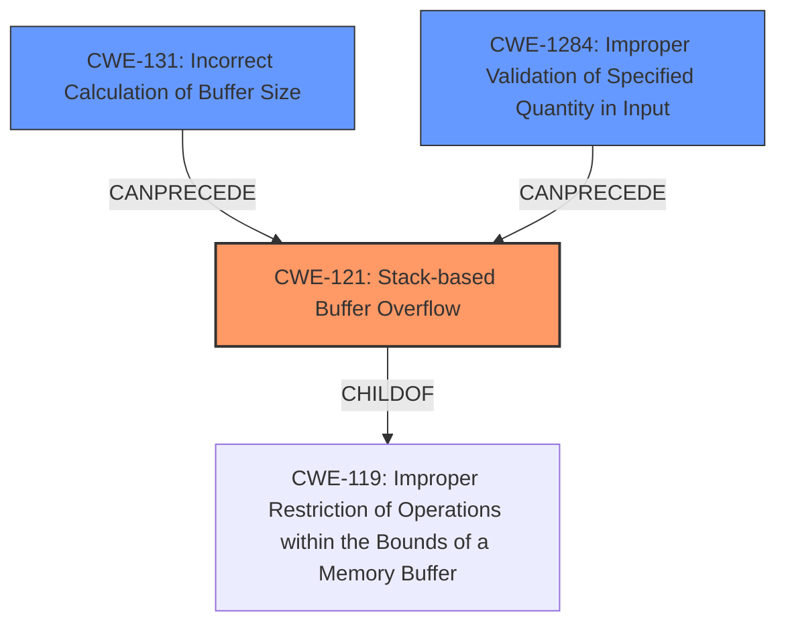

# Final Resolution for CVE-2021-31578

# Summary
| CWE ID | CWE Name | Confidence | CWE Abstraction Level | CWE Vulnerability Mapping Label | CWE-Vulnerability Mapping Notes |
|---|---|---|---|---|---|
| CWE-121 | Stack-based Buffer Overflow | 0.9 | Variant | Allowed | Primary CWE. Consider return address overwrites or function pointer overwrites. Mitigations include compiler-based overflow detection (/GS flag, FORTIFY_SOURCE). Potentially part of a chain originating from CWE-131 or CWE-1284. |
| CWE-131 | Incorrect Calculation of Buffer Size | 0.6 | Base | Allowed | Secondary Candidate. Could be caused by simple math errors, or expansion transformations. Mitigations include careful numeric representation and sufficient memory allocation. |
| CWE-1284 | Improper Validation of Specified Quantity in Input | 0.4 | Base | Allowed | Secondary Candidate. Input size or length might not be validated. Mitigations include an "accept known good" input validation strategy. |

## Evidence and Confidence

*   **Confidence Score:** 0.9
*   **Evidence Strength:** MEDIUM

## Relationship Analysis
The primary CWE is CWE-121, which is a variant of CWE-119 (Improper Restriction of Operations within the Bounds of a Memory Buffer). The selection of CWE-121 is influenced by the explicit mention of "stack buffer overflow" in the vulnerability description, providing more specific information than CWE-119. CWE-131 (Incorrect Calculation of Buffer Size) and CWE-1284 (Improper Validation of Specified Quantity in Input) are considered as potential root causes that CanPrecede CWE-121. The abstraction levels of Base (CWE-131, CWE-1284) and Variant (CWE-121) are appropriate for mapping the vulnerability.

## Vulnerability Chain
The vulnerability chain starts with a potential **ROOTCAUSE** of CWE-1284 (Improper Validation of Specified Quantity in Input), where the input size or length is not properly validated. This can lead to CWE-131 (**WEAKNESS** - Incorrect Calculation of Buffer Size), where the buffer size is incorrectly calculated due to the lack of proper validation. Finally, this results in CWE-121 (**WEAKNESS** - Stack-based Buffer Overflow), where a buffer on the stack is overflowed due to the incorrect size calculation. The impact is a possible escalation of privilege, allowing a proximal attacker to gain unauthorized access without needing additional execution privileges.

## Summary of Analysis
The analysis is based on the vulnerability description provided, which explicitly states a "stack buffer overflow." This direct evidence leads to the selection of CWE-121 (Stack-based Buffer Overflow) as the primary CWE with high confidence (0.9). The retriever scores also support this choice.

The relationship analysis influenced the selection by considering CWE-119 (Improper Restriction of Operations within the Bounds of a Memory Buffer) as a parent but opting for the more specific CWE-121 due to the explicit "stack" mention. The analysis also considered potential root causes like CWE-131 and CWE-1284, which could precede CWE-121 in a vulnerability chain.

The selected CWEs are at the optimal level of specificity. CWE-121 is a Variant, which is a preferred level of abstraction. CWE-131 and CWE-1284 are at the Base level, which is also a preferred level. The mapping guidance for these CWEs allows their use.

The criticism provided was used to improve the analysis by:
- Suggesting more potential causes of incorrect calculation of buffer sizes such as: simple math errors, or incorrectly updating parallel counters.
- Adding more potential causes of incorrect calculation such as: simple math errors, or incorrectly updating parallel counters.
- Detailing the potential chain of events that leads from the root cause (CWE-1284) to the eventual impact (CWE-121).
- Including mitigations for each of the identified CWEs.

The evidence is based on the vulnerability description: "In Boa, there is a possible escalation of privilege due to a stack buffer overflow."