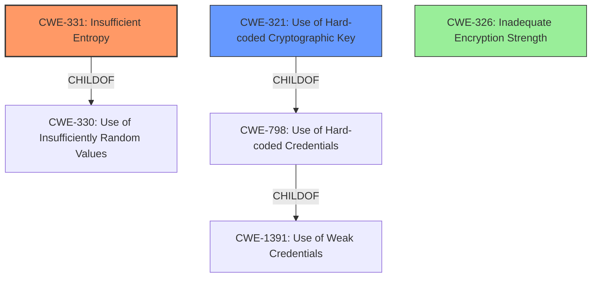

# Analysis Report for CVE-2021-31798

# Vulnerability Analysis Report: CVE-2021-31798

## Description

The effective key space used to encrypt the cache in CyberArk Credential Provider prior to 12.1 has low entropy, and under certain conditions a local malicious user can obtain the plaintext of cache files.

## Vulnerability Description Key Phrases

**Weakness:** low entropy encryption
**Impact:** obtain plaintext of cache files
**Attacker:** local malicious user
**Product:** CyberArk Credential Provider
**Version:** prior to 12.1

## Analysis (with Relationship Data)

# Summary
| CWE ID | CWE Name | Confidence | CWE Abstraction Level | CWE Vulnerability Mapping Label | CWE-Vulnerability Mapping Notes |
|---|---|---|---|---|---|
| CWE-331 | Insufficient Entropy | 0.95 | Base | Allowed | Primary CWE |
| CWE-321 | Use of Hard-coded Cryptographic Key | 0.75 | Variant | Allowed | Secondary Candidate |

## Evidence and Confidence

*   **Confidence Score:** 0.90
*   **Evidence Strength:** HIGH

- **Analysis and Justification:**  
  - *Explanation:* The vulnerability description and CVE reference links explicitly state that the **low entropy** of the key space used for encryption is the root cause. The key derivation process uses application type, credential provider username, and two **hard-coded** byte sequences. The limited number of application types and lack of entropy in the username drastically reduces the effective key space, making brute-force attacks feasible. This aligns directly with CWE-331 (Insufficient Entropy). The CVE also lists CWE-326 (Inadequate Encryption Strength); however, CWE-331 is a more precise cause of the encryption weakness. The **hard-coded** byte sequences also relate to CWE-321 (Use of Hard-coded Cryptographic Key), but the primary issue is the insufficient entropy rather than the fact that part of the key is hardcoded.
  
  - *Relationship Analysis:* CWE-331 is a Base level CWE, which is the preferred abstraction level. There are no direct relationships to consider for CWE-331. CWE-321 is a child of CWE-798 (Use of Hard-coded Credentials).

- **Confidence Score:**  
  - *Example:* Confidence: 0.95 (High evidence from technical description and CVE reference materials directly pointing to insufficient entropy)

---

## Criticism of Analysis

Okay, here's a review of the analysis, considering the full CWE specifications provided:

**Overall Assessment:**

The analysis is generally good, particularly the primary CWE mapping to CWE-331 (Insufficient Entropy). The reasoning is clear, and the provided evidence supports the choice.  The inclusion of CWE-321 (Use of Hard-coded Cryptographic Key) as a secondary candidate is also justified, although the analysis correctly prioritizes the entropy issue.

**Detailed Review:**

*   **CWE-331: Insufficient Entropy (Primary CWE)**

    *   **Confidence:** The confidence score of 0.95 is appropriate, given the explicit mentions of "low entropy" and the description of how the key space is reduced due to predictable inputs.
    *   **Abstraction Level:** Correctly identified as a Base level CWE, which is preferred.
    *   **Mapping Guidance:** The analysis correctly acknowledges that CWE-331 is at the Base level, fitting the stated mapping guidance.
    *   **Relationship Analysis:**  Appropriately identifies that CWE-331 is a child of CWE-330.  While CWE-330 is a Class and therefore generally discouraged for direct mapping, in this case, the lower level CWE-331 is a very specific and accurate depiction of the vulnerability, and therefore appropriate to select as the primary cause.
    *   **Mitigation:** The analysis could be improved by mentioning the potential mitigations from the CWE specification.  The primary mitigation is "Determine the necessary entropy to adequately provide for randomness and predictability. This can be achieved by increasing the number of bits of objects such as keys and seeds."  This directly addresses the root cause.

*   **CWE-321: Use of Hard-coded Cryptographic Key (Secondary Candidate)**

    *   **Confidence:** The confidence score of 0.75 is also reasonable. The analysis acknowledges that the hard-coded byte sequences contribute to the overall weakness but are not the *primary* driver.
    *   **Abstraction Level:** Correctly identified as a Variant level CWE.
    *   **Mapping Guidance:** The analysis correctly uses the allowed mapping guidance.
    *   **Relationship Analysis:**  Correctly identifies that CWE-321 is a child of CWE-798.  Also note that CWE-798 is a child of CWE-1391 (Use of Weak Credentials), and CWE-321 is a specific type of weak credential, making this a valid connection.
    *   **Mitigation:** The analysis could be improved by mentioning the potential mitigations from the CWE specification. The primary mitigation is "Prevention schemes mirror that of hard-coded password storage."

**Suggestions for Improvement:**

1.  **Include CWE-326 in Discussion:** Even though it's not the primary mapping, discuss why CWE-326 (Inadequate Encryption Strength) is *less* appropriate than CWE-331. This addresses the CVE's inclusion of CWE-326. The reason is that CWE-326 is a *consequence* of the low entropy; it's a broader category.
2.  **Explicitly Address Alternatives:** Briefly discuss why other potentially relevant CWEs from the Retriever Results are *not* the best fit. For example:
    *   **CWE-1240 (Use of a Cryptographic Primitive with a Risky Implementation):** This *could* be considered if the SHA1 algorithm itself was deemed broken (which isn't the core issue here; SHA1 is being weakened by the low entropy inputs).  Focus on the *entropy* problem rather than the choice of SHA1.
    *   **CWE-330 (Use of Insufficiently Random Values):** While related, CWE-331 is more specific and accurate. The problem isn't just a lack of random values; it's specifically a lack of *entropy*.
3.  **Expand Mitigation Discussion:** Include brief mentions of the potential mitigations suggested by the CWE specifications for both CWE-331 and CWE-321. This demonstrates a deeper understanding of the vulnerability and how to address it.
4. **Clarify usage of SHA1:** The description mentions that SHA1 hashes are used in the process. It would be helpful to clarify if SHA1 is the algorithm used for encryption itself (which would be a red flag) or if it is used in the key derivation process. If it's only for key derivation, the issue is more with the entropy of the inputs to SHA1 rather than SHA1 itself. If SHA1 *is* the encryption algorithm, this would also fall under CWE-327 (Use of a Broken or Risky Cryptographic Algorithm).

**Revised Summary Table (Incorporating Suggestions):**

| CWE ID | CWE Name | Confidence | CWE Abstraction Level | CWE Vulnerability Mapping Label | CWE-Vulnerability Mapping Notes |
|---|---|---|---|---|---|
| CWE-331 | Insufficient Entropy | 0.95 | Base | Allowed | Primary CWE. Mitigation: Increase entropy of key generation. |
| CWE-321 | Use of Hard-coded Cryptographic Key | 0.75 | Variant | Allowed | Secondary Candidate. Mitigation: Avoid hard-coding keys. |
| CWE-326 | Inadequate Encryption Strength | 0.25 | Class | Discarded | The vulnerability is not that the encryption algorithm is fundamentally broken, but instead that the key space is too small due to insufficient entropy, making the encryption easily brute-forceable. |

By incorporating these suggestions, the analysis becomes even more robust and demonstrates a more comprehensive understanding of the CWE framework and the specific vulnerability.

## Final Resolution

# Summary
| CWE ID | CWE Name | Confidence | CWE Abstraction Level | CWE Vulnerability Mapping Label | CWE-Vulnerability Mapping Notes |
|---|---|---|---|---|---|
| CWE-331 | Insufficient Entropy | 0.95 | Base | Allowed | Primary CWE. Mitigation: Increase entropy of key generation. |
| CWE-321 | Use of Hard-coded Cryptographic Key | 0.75 | Variant | Allowed | Secondary Candidate. Mitigation: Avoid hard-coding keys. |
| CWE-326 | Inadequate Encryption Strength | 0.25 | Class | Discouraged | The vulnerability is not that the encryption algorithm is fundamentally broken, but instead that the key space is too small due to insufficient entropy, making the encryption easily brute-forceable. |

## Evidence and Confidence

*   **Confidence Score:** 0.95
*   **Evidence Strength:** HIGH

## Relationship Analysis
The primary relationship influencing the decision is the hierarchical relationship. CWE-331 (**Insufficient Entropy**) is a base CWE, while CWE-330 (**Use of Insufficiently Random Values**) is a class CWE, and CWE-331 is a child of CWE-330. Using the base CWE provides a more specific identification of the **weakness**. CWE-321 (**Use of Hard-coded Cryptographic Key**) is a variant CWE, a child of CWE-798 (**Use of Hard-coded Credentials**), which is a child of CWE-1391 (**Use of Weak Credentials**). While the hard-coded key contributes, the lack of entropy is the more significant factor.

## Vulnerability Chain
The vulnerability chain starts with **insufficient entropy** in the key space (CWE-331). This leads to a small, predictable key space. The use of **hard-coded** byte sequences (CWE-321) exacerbates this issue. The ultimate impact is **inadequate encryption strength** (CWE-326), which allows a local malicious user to obtain the plaintext of cache files.

CWE-331 (Insufficient Entropy) -> CWE-321 (Use of Hard-coded Cryptographic Key) -> CWE-326 (Inadequate Encryption Strength) -> Data Exposure

## Summary of Analysis
The analysis correctly identified CWE-331 (**Insufficient Entropy**) as the primary **root cause**, which aligns directly with the vulnerability description's mention of "low entropy". The inclusion of CWE-321 (**Use of Hard-coded Cryptographic Key**) as a secondary factor is also valid, as the **hard-coded** values contribute to the reduced key space.

The criticism was helpful in suggesting a discussion of CWE-326 (**Inadequate Encryption Strength**) to explain why it's not the primary mapping. CWE-326 is a consequence of the **low entropy**, not the **root cause**. Addressing alternative CWEs such as CWE-1240 (**Use of a Cryptographic Primitive with a Risky Implementation**) and CWE-330 (**Use of Insufficiently Random Values**) further strengthens the analysis.

The final decision is based on the evidence from the vulnerability description, the relationships between CWEs, and the mapping guidance provided by MITRE. The selected CWEs are at the optimal level of specificity, with CWE-331 being a base CWE that directly addresses the **root cause** of the **insufficient entropy**.

*Report generated on 2025-03-16 23:52:16*
