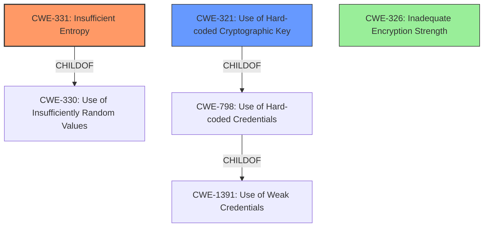

# Final Resolution for CVE-2021-31798

# Summary
| CWE ID | CWE Name | Confidence | CWE Abstraction Level | CWE Vulnerability Mapping Label | CWE-Vulnerability Mapping Notes |
|---|---|---|---|---|---|
| CWE-331 | Insufficient Entropy | 0.95 | Base | Allowed | Primary CWE. Mitigation: Increase entropy of key generation. |
| CWE-321 | Use of Hard-coded Cryptographic Key | 0.75 | Variant | Allowed | Secondary Candidate. Mitigation: Avoid hard-coding keys. |
| CWE-326 | Inadequate Encryption Strength | 0.25 | Class | Discouraged | The vulnerability is not that the encryption algorithm is fundamentally broken, but instead that the key space is too small due to insufficient entropy, making the encryption easily brute-forceable. |

## Evidence and Confidence

*   **Confidence Score:** 0.95
*   **Evidence Strength:** HIGH

## Relationship Analysis
The primary relationship influencing the decision is the hierarchical relationship. CWE-331 (**Insufficient Entropy**) is a base CWE, while CWE-330 (**Use of Insufficiently Random Values**) is a class CWE, and CWE-331 is a child of CWE-330. Using the base CWE provides a more specific identification of the **weakness**. CWE-321 (**Use of Hard-coded Cryptographic Key**) is a variant CWE, a child of CWE-798 (**Use of Hard-coded Credentials**), which is a child of CWE-1391 (**Use of Weak Credentials**). While the hard-coded key contributes, the lack of entropy is the more significant factor.

## Vulnerability Chain
The vulnerability chain starts with **insufficient entropy** in the key space (CWE-331). This leads to a small, predictable key space. The use of **hard-coded** byte sequences (CWE-321) exacerbates this issue. The ultimate impact is **inadequate encryption strength** (CWE-326), which allows a local malicious user to obtain the plaintext of cache files.

CWE-331 (Insufficient Entropy) -> CWE-321 (Use of Hard-coded Cryptographic Key) -> CWE-326 (Inadequate Encryption Strength) -> Data Exposure

## Summary of Analysis
The analysis correctly identified CWE-331 (**Insufficient Entropy**) as the primary **root cause**, which aligns directly with the vulnerability description's mention of "low entropy". The inclusion of CWE-321 (**Use of Hard-coded Cryptographic Key**) as a secondary factor is also valid, as the **hard-coded** values contribute to the reduced key space.

The criticism was helpful in suggesting a discussion of CWE-326 (**Inadequate Encryption Strength**) to explain why it's not the primary mapping. CWE-326 is a consequence of the **low entropy**, not the **root cause**. Addressing alternative CWEs such as CWE-1240 (**Use of a Cryptographic Primitive with a Risky Implementation**) and CWE-330 (**Use of Insufficiently Random Values**) further strengthens the analysis.

The final decision is based on the evidence from the vulnerability description, the relationships between CWEs, and the mapping guidance provided by MITRE. The selected CWEs are at the optimal level of specificity, with CWE-331 being a base CWE that directly addresses the **root cause** of the **insufficient entropy**.