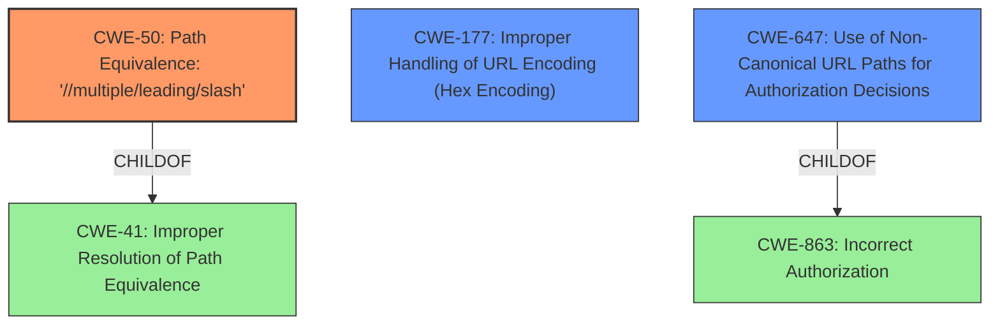

# Final Resolution for CVE-2021-31920

# Summary
| CWE ID | CWE Name | Confidence | CWE Abstraction Level | CWE Vulnerability Mapping Label | CWE-Vulnerability Mapping Notes |
|---|---|---|---|---|---|
| CWE-50 | Path Equivalence: '//multiple/leading/slash' | 0.90 | Variant | Allowed | Primary CWE |
| CWE-177 | Improper Handling of URL Encoding (Hex Encoding) | 0.75 | Variant | Allowed | Secondary Candidate |
| CWE-647 | Use of Non-Canonical URL Paths for Authorization Decisions | 0.70 | Variant | Allowed | Secondary Candidate |

## Evidence and Confidence

*   **Confidence Score:** 0.85
*   **Evidence Strength:** HIGH

## Relationship Analysis
The decision-making process was significantly influenced by understanding the relationships between the candidate CWEs. CWE-50 is a specific variant addressing multiple leading slashes, making it a more precise fit than its parent, CWE-41. CWE-647, a variant focused on non-canonical URLs in authorization, directly addresses the authorization bypass aspect of the vulnerability, offering a more targeted classification than the broader CWE-863. CWE-177 identifies that the Istio component fails to decode or normalize URL-encoded characters before authorization decisions. These relationships helped refine the selection to CWEs at the optimal level of specificity.

## Vulnerability Chain
The vulnerability chain starts with **improper input handling (CWE-50 and CWE-177)**, where the system fails to normalize or decode the URL path. This leads to the path not being correctly recognized by the authorization mechanism. As a result, the authorization check is bypassed (**CWE-647**), granting unauthorized access. The root cause is the **failure to canonicalize the URL path**, and the impact is an authorization bypass.

## Summary of Analysis
The initial analysis provided a solid foundation, but the criticism highlighted key areas for improvement, particularly regarding the specificity of CWE selections.

The vulnerability description explicitly mentions "HTTP request path with multiple slashes or escaped slash characters (%2F or %5C) could potentially bypass an Istio authorization policy when path based authorization rules are used." This statement directly supports the selection of CWE-50 as the primary **WEAKNESS**, as it precisely describes the mishandling of multiple slashes. It also supports the selection of CWE-177 due to the mention of escaped slash characters, such as %2F or %5C.

The criticism's suggestion to consider CWE-647 was particularly insightful. The description of CWE-647, "The product defines policy namespaces and makes authorization decisions based on the assumption that a URL is canonical. This can allow a non-canonical URL to bypass the authorization," aligns very closely with the vulnerability, making it a strong secondary CWE.

The original selection of CWE-41, while technically related, was deemed less specific and less directly relevant to the authorization bypass aspect of the vulnerability. Therefore, it was replaced with CWE-647, which more accurately reflects the **ROOTCAUSE**.

The final classification reflects the optimal level of specificity by focusing on the most direct causes of the vulnerability, namely the mishandling of multiple slashes (**CWE-50**), improper URL encoding (**CWE-177**), and the use of non-canonical URLs in authorization decisions (**CWE-647**).