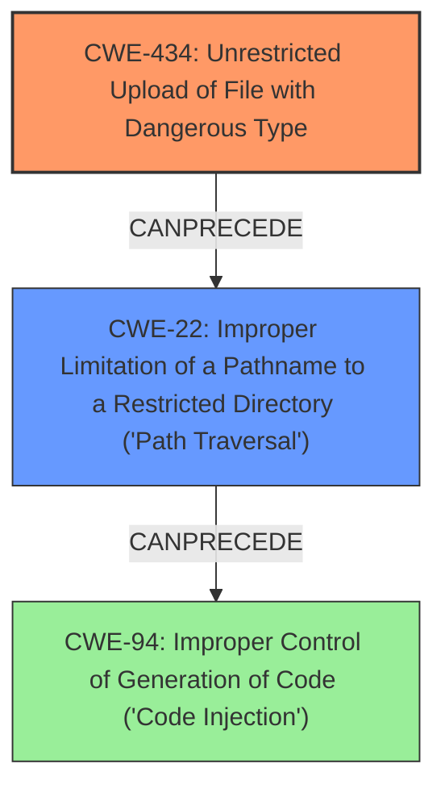

# Analysis Report for CVE-2021-31933

# Vulnerability Analysis Report: CVE-2021-31933

## Description

A remote code execution vulnerability exists in Chamilo through 1.11.14 due to improper input sanitization of a parameter used for file uploads, and improper file-extension filtering for certain filenames (e.g., .phar or .pht). A remote authenticated administrator is able to upload a file containing arbitrary PHP code into specific directories via main/inc/lib/fileUpload.lib.php directory traversal to achieve PHP code execution.

## Vulnerability Description Key Phrases

**Rootcause:** improper input sanitization
**Impact:** remote code execution
**Vector:** directory traversal
**Attacker:** remote authenticated administrator
**Product:** Chamilo
**Version:** through 1.11.14
**Component:** main/inc/lib/fileUpload.lib.php

## Analysis (with Relationship Data)

# Summary
| CWE ID | CWE Name | Confidence | CWE Abstraction Level | CWE Vulnerability Mapping Label | CWE-Vulnerability Mapping Notes |
|---|---|---|---|---|---|
| CWE-434 | Unrestricted Upload of File with Dangerous Type | 0.95 | Base | Allowed | Primary CWE |
| CWE-22 | Improper Limitation of a Pathname to a Restricted Directory ('Path Traversal') | 0.85 | Base | Allowed | Secondary Candidate |
| CWE-94 | Improper Control of Generation of Code ('Code Injection') | 0.75 | Base | Allowed-with-Review | Secondary Candidate |

## Evidence and Confidence

*   **Confidence Score:** 0.9
*   **Evidence Strength:** HIGH

- **Analysis and Justification:**
  - *Explanation:* The primary weakness is the **unrestricted upload of a file with a dangerous type** (CWE-434). The vulnerability description states that there is **improper input sanitization** of a parameter used for file uploads and **improper file-extension filtering**, which allows an authenticated administrator to upload a file containing arbitrary PHP code. The "CVE Reference Links Content Summary" confirms this, mentioning that uploaded files were not sufficiently validated, potentially leading to malicious code execution. This aligns perfectly with CWE-434, which describes allowing the upload of dangerous file types that are automatically processed. The usage is ALLOWED, and it's a Base level of abstraction, as preferred.

  - *Relationship Analysis:* The vulnerability also involves **path traversal** (CWE-22), as the administrator can upload the file into specific directories via directory traversal. Additionally, the ability to upload arbitrary PHP code directly relates to **code injection** (CWE-94). CWE-434 can precede weaknesses like CWE-73 (External Control of File Name or Path), as an attacker might control the filename and path to exploit other vulnerabilities after the file upload.

- **Confidence Score:**
  - Confidence: 0.95 (Strong evidence from the vulnerability description and CVE reference materials directly supports CWE-434 as the primary weakness).

---
- **Analysis and Justification:**
  - *Explanation:* The vulnerability description mentions directory traversal to achieve PHP code execution. The "CVE Reference Links Content Summary" also specifies that the file upload functionality lacked proper validation of the destination path, which could lead to path traversal attacks (CWE-22), allowing attackers to write files outside the intended directory. This directly aligns with the description of CWE-22, which involves using external input to construct a pathname outside of a restricted directory. The "Mitigation/Fixes" section mentions that path validation was added using `Security::check_abs_path`.
  - *Relationship Analysis:* CWE-22 is related to other path-related weaknesses like CWE-23 (Relative Path Traversal). It can precede weaknesses such as CWE-73 (External Control of File Name or Path), where control over the file path can lead to further exploitation.

- **Confidence Score:**
  - Confidence: 0.85 (The evidence supports CWE-22 as a secondary contributing factor, although the primary issue is the dangerous file upload).
---
- **Analysis and Justification:**
  - *Explanation:* The vulnerability allows for the upload of arbitrary PHP code, which, when executed, leads to code injection (CWE-94). The "CVE Reference Links Content Summary" highlights the arbitrary code execution weakness and the ability to upload malicious PHP files. While the root cause is **improper input sanitization** and **improper file-extension filtering**, the end result is the execution of injected code.
  - *Relationship Analysis:* CWE-94 is a parent of CWE-95 (Improper Neutralization of Directives in Dynamically Evaluated Code ('Eval Injection')) and CWE-96 (Improper Neutralization of Directives in Statically Saved Code ('Static Code Injection')). In this case, the injected code is statically saved, making CWE-96 a more specific variant but the initial injection point begins with code injection. The MITRE mapping guidance for CWE-94 suggests reviewing the usage, as it's frequently misused. In this case, the vulnerability leads to code execution, and since we identified the root cause as CWE-434 and CWE-22, CWE-94 should be considered as a contributing factor.

- **Confidence Score:**
  - Confidence: 0.75 (The evidence supports CWE-94 as a consequence of the initial vulnerability related to unrestricted file upload.)

## Criticism of Analysis

Okay, here's a detailed critique of the CWE analysis provided, incorporating the full CWE specifications:

**Overall Assessment:**

The analysis is generally good and identifies the key weaknesses contributing to the vulnerability.  The primary CWE assignment of CWE-434 is accurate and well-supported. The secondary CWEs, CWE-22 and CWE-94, are also relevant contributing factors. The analysis includes clear justifications and confidence scores. However, there are some minor areas for improvement.

**Detailed Breakdown:**

**1. CWE-434: Unrestricted Upload of File with Dangerous Type**

*   **Assessment:** Excellent choice as the primary CWE. The vulnerability description clearly aligns with the core definition of CWE-434: "The product allows the upload or transfer of dangerous file types that are automatically processed within its environment." The analysis correctly emphasizes the insufficient input sanitization and file extension filtering. The example CVEs provided are also relevant.
*   **Mapping Guidance:** The analysis correctly notes that CWE-434 is a Base-level CWE, which is preferred, and the provided rationale is sound.
*   **Potential Mitigations:** The analysis could be strengthened by explicitly mentioning some of the mitigations suggested in the CWE specification:
    *   Generating a new, unique filename for uploaded files (Mitigation 1).  This would help prevent attackers from controlling the name of the file, which could be used to bypass other security checks or exploit other vulnerabilities.
    *   Storing uploaded files outside the web document root (Mitigation 3). This prevents direct execution of uploaded files.
    *   Enforcement by conversion (Mitigation 2).

*   **Confidence Level:** 0.95 is appropriate, given the strong evidence.
*  **Overall CWE-434 rating:** correct.

**2. CWE-22: Improper Limitation of a Pathname to a Restricted Directory ('Path Traversal')**

*   **Assessment:** The analysis correctly identifies path traversal as a secondary factor. The attacker's ability to upload files into specific directories through directory traversal reinforces this. The analysis also rightly points out that the fix included `Security::check_abs_path`.
*   **Mapping Guidance:** Aligns well with the Base level of abstraction guidance.
*   **Potential Mitigations:** The analysis should emphasize these mitigations from the CWE specification:
    *   Stringent allowlists for filenames (Mitigation 1).
    *   Using a built-in path canonicalization function (Mitigation 3, `realpath()` in PHP).
*   **Relationship Analysis:** The analysis correctly identifies relationships to CWE-23 and CWE-73.
*   **Confidence Level:** 0.85 is appropriate.
*   **Overall CWE-22 rating:** Correct.

**3. CWE-94: Improper Control of Generation of Code ('Code Injection')**

*   **Assessment:** The analysis identifies that the unrestricted upload of PHP code directly results in code injection. The rationale for including it is reasonable, but it's important to emphasize that CWE-94 is *not* the *root cause* here.
*   **Mapping Guidance:** The analysis acknowledges the "Allowed-with-Review" usage recommendation and the potential for misuse. It appropriately explains why, despite the code execution, the vulnerability is better characterized by the other CWEs due to its root cause.
*   **Potential Mitigations:** Mentioning potential mitigations would further strengthen the analysis. Since the dynamic generation of code is not strictly necessary, the best mitigation would be refactoring to avoid it (Mitigation 1). The "jail" approach (Mitigation 2) could be mentioned, but it's less relevant given that the core issue is the upload of the code itself, not necessarily how it's executed after that.
* **Static Code Injection (CWE-96):** The initial analysis correctly identifies that the injected code becomes statically saved.
*   **Confidence Level:** 0.75 is appropriate. This is a *consequence* more than a root cause.
*   **Overall CWE-94 rating:** Correct.

**Suggestions for Improvement:**

*   **More Specific Mitigations:** For each CWE, explicitly link the *specific* mitigations from the CWE entry to the vulnerability. This makes the analysis more actionable.
*   **Chaining:** Emphasize the *chaining* aspect more explicitly. The vulnerability isn't just *presenting* multiple CWEs, but that exploiting one leads to another. The attacker uploads (CWE-434), potentially using path traversal (CWE-22), which then *results* in code execution (CWE-94).
*  **More Details:** Add more details for mitigation strategies from the specific CWEs, as the more explicit mitigations for each CWE would improve the value of the analysis.

**Revised Summary Table:**

| CWE ID | CWE Name | Confidence | CWE Abstraction Level | CWE Vulnerability Mapping Label | CWE-Vulnerability Mapping Notes |
|---|---|---|---|---|---|
| CWE-434 | Unrestricted Upload of File with Dangerous Type | 0.95 | Base | Allowed | Primary CWE |
| CWE-22 | Improper Limitation of a Pathname to a Restricted Directory ('Path Traversal') | 0.85 | Base | Allowed | Secondary Candidate |
| CWE-94 | Improper Control of Generation of Code ('Code Injection') | 0.75 | Base | Allowed-with-Review | Consequence of CWE-434 and CWE-22 |

By incorporating these suggestions, the analysis becomes even more complete and provides a clearer understanding of the vulnerability and how to address it effectively.

## Final Resolution

# Summary
| CWE ID | CWE Name | Confidence | CWE Abstraction Level | CWE Vulnerability Mapping Label | CWE-Vulnerability Mapping Notes |
|---|---|---|---|---|---|
| CWE-434 | Unrestricted Upload of File with Dangerous Type | 0.95 | Base | Allowed | Primary CWE |
| CWE-22 | Improper Limitation of a Pathname to a Restricted Directory ('Path Traversal') | 0.85 | Base | Allowed | Secondary Candidate |
| CWE-94 | Improper Control of Generation of Code ('Code Injection') | 0.75 | Base | Allowed-with-Review | Consequence of **CWE-434** and **CWE-22** |

## Evidence and Confidence

*   **Confidence Score:** 0.90
*   **Evidence Strength:** HIGH

## Relationship Analysis
The primary relationship is that **CWE-434** (Unrestricted Upload of File with Dangerous Type) and **CWE-22** (Improper Limitation of a Pathname to a Restricted Directory) can lead to **CWE-94** (Improper Control of Generation of Code ('Code Injection')). **CWE-434** is the root cause, as it allows the initial malicious file upload. **CWE-22** allows the attacker to place the file in a location where it can be executed. **CWE-94** is a consequence of the successful exploitation of these weaknesses. All three CWEs are at the Base level of abstraction, which is appropriate for root cause analysis.

## Vulnerability Chain
The vulnerability chain starts with **CWE-434**, the **unrestricted upload of a file with a dangerous type**. This allows an attacker to upload a file containing malicious code. **CWE-22** comes into play when the attacker uses **path traversal** to place the file in a specific directory where it can be executed. Finally, the execution of the uploaded file leads to **CWE-94**, **code injection**, resulting in arbitrary code execution on the server.

## Summary of Analysis
The initial analysis correctly identified **CWE-434** as the primary weakness, with **CWE-22** and **CWE-94** as contributing factors. The criticism provided useful suggestions for improvement, such as including more specific mitigations and emphasizing the chaining aspect of the vulnerability.

The vulnerability description explicitly states: "A remote code execution vulnerability exists in Chamilo through 1.11.14 due to **improper input sanitization** of a parameter used for file uploads, and **improper file-extension filtering** for certain filenames (e.g., .phar or .pht)." This directly supports the classification of **CWE-434**, as it involves the **unrestricted upload of a file with a dangerous type**.

The graph relationships influenced the final selection by highlighting the sequence of weaknesses. **CWE-434** enables **CWE-22**, which in turn leads to **CWE-94**. This chain of events provides a clear understanding of how the vulnerability can be exploited.

The selected CWEs are at the optimal level of specificity. **CWE-434** is a Base-level CWE that accurately reflects the root cause of the vulnerability. **CWE-22** is also a Base-level CWE that describes the path traversal aspect of the vulnerability. **CWE-94**, while also a Base-level CWE, is a consequence of the other two weaknesses and represents the end result of the exploitation.

*Report generated on 2025-03-16 22:40:26*
