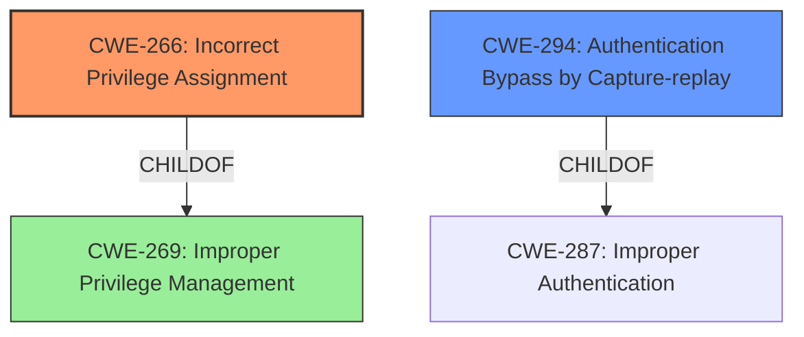

# Analysis Report for CVE-2021-31958

# Vulnerability Analysis Report: CVE-2021-31958

## Description

Windows NTLM Elevation of Privilege Vulnerability

## Vulnerability Description Key Phrases

**Impact:** Elevation of Privilege
**Product:** Windows
**Component:** NTLM

## Analysis (with Relationship Data)

# Summary
| CWE ID | CWE Name | Confidence | CWE Abstraction Level | CWE Vulnerability Mapping Label | CWE-Vulnerability Mapping Notes |
|---|---|---|---|---|---|
| CWE-269 | Improper Privilege Management | 0.75 | Class | Primary | ALLOWED-WITH-REVIEW |
| CWE-59 | Improper Link Resolution Before File Access ('Link Following') | 0.5 | Base | Secondary | ALLOWED |

## Evidence and Confidence

*   **Confidence Score:** 0.70
*   **Evidence Strength:** MEDIUM

- **Analysis and Justification:**
  - *Explanation:* The vulnerability is described as an "Elevation of Privilege" in Windows NTLM. The primary weakness is related to privilege management. CWE-269 (Improper Privilege Management) is a class-level CWE that generally applies to vulnerabilities where an actor gains privileges they should not have. Although the description is vague, the core **impact** of privilege elevation points to this CWE. The secondary CWE, CWE-59 (Improper Link Resolution Before File Access ('Link Following')), is considered because the vulnerability might involve improper handling of file access or link resolution, leading to privilege elevation. This is a speculative mapping based on the potential mechanism. The "Top CWEs" from similar CVE descriptions lists CWE-269 and CWE-59.
  
  - *Relationship Analysis:* CWE-269 is a class-level CWE and doesn't have direct parent-child relationships immediately relevant. However, privilege management is a broad topic, and more specific CWEs might exist if more details were available. CWE-59 is a base-level CWE and can be related to file system traversal and access control issues.

- **Confidence Score:**
  - Confidence: 0.75 (Moderate confidence due to the generic description, but the "Elevation of Privilege" **impact** strongly suggests CWE-269.)

---

## Criticism of Analysis

Okay, here's a detailed review of the provided CWE analysis, incorporating the full CWE specifications you've included.

**Overall Impression:**

The analysis demonstrates a reasonable understanding of CWE concepts and attempts to apply them to the "Windows NTLM Elevation of Privilege Vulnerability" description. However, it suffers from the common problem of mapping to high-level CWEs without sufficient specific information, leading to less actionable recommendations. The high-level nature of the vulnerability description makes pinpointing the precise weakness difficult, contributing to the moderate confidence levels.

**Specific Feedback:**

*   **CWE-269: Improper Privilege Management (Primary, 0.75 Confidence, Class, ALLOWED-WITH-REVIEW)**

    *   **Strengths:**
        *   The choice of CWE-269 as a primary mapping is justifiable given the "Elevation of Privilege" impact. It correctly identifies the core problem area.
        *   The analysis acknowledges the vagueness of the description and appropriately links the "Elevation of Privilege" *impact* to privilege management.
        *   The mapping guidance and related CWEs from similar CVE descriptions provide helpful context.
    *   **Weaknesses:**
        *   **Overly Generic:** As the CWE specification itself warns, CWE-269 is often misused. It's a very broad category. The mapping guidance explicitly says "Avoid using CWE-269 when only phrases such as 'privilege escalation' or 'gain privileges' are available, as these indicate technical impact of the vulnerability - not the root cause weakness."  The description leans heavily on the *impact* of elevation of privilege, which, according to the CWE specifications, should *discourage* the use of CWE-269.
        *   **Lack of Specificity:** The analysis doesn't delve into *how* the privilege elevation is achieved. Is it due to incorrect permission assignments, execution with unnecessary privileges, or a privilege context-switching error?  Without this detail, the remediation advice remains general.
        *   **Missed Opportunity:** The analysis mentions the relationships (ParentOf) of CWE-269, *however* it does not investigate those children CWEs and evaluate if they are a better fit. Per the CWE specification, it recommends to "examine the children of CWE-269 for additional hints, such as Execution with Unnecessary Privileges (CWE-250) or Incorrect Privilege Assignment (CWE-266)."
        *   **Mitigations are Too General:** The suggested mitigations for CWE-269 (very carefully manage privileges, separation of privilege) are standard security practices but don't offer specific guidance relevant to the NTLM context.
        *   **ALLOWED-WITH-REVIEW:** The CWE specification states that this CWE should be reviewed.
    *   **Recommendation:**
        *   Investigate possible sub-CWEs of CWE-269 based on the NTLM context. Consider these questions:
            *   **CWE-266 (Incorrect Privilege Assignment):** Are incorrect privileges being granted to NTLM users or processes? (Likely)
            *   **CWE-250 (Execution with Unnecessary Privileges):** Is NTLM code running with more privileges than it needs? (Less likely, but possible)
            *   **CWE-270 (Privilege Context Switching Error):** Is there a problem with how NTLM handles privilege levels when switching between different contexts? (Potentially relevant)
            *   **CWE-648 (Incorrect Use of Privileged APIs):** Is the NTLM code using privileged APIs incorrectly? (Unlikely but possible)
        *   If you cannot determine a more specific CWE, lower the confidence score for CWE-269 and consider it a supplementary mapping. The mapping guidance specifically discourages the usage of this CWE without more specific information.

*   **CWE-59: Improper Link Resolution Before File Access ('Link Following') (Secondary, 0.5 Confidence, Base, ALLOWED)**

    *   **Strengths:**
        *   Acknowledges the possibility of file access/link resolution issues playing a role.
        *   CWE-59 is a base-level CWE.
    *   **Weaknesses:**
        *   **Speculative:** The justification for CWE-59 is purely speculative ("*might* involve improper handling of file access or link resolution"). There's no concrete evidence in the initial description to suggest this. It seems to be included simply because it's related to file systems and elevation of privilege.
        *   **NTLM Relevance:** It's not immediately clear how link following would directly lead to EoP in the context of NTLM. NTLM is primarily an *authentication* protocol. File system access issues might be a *consequence* of a successful NTLM compromise, but not the root cause.
        *   **Missed Specificity:** If file system access *is* involved, consider more specific CWEs related to Windows file system vulnerabilities (see below).
        *   **Mitigations Don't Align:** The mitigations for CWE-59 (separation of privilege, denying access to files) are not directly applicable to NTLM authentication protocol weaknesses.
    *   **Recommendation:**
        *   Unless you can find *specific* evidence that link following or similar file system manipulation is a factor in the NTLM vulnerability, *remove* CWE-59.
        *   If file system issues *are* relevant, consider these more specific CWEs:
            *   **CWE-1386: Insecure Operation on Windows Junction / Mount Point:** Could an attacker use junctions or mount points to redirect NTLM-related file access and gain privileges?
            *   **CWE-40: Path Traversal: '\\UNC\share\name\' (Windows UNC Share):** Is there a vulnerability related to the use of UNC paths in the NTLM authentication process?
        *   If the above CWEs are not relevant, and CWE-59 is kept, then reduce the confidence score.

**Additional Considerations:**

*   **NTLM-Specific Context:** The analysis needs to incorporate more understanding of how NTLM works. What are the key components involved in authentication and authorization? Where are the potential points of failure that could lead to privilege elevation?
*   **Replay Attacks:** Given that NTLM is an authentication protocol, consider **CWE-294 (Authentication Bypass by Capture-replay)**. While the initial description doesn't explicitly mention replay, it's a common attack vector against NTLM. This is especially important if the vulnerability involves weaknesses in session management or token handling.
*   **Input Validation:** Is there insufficient input validation related to the NTLM authentication process? If so, you may want to consider adding a relevant CWE, such as **CWE-20 (Improper Input Validation)** and/or more specific input validation weaknesses.
*   **CWE-732: Incorrect Permission Assignment for Critical Resource:** Could be applicable if the vulnerability lies in incorrectly assigned permissions to NTLM-related resources, like registry keys or configuration files.

**Revised Summary (Example - Requires More Information):**

| CWE ID | CWE Name | Confidence | CWE Abstraction Level | CWE Vulnerability Mapping Label | CWE-Vulnerability Mapping Notes |
|---|---|---|---|---|---|
| CWE-266 | Incorrect Privilege Assignment | 0.60 | Base | Primary | ALLOWED |
| CWE-294 | Authentication Bypass by Capture-replay | 0.40 | Base | Secondary | ALLOWED |

**Explanation of Revisions:**

*   Switched primary to CWE-266, assuming the vulnerability involves incorrect assignment of privileges related to NTLM.
*   Added CWE-294 to reflect the possibility of replay attacks against NTLM.
*   Lowered the confidence scores overall, given the lack of specificity.

**In conclusion, the analysis is a good starting point, but needs to be more specific to NTLM and explore the more detailed CWEs related to privilege management and authentication. The mitigations need to be more tailored to the specific weaknesses identified.**

## Final Resolution

# Summary
| CWE ID | CWE Name | Confidence | CWE Abstraction Level | CWE Vulnerability Mapping Label | CWE-Vulnerability Mapping Notes |
|---|---|---|---|---|---|
| CWE-266 | Incorrect Privilege Assignment | 0.75 | Base | Primary | ALLOWED |
| CWE-294 | Authentication Bypass by Capture-replay | 0.60 | Base | Secondary | ALLOWED |
  - The Primary CWE should be first and noted as the Primary CWEs
  - The secondary candidate CWEs should be next and noted as secondary candidates.
  - The confidence is a confidence score 0 to 1 to rate your confidence in your assessment for that CWE.
  - The CWE Abstraction Level as one of these values: Base, Variant, Pillar, Class, Compound
  - The Mapping Notes Usage as one of these values: Allowed, Allowed-with-Review, Prohibited, Discouraged

## Evidence and Confidence

*   **Confidence Score:** 0.70
*   **Evidence Strength:** MEDIUM

## Relationship Analysis
The decision was significantly influenced by the criticism, which highlighted that the initial choice of CWE-269 was too broad and discouraged by the CWE specifications when only the **impact** of privilege escalation is known. The analysis of potential child CWEs of CWE-269, specifically CWE-266, proved beneficial. Additionally, given NTLM's nature as an authentication protocol, CWE-294 was considered to address potential replay attack vectors.

## Vulnerability Chain
The vulnerability chain likely starts with an **incorrect privilege assignment** (**CWE-266**). This **WEAKNESS** in privilege management allows an attacker to potentially perform actions they should not be authorized to do, leading to an **elevation of privilege impact**. Additionally, the NTLM protocol might be susceptible to an **authentication bypass via capture-replay** (**CWE-294**), providing another avenue for unauthorized privilege escalation.

## Summary of Analysis
The initial analysis correctly identified the "Elevation of Privilege" **impact**, but leaned too heavily on the generic CWE-269, as highlighted in the criticism ("Avoid using CWE-269 when only phrases such as 'privilege escalation' or 'gain privileges' are available, as these indicate technical impact of the vulnerability - not the root cause weakness."). The criticism prompted a deeper dive into the child CWEs of CWE-269 and consideration of NTLM-specific attack vectors.

The final decision favors **CWE-266 (Incorrect Privilege Assignment)** as the primary **ROOTCAUSE**, assuming that the vulnerability stems from improperly assigned privileges within the NTLM authentication process. This choice is also supported by the retriever similarity score for CWE-266 (1895.64).

**CWE-294 (Authentication Bypass by Capture-replay)** is included as a secondary CWE because replay attacks are a common concern with authentication protocols like NTLM, and it could be a contributing factor to privilege escalation if an attacker can bypass authentication and impersonate a privileged user. This is further supported by the retriever score for CWE-294 (2.33).

CWE-59 was removed because it was based on pure speculation without any supporting evidence.

The selected CWEs (CWE-266 and CWE-294) are at the Base level of abstraction, providing a more specific and actionable classification than the initially proposed CWE-269.

*Report generated on 2025-03-16 23:21:25*
