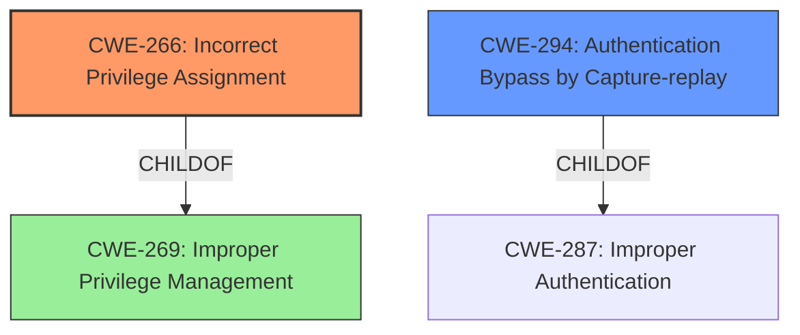

# Final Resolution for CVE-2021-31958

# Summary
| CWE ID | CWE Name | Confidence | CWE Abstraction Level | CWE Vulnerability Mapping Label | CWE-Vulnerability Mapping Notes |
|---|---|---|---|---|---|
| CWE-266 | Incorrect Privilege Assignment | 0.75 | Base | Primary | ALLOWED |
| CWE-294 | Authentication Bypass by Capture-replay | 0.60 | Base | Secondary | ALLOWED |
  - The Primary CWE should be first and noted as the Primary CWEs
  - The secondary candidate CWEs should be next and noted as secondary candidates.
  - The confidence is a confidence score 0 to 1 to rate your confidence in your assessment for that CWE.
  - The CWE Abstraction Level as one of these values: Base, Variant, Pillar, Class, Compound
  - The Mapping Notes Usage as one of these values: Allowed, Allowed-with-Review, Prohibited, Discouraged

## Evidence and Confidence

*   **Confidence Score:** 0.70
*   **Evidence Strength:** MEDIUM

## Relationship Analysis
The decision was significantly influenced by the criticism, which highlighted that the initial choice of CWE-269 was too broad and discouraged by the CWE specifications when only the **impact** of privilege escalation is known. The analysis of potential child CWEs of CWE-269, specifically CWE-266, proved beneficial. Additionally, given NTLM's nature as an authentication protocol, CWE-294 was considered to address potential replay attack vectors.

## Vulnerability Chain
The vulnerability chain likely starts with an **incorrect privilege assignment** (**CWE-266**). This **WEAKNESS** in privilege management allows an attacker to potentially perform actions they should not be authorized to do, leading to an **elevation of privilege impact**. Additionally, the NTLM protocol might be susceptible to an **authentication bypass via capture-replay** (**CWE-294**), providing another avenue for unauthorized privilege escalation.

## Summary of Analysis
The initial analysis correctly identified the "Elevation of Privilege" **impact**, but leaned too heavily on the generic CWE-269, as highlighted in the criticism ("Avoid using CWE-269 when only phrases such as 'privilege escalation' or 'gain privileges' are available, as these indicate technical impact of the vulnerability - not the root cause weakness."). The criticism prompted a deeper dive into the child CWEs of CWE-269 and consideration of NTLM-specific attack vectors.

The final decision favors **CWE-266 (Incorrect Privilege Assignment)** as the primary **ROOTCAUSE**, assuming that the vulnerability stems from improperly assigned privileges within the NTLM authentication process. This choice is also supported by the retriever similarity score for CWE-266 (1895.64).

**CWE-294 (Authentication Bypass by Capture-replay)** is included as a secondary CWE because replay attacks are a common concern with authentication protocols like NTLM, and it could be a contributing factor to privilege escalation if an attacker can bypass authentication and impersonate a privileged user. This is further supported by the retriever score for CWE-294 (2.33).

CWE-59 was removed because it was based on pure speculation without any supporting evidence.

The selected CWEs (CWE-266 and CWE-294) are at the Base level of abstraction, providing a more specific and actionable classification than the initially proposed CWE-269.