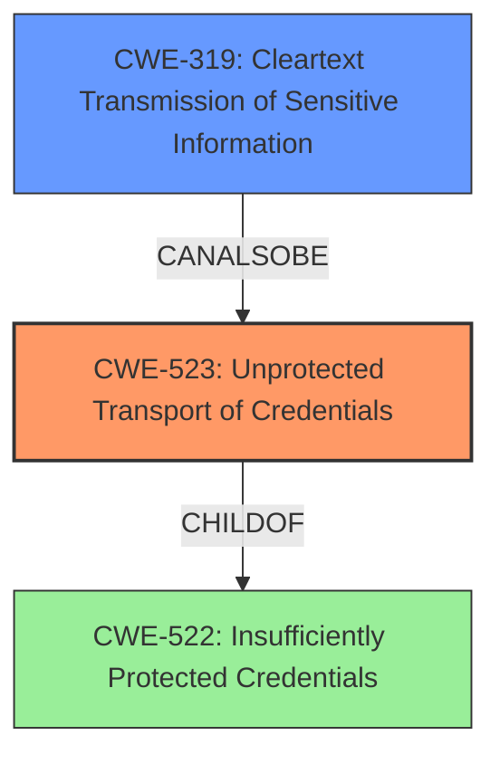

# Analysis Report for CVE-2021-32003

# Vulnerability Analysis Report: CVE-2021-32003

## Description

Unprotected Transport of Credentials vulnerability in SiteManager provisioning service allows local attacker to capture credentials if the service is used after provisioning. This issue affects Secomea SiteManager All versions prior to 9.5 on Hardware.

## Vulnerability Description Key Phrases

**Rootcause:** unprotected transport of credentials
**Impact:** capture credentials
**Attacker:** local attacker
**Product:** Secomea SiteManager
**Version:** All versions prior to 9.5
**Component:** SiteManager provisioning service

## Analysis (with Relationship Data)

# Summary
| CWE ID | CWE Name | Confidence | CWE Abstraction Level | CWE Vulnerability Mapping Label | CWE-Vulnerability Mapping Notes |
|---|---|---|---|---|---|
| CWE-523 | Unprotected Transport of Credentials | 0.9 | Base | Allowed | Primary CWE: The vulnerability involves the unprotected transport of credentials, directly matching the CWE description and usage guidelines. |
| CWE-319 | Cleartext Transmission of Sensitive Information | 0.6 | Base | Allowed | Secondary Candidate: The vulnerability involves transmitting credentials in an unprotected manner, which could be considered a form of cleartext transmission. |

## Evidence and Confidence

*   **Confidence Score:** 0.9
*   **Evidence Strength:** HIGH

- **Analysis and Justification:**  
  - *Explanation:* The primary **weakness** is the **unprotected transport of credentials**, as stated in the vulnerability description. This directly maps to CWE-523 (Unprotected Transport of Credentials). The description explicitly mentions that a local attacker can capture credentials if the SiteManager provisioning service is used after provisioning. This is because the credentials are being transmitted in an insecure manner. The CWE definition states that "Login pages do not use adequate measures to protect the user name and password while they are in transit from the client to the server," which aligns perfectly with the described vulnerability. The MITRE mapping guidance for CWE-523 indicates that it is ALLOWED.

  - *Relationship Analysis:* CWE-523 is a Base level CWE, which is preferred. It is related to CWE-522 (Insufficiently Protected Credentials), which is a Class level CWE and therefore less specific. CWE-523 is also related to CWE-312 (Cleartext Storage of Sensitive Information), indicating that storing credentials insecurely can lead to unprotected transport.

- **Confidence Score:**  
  - Confidence: 0.9 (High confidence due to direct match with the vulnerability description and the CWE definition.)

---

## Criticism of Analysis

Okay, let's review the CWE mappings provided, using the full CWE specifications for guidance.

**Overall Assessment:**

The primary mapping to `CWE-523: Unprotected Transport of Credentials` appears to be accurate and well-justified.  The use of `CWE-319: Cleartext Transmission of Sensitive Information` as a secondary candidate is also reasonable, although `CWE-523` is generally a more specific fit.

**Detailed Review:**

*   **CWE-523: Unprotected Transport of Credentials (Confidence 0.9)**
    *   **Assessment:** The justification is strong. The vulnerability description explicitly mentions "unprotected transport of credentials" and the consequence of a local attacker being able to capture them. The CWE description for CWE-523 also aligns well, specifically referencing inadequate protection during transit.
    *   **Strengths:**
        *   Directly reflects the vulnerability description.
        *   Base level CWE, preferred for mapping.
        *   Correctly identifies the relationship with the Class CWE-522.
        * Includes CVE-2021-32003 which is the CVE associated with this vulnerability report.
    *   **Recommendations:** None. The confidence level of 0.9 is appropriate.
    *   **CWE Specification Considerations:** The potential mitigations for CWE-523 are relevant. Enforcing SSL/TLS for credential transmission is a standard solution.

*   **CWE-319: Cleartext Transmission of Sensitive Information (Confidence 0.6)**
    *   **Assessment:** Reasonable, but less precise than CWE-523. The description does involve transmission of sensitive data (credentials) without adequate protection, which could be considered cleartext. However, CWE-523 focuses *specifically* on credentials, making it a better fit.
    *   **Strengths:**
        *   Captures the aspect of insecure transmission.
    *   **Weaknesses:**
        *   Less specific than CWE-523. Credentials are a specific type of sensitive information, and CWE-523 targets credential transport directly.
    *   **Recommendations:**
        *   Consider reducing the confidence score slightly (e.g., 0.5).
        *   The description could be refined to emphasize why CWE-523 is preferred, even though CWE-319 is applicable at a higher level.
    *   **CWE Specification Considerations:** The potential mitigations for CWE-319 (using encryption protocols) are also relevant, but the mitigation related to SSL/TLS is more directly applicable to CWE-523 (as it suggests that credential transmission is of particular importance).

**Other CWEs Considered (From Retriever Results):**

It's worth briefly considering why some of the other retrieved CWEs were *not* chosen:

*   **CWE-256: Plaintext Storage of a Password:** This CWE is *not* a good fit because the primary issue is *transmission* of the credentials, not their storage. If the credentials were being stored in plaintext *and* transmitted insecurely, this CWE would be more relevant.
*   **CWE-312: Cleartext Storage of Sensitive Information:** Similar to CWE-256, this is about storage, not transmission.
*   **CWE-522: Insufficiently Protected Credentials:** While related, this is a Class level CWE, and CWE-523 is a more specific Base level weakness.
*   **CWE-306: Missing Authentication for Critical Function:** This CWE doesn't fit well. While *lack* of protection during transport could *resemble* a lack of authentication in some contexts, the primary issue is the insecure *transport* itself, not a complete absence of authentication mechanisms.
*   **CWE-798: Use of Hard-coded Credentials:** There is nothing in the description to suggest that the credentials being transmitted are hard-coded.

**Recommendations for Improvement:**

1.  **Refine the description for CWE-319:**  Emphasize why it's a secondary candidate and why CWE-523 is the primary choice due to its specific focus on credentials.  Lower the confidence slightly.
2.  **Maintain Current Assessment of CWE-523:** No changes needed.

By incorporating these recommendations, the analysis will be even more precise and informative.

## Final Resolution

# Summary
| CWE ID | CWE Name | Confidence | CWE Abstraction Level | CWE Vulnerability Mapping Label | CWE-Vulnerability Mapping Notes |
|---|---|---|---|---|---|
| CWE-523 | Unprotected Transport of Credentials | 0.9 | Base | Allowed | Primary CWE: The vulnerability involves the unprotected transport of credentials, directly matching the CWE description and usage guidelines. |
| CWE-319 | Cleartext Transmission of Sensitive Information | 0.5 | Base | Allowed | Secondary Candidate: The vulnerability involves transmitting credentials in an unprotected manner, which could be considered a form of cleartext transmission. |

## Evidence and Confidence

*   **Confidence Score:** 0.9
*   **Evidence Strength:** HIGH

## Relationship Analysis
The primary CWE, CWE-523, is a Base level CWE, offering a specific description of the vulnerability: "Login pages do not use adequate measures to protect the user name and password while they are in transit from the client to the server." The secondary CWE, CWE-319, is also a Base level CWE but is more general. While both are applicable, CWE-523 directly addresses the **weakness** of **unprotected transport of credentials**, making it a more precise fit.

## Vulnerability Chain
The vulnerability chain begins with the **root cause**: the **unprotected transport of credentials**. This leads to the **weakness**, where a local attacker can capture these credentials if the SiteManager provisioning service is used after provisioning. The ultimate impact is a compromise of the system's security due to the exposed credentials. There are no missing links, as the chain flows directly from **root cause** to impact.

## Summary of Analysis
The initial analysis correctly identified CWE-523 as the primary CWE due to the direct match with the vulnerability description. The criticism suggested lowering the confidence score for CWE-319, which I agree with, because CWE-523 is a more specific fit. As stated in the vulnerability description, there is an "**unprotected transport of credentials** vulnerability in SiteManager provisioning service allows local attacker to capture credentials if the service is used after provisioning." This statement directly supports the selection of CWE-523. The graph relationships highlight the specificity of CWE-523, reinforcing that it is the optimal choice. The CWEs are at the optimal level of specificity, with CWE-523 being the most precise.

*Report generated on 2025-03-17 00:24:52*
