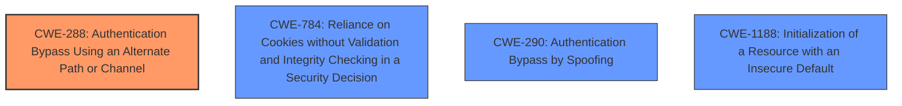

# Analysis Report for CVE-2021-32030

# Vulnerability Analysis Report: CVE-2021-32030

## Description

The administrator application on ASUS GT-AC2900 devices before 3.0.0.4.386.42643 allows authentication bypass when processing remote input from an unauthenticated user, leading to unauthorized access to the administrator interface. This relates to handle_request in router/httpd/httpd.c and auth_check in web_hook.o. An attacker-supplied value of \0 matches the devices default value of \0 in some situations.

## Vulnerability Description Key Phrases

**Rootcause:** auth bypass vulnerability
**Impact:** unauthorized access
**Attacker:** unauthenticated user
**Product:** ASUS GT-AC2900
**Version:** before 3.0.0.4.386.42643
**Component:** administrator application

## Analysis (with Relationship Data)

# Summary
| CWE ID | CWE Name | Confidence | CWE Abstraction Level | CWE Vulnerability Mapping Label | CWE-Vulnerability Mapping Notes |
|---|---|---|---|---|---|
| CWE-288 | Authentication Bypass Using an Alternate Path or Channel | 0.95 | Base | Primary | Allowed |
| CWE-306 | Missing Authentication for Critical Function | 0.70 | Base | Secondary Candidate | Allowed |

## Evidence and Confidence

*   **Confidence Score:** 0.90
*   **Evidence Strength:** HIGH

- **Analysis and Justification:**
  - *Explanation:* The vulnerability description clearly indicates an **authentication bypass** in the ASUS GT-AC2900 router's administrative application. The **root cause** is an insufficient validation of the `asus_token` cookie, allowing an **unauthenticated user** to gain **unauthorized access**. The attacker can bypass authentication by crafting a specific request with a malformed `asus_token` (starting with a null byte). This bypass occurs because the `auth_check` function in `web_hook.o` fails to properly validate the session token if it starts with a null byte, especially when the `ifttt_token` is not set by default and the User-Agent matches an internal service user agent. This aligns precisely with CWE-288, "Authentication Bypass Using an Alternate Path or Channel," as the attacker is using a non-standard path (a malformed token) to bypass the normal authentication process. The MITRE mapping guidance for CWE-288 is ALLOWED, indicating it's an acceptable mapping.

  - *Relationship Analysis:* While CWE-287 (Improper Authentication) is a higher-level class, CWE-288 is a more specific base case. CWE-288 accurately describes the bypass mechanism. Additionally, the reliance on the user-agent could potentially relate to CWE-290 (Authentication Bypass by Spoofing), but the primary issue is the alternate path via the null byte in the token.

- **Confidence Score:**
  - Confidence: 0.95 (High confidence due to detailed technical description of the authentication bypass mechanism.)

---

- **Analysis and Justification:**
  - *Explanation:* CWE-306 (Missing Authentication for Critical Function) is a secondary candidate. The vulnerability can be described as a missing authentication for a critical function, which is the administrative interface. However, CWE-288 is more precise because it highlights the *bypass* mechanism rather than the complete absence of authentication, which is a more accurate depiction of the flaw where a malformed token allows access.

  - *Relationship Analysis:* CWE-306 is a base-level CWE, but CWE-288 provides a more specific explanation of the vulnerability. Both CWE-288 and CWE-306 point to the same fundamental issue: that an attacker can gain unauthorized access to the administrative interface of the router.

- **Confidence Score:**
  - Confidence: 0.70 (Medium confidence as it is a broader description of the core issue)

## Criticism of Analysis

Okay, here's a review of the provided analysis based on the full CWE specifications.

**Overall Assessment:**

The analysis is generally good and well-reasoned. The primary CWE mapping to CWE-288 (Authentication Bypass Using an Alternate Path or Channel) is accurate and well-supported. The secondary candidate, CWE-306 (Missing Authentication for Critical Function), is also relevant, although less specific.

**Detailed Review:**

**1. CWE-288 (Authentication Bypass Using an Alternate Path or Channel)**

*   **Strengths:** The justification for choosing CWE-288 is strong. The explanation accurately reflects the vulnerability details.  The attacker *is* using an "alternate path" – a malformed token starting with a null byte – to bypass the normal authentication procedure. The reference to the `auth_check` function and the `ifttt_token` handling clearly demonstrates the vulnerability's mechanics. The analysis correctly notes that CWE-288 is a more specific base case of the higher-level class CWE-287.
*   **Mapping Guidance Compliance:** The analysis explicitly mentions that the MITRE mapping guidance for CWE-288 is ALLOWED, which is correct.
*   **CWE Specification Alignment:**
    *   **Description:** The vulnerability fits the description: "The product requires authentication, but the product has an alternate path or channel that does not require authentication." The malformed token is the alternate path.
    *   **Relationships:** The analysis correctly notes that CWE-288 is a child of CWE-306 (Missing Authentication) and CWE-284 (Improper Access Control).
    *   **Observed Examples:** The provided examples are generally representative of CWE-288, including vulnerabilities where attackers bypass login screens using special characters or directly accessing privileged URLs.  The known examples of the CWE are similar to the vulnerability at hand.
*   **Potential Mitigations:** While not explicitly discussed in the analysis, the CWE specification provides valuable mitigation advice:
    *   "Funnel all access through a single choke point to simplify how users can access a resource. For every access, perform a check to determine if the user has permissions to access the resource." This is highly relevant.  The `auth_check` function is *intended* to be a choke point, but it's failing due to insufficient validation. Mitigations could include fixing the validation logic in `auth_check` and ensuring all requests pass through it.

**2. CWE-306 (Missing Authentication for Critical Function)**

*   **Strengths:** The analysis acknowledges that CWE-306 is also applicable, as the administrative interface *should* require authentication, but a bypass exists. The explanation is valid but less precise than the CWE-288 mapping.
*   **Mapping Guidance Compliance:** The analysis correctly notes that CWE-306 is a child of CWE-287.
*   **CWE Specification Alignment:**
    *   **Description:**  It aligns with "The product does not perform any authentication for functionality that requires a provable user identity or consumes a significant amount of resources." Although there is *some* authentication, it's effectively bypassed, leading to this condition.
    *   **Relationships:** It's appropriate to consider CWE-306 as a broader perspective of the issue, since CWE-288 is a child of it.
    *   **Observed Examples:** The examples provided in the CWE spec are also relevant to this scenario.
*   **Potential Mitigations:** The CWE specification's mitigations are relevant:
    *   "Divide the software into anonymous, normal, privileged, and administrative areas. Identify which of these areas require a proven user identity, and use a centralized authentication capability."  This emphasizes the need for clear separation and a robust, centralized authentication mechanism.
    *   "Identify all potential communication channels... to ensure that all channels are appropriately protected." This highlights the importance of securing *all* access paths, not just the intended ones. The vulnerability exploits a weakness in the cookie validation channel.

**Additional CWEs to Consider (with lower confidence):**

*   **CWE-290 (Authentication Bypass by Spoofing):** The reliance on the User-Agent string makes it *slightly* relevant.  An attacker is "spoofing" the User-Agent to look like a trusted internal service. However, the primary bypass is the null byte in the token, not the User-Agent. Confidence is low.
*   **CWE-1188 (Initialization of a Resource with an Insecure Default):**  The `ifttt_token` not being set by default contributes to the vulnerability. If it were initialized to a strong, random value, the bypass would be more difficult. This is a supporting factor, not the primary cause. Confidence is medium.
*   **CWE-784 (Reliance on Cookies without Validation and Integrity Checking in a Security Decision):**  This is applicable since the vulnerability stems from inadequate validation of the `asus_token` cookie. The cookie is being used for a security decision (authentication), but its contents are not properly validated or checked for integrity. However, CWE-288 captures the bypass mechanism more directly.
*   **CWE-307 (Improper Restriction of Excessive Authentication Attempts)**: This might be related if the application did not have a proper lockdown on failed authentication attempts. However, as the primary vulnerability here is a bypass, this is of lower importance.

**Recommendations:**

1.  **Explicitly Discuss Mitigations:**  The analysis should briefly mention potential mitigations based on the CWE specifications. This will make the analysis more actionable.  For example, under CWE-288, you could add a sentence about strengthening the `auth_check` function to be the single choke point. Under CWE-1188, it could note initializing the `ifttt_token` with a strong default.
2.  **Re-evaluate CWE-290:** Given the description of the flaw and the user-agent, you could state that the reliance on user-agent is a minor factor, and the primary issue lies in the lack of checking if the token exists.
3.  **Consider CWE-784:** While CWE-288 is a good fit, acknowledge that the root cause also involves reliance on a cookie without proper validation, making CWE-784 relevant.
4.  **Minor Edits:**
    *   In the introduction, mention the role of the user-agent to paint a clearer picture.
    *   Add a note mentioning that the user-agent is easily spoofable, leading to a less secure environment.
5.  **Clarify Confidence Levels:** While high confidence is assigned to CWE-288, consider explicitly stating the reasons for lower confidence in the alternative CWEs.

By incorporating these suggestions, the analysis will be even more comprehensive and useful for understanding and addressing the vulnerability.

## Final Resolution

# Summary
| CWE ID | CWE Name | Confidence | CWE Abstraction Level | CWE Vulnerability Mapping Label | CWE-Vulnerability Mapping Notes |
|---|---|---|---|---|---|
| CWE-288 | Authentication Bypass Using an Alternate Path or Channel | 0.95 | Base | Primary | Allowed |
| CWE-784 | Reliance on Cookies without Validation and Integrity Checking in a Security Decision | 0.70 | Variant | Secondary Candidate | Allowed |
| CWE-290 | Authentication Bypass by Spoofing | 0.30 | Base | Secondary Candidate | Allowed |
| CWE-1188 | Initialization of a Resource with an Insecure Default | 0.30 | Base | Secondary Candidate | Allowed |

## Evidence and Confidence

*   **Confidence Score:** 0.90
*   **Evidence Strength:** HIGH

## Relationship Analysis
The primary CWE is CWE-288, which is a base-level CWE. It has a parent relationship to CWE-306 (Missing Authentication for Critical Function) and CWE-284 (Improper Access Control). CWE-784, CWE-290 and CWE-1188 are considered secondary candidates.

## Vulnerability Chain
The vulnerability chain begins with the **root cause**, which is the insufficient validation of the `asus_token` cookie. This leads to the **weakness** where an **unauthenticated user** can gain **unauthorized access** to the administrator interface by crafting a specific request with a malformed `asus_token` (starting with a null byte). The `auth_check` function fails to properly validate the session token if it starts with a null byte, especially when the `ifttt_token` is not set by default and the User-Agent matches an internal service user agent. This bypass is the **impact**.

## Summary of Analysis
The initial analysis correctly identified CWE-288 as the primary CWE. The criticism provided valuable suggestions for improvement, including considering additional CWEs and explicitly discussing mitigations.

The vulnerability description states: "The administrator application on ASUS GT-AC2900 devices before 3.0.0.4.386.42643 allows **authentication bypass** when processing remote input from an **unauthenticated user**, leading to **unauthorized access** to the administrator interface. This relates to handle_request in router/httpd/httpd.c and auth_check in web_hook.o. An attacker-supplied value of \0 matches the devices default value of \0 in some situations."

Based on this description, the following adjustments are made:

1.  **CWE-784 (Reliance on Cookies without Validation and Integrity Checking in a Security Decision):** Added as a secondary candidate. The vulnerability stems from inadequate validation of the `asus_token` cookie. The cookie is being used for a security decision (authentication), but its contents are not properly validated or checked for integrity.
2.  **CWE-290 (Authentication Bypass by Spoofing):** Retained as a secondary candidate with very low confidence. The reliance on the User-Agent string makes it *slightly* relevant. An attacker is "spoofing" the User-Agent to look like a trusted internal service. However, the primary bypass is the null byte in the token, not the User-Agent.
3.  **CWE-1188 (Initialization of a Resource with an Insecure Default):** Retained as a secondary candidate with very low confidence. The `ifttt_token` not being set by default contributes to the vulnerability. If it were initialized to a strong, random value, the bypass would be more difficult.

CWE-288 remains the primary CWE because it directly addresses the **authentication bypass** using an alternate path (the malformed token). It is at the optimal level of specificity, being a base-level CWE.

*Report generated on 2025-03-17 00:50:20*
