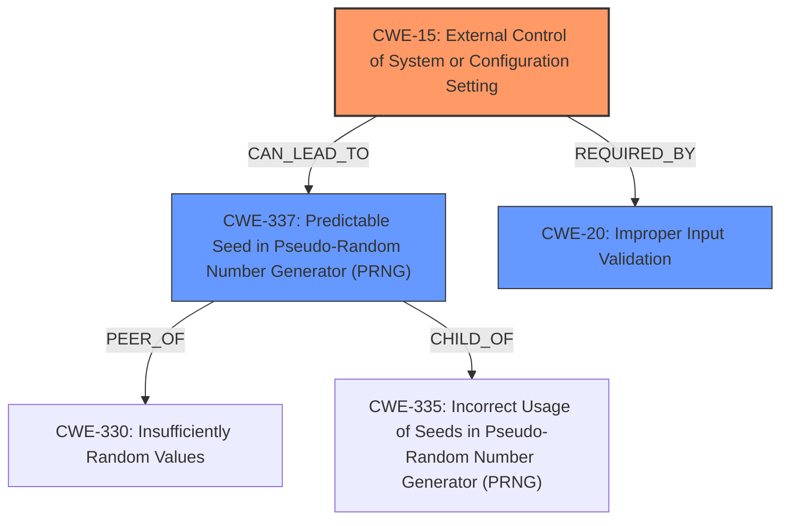

# Final Resolution for CVE-2021-32033

# Summary
| CWE ID  | CWE Name                                                        | Confidence | CWE Abstraction Level | CWE Vulnerability Mapping Label | CWE-Vulnerability Mapping Notes |
| :-------- | :-------------------------------------------------------------- | :--------- | :-------------------- | :------------------------------ | :------------------------------ |
| CWE-15    | External Control of System or Configuration Setting            | 0.95       | Base                  | Allowed                         | Primary CWE                     |
| CWE-337   | Predictable Seed in Pseudo-Random Number Generator (PRNG)     | 0.80       | Variant               | Allowed                         | Secondary Candidate             |
| CWE-20    | Improper Input Validation                                       | 0.70       | Base                  | Allowed                         | Secondary Candidate             |

## Evidence and Confidence

*   **Confidence Score:** 0.90
*   **Evidence Strength:** HIGH

## Relationship Analysis
The primary weakness is clearly **CWE-15 (External Control of System or Configuration Setting)**, as the core issue is the ability to manipulate the device's time without authentication. This leads to a secondary weakness, **CWE-337 (Predictable Seed in Pseudo-Random Number Generator (PRNG))**, because the controllable time acts as a predictable seed for the TOTP generation. **CWE-20 (Improper Input Validation)** is related to **CWE-15** as the lack of input validation on the time setting is the cause of the external control.

## Vulnerability Chain
The vulnerability chain starts with the lack of input validation (**CWE-20**) on the time setting, which allows external control of the system's configuration (**CWE-15**). This external control enables manipulation of the real-time clock (RTC), which acts as a predictable seed in the TOTP generation process (**CWE-337**). The ultimate impact is the ability to predict future TOTP values, bypassing authentication and potentially compromising the system.

## Summary of Analysis
The initial analysis correctly identified **CWE-15** as the primary **WEAKNESS**. The criticism suggested considering **CWE-337**, which I agree is a more accurate secondary **WEAKNESS** than the original **CWE-341**. The core of the vulnerability is that the time value, acting as a seed, can be set independently from the actual seed value, without authentication. This makes the seed predictable, which aligns well with **CWE-337**. The analysis is based on the vulnerability description, which explicitly states that "the time value used by the device can be set independently from the used seed value for generating time-based one-time passwords, without authentication."

I am increasing the confidence score for **CWE-15** to 0.95, as the evidence is very strong, and adding **CWE-337** with a confidence score of 0.80. I am including **CWE-20** as a secondary candidate with a confidence score of 0.70 as the lack of input validation is a direct cause for the **CWE-15**. These CWEs are at the optimal level of specificity, as **CWE-15** is a base-level **WEAKNESS**, and **CWE-337** is a variant-level **WEAKNESS**.