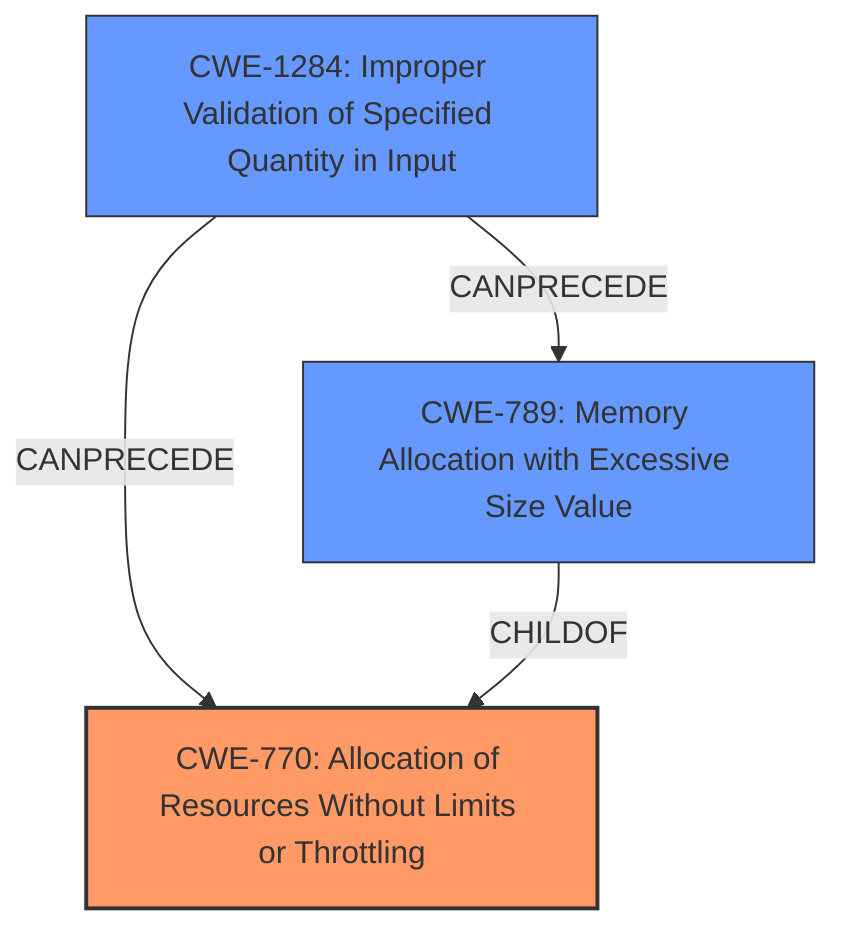

# Final Resolution for CVE-2021-32040

# Summary

| CWE ID   | CWE Name                                               | Confidence | CWE Abstraction Level | CWE Vulnerability Mapping Label | CWE-Vulnerability Mapping Notes                                                                                           |
| :------- | :----------------------------------------------------- | :--------- | :-------------------- | :----------------------------- | :------------------------------------------------------------------------------------------------------------------------ |
| CWE-770  | Allocation of Resources Without Limits or Throttling    | 0.85       | Base                  | Allowed                      | Primary CWE. Unbounded pipeline length leads to stack exhaustion.                                                     |
| CWE-1284 | Improper Validation of Specified Quantity in Input      | 0.75       | Base                  | Allowed                      | Pipeline Length is an unvalidated quantity, leading to resource exhaustion.                                               |
| CWE-789  | Memory Allocation with Excessive Size Value             | 0.70       | Variant               | Allowed                      | Secondary Candidate CWE. Contributes to stack exhaustion within aggregation stages if allocation sizes are also unvalidated. |

## Evidence and Confidence

*   **Confidence Score:** 0.80
*   **Evidence Strength:** MEDIUM

## Relationship Analysis

The primary relationship is that CWE-1284 can precede CWE-770 and CWE-789. The improper validation of input (CWE-1284) allows for the allocation of resources without limits (CWE-770), which in turn can lead to memory allocation with an excessive size value (CWE-789) contributing to the stack overflow.

## Vulnerability Chain

The vulnerability chain starts with the lack of validation of the aggregation pipeline length (CWE-1284). This leads to an allocation of resources without limits or throttling (CWE-770), potentially resulting in memory allocation with an excessive size value for stack frames within the aggregation pipeline stages (CWE-789). The ultimate impact is a stack overflow, causing a denial-of-service (DoS) attack by crashing the MongoDB server.

## Summary of Analysis

The initial analysis correctly identified CWE-770 as a primary weakness and CWE-789 as a secondary candidate. The criticism provided valuable suggestions to strengthen the analysis by considering CWE-1284 and clarifying the relationships between the CWEs.

The vulnerability description states: "It may be possible to have an **extremely long aggregation pipeline** in conjunction with a specific stage/operator and cause a **stack overflow** due to the size of the stack frames used by that stage." This directly supports the selection of CWE-770 (Allocation of Resources Without Limits or Throttling) since the **extremely long aggregation pipeline** represents unbounded resource allocation. The suggestion to add `--setParameter internalPipelineLengthLimit=50` as a workaround is an explicit mitigation for unbounded pipeline length.

CWE-1284 (Improper Validation of Specified Quantity in Input) is included because the length of the aggregation pipeline is an input quantity that is not properly validated, leading to excessive resource consumption.

CWE-789 (Memory Allocation with Excessive Size Value) is a contributing factor, especially if the individual aggregation stages allocate memory on the stack based on the pipeline length or other unvalidated sizes.

The final selection of CWEs reflects an optimal level of specificity. CWE-770 captures the primary root cause (unbounded resource allocation), CWE-1284 identifies the lack of input validation as a contributing factor, and CWE-789 acknowledges the potential for excessive memory allocation within the aggregation stages. The abstraction levels (Base and Variant) are appropriate for mapping to the root causes of the vulnerability.