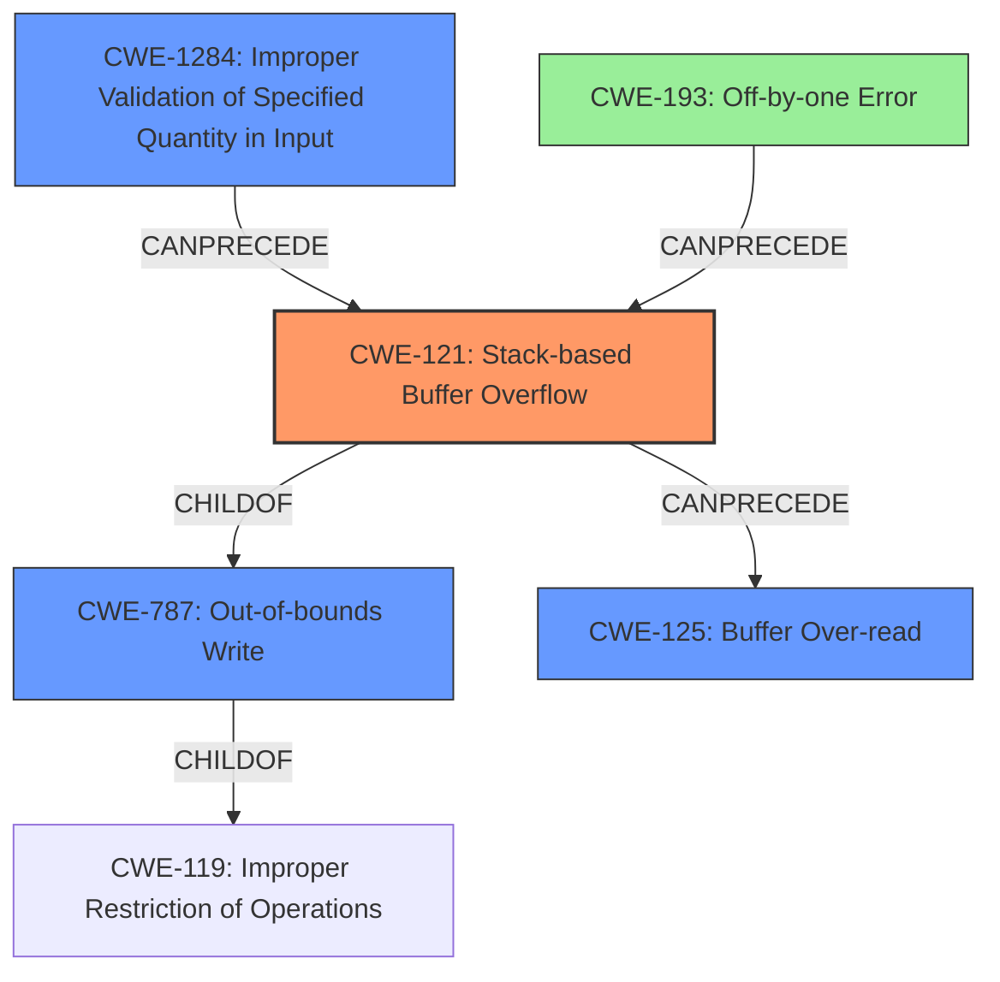

# Analysis Report for CVE-2021-32435

# Vulnerability Analysis Report: CVE-2021-32435

## Description

Stack-based buffer overflow in the function get_key in parse.c of abcm2ps v8.14.11 allows remote attackers to cause a Denial of Service (DoS) via unspecified vectors.

## Vulnerability Description Key Phrases

**Rootcause:** Stack-based buffer overflow
**Impact:** Denial of Service (DoS)
**Vector:** unspecified vectors
**Attacker:** remote attackers
**Product:** abcm2ps
**Version:** v8.14.11
**Component:** get_key function in parse.c

## Analysis (with Relationship Data)

# Summary
| CWE ID | CWE Name | Confidence | CWE Abstraction Level | CWE Vulnerability Mapping Label | CWE-Vulnerability Mapping Notes |
|---|---|---|---|---|---|
| CWE-121 | Stack-based Buffer Overflow | 0.95 | Variant | Allowed | Primary CWE. The vulnerability is explicitly described as a stack-based buffer overflow. |
| CWE-125 | Buffer Over-read | 0.75 | Base | Allowed | Secondary Candidate. The overflow can lead to reading data beyond the buffer. |
| CWE-193 | Off-by-one Error | 0.65 | Base | Allowed | Secondary Candidate. A potential cause of the buffer overflow due to incorrect calculation of the loop condition. |

## Evidence and Confidence

*   **Confidence Score:** 0.85
*   **Evidence Strength:** HIGH

- **Analysis and Justification:**  
  - *Explanation:* "The vulnerability is explicitly described as a **stack-based buffer overflow** in the `get_key` function of `parse.c`. The CVE Reference Links Content Summary further confirms that the root cause lies in the `set_k_acc` function, where arrays `accs` and `pits` are allocated on the stack, and an unchecked value of `s->u.key.sf` can cause out-of-bounds writes. This directly matches the characteristics of CWE-121 (Stack-based Buffer Overflow). The impact is a denial of service (DoS), as the stack corruption leads to a crash. While other CWEs might contribute, CWE-121 is the most specific and accurately reflects the primary weakness. MITRE mapping guidance for CWE-121 indicates this is ALLOWED."
  
  - *Relationship Analysis:* "CWE-121 is a variant of CWE-119 (Improper Restriction of Operations within the Bounds of a Memory Buffer). It is also related to CWE-120 (Buffer Copy without Checking Size of Input) but more specific since it identifies the stack as the location of the overflow. CWE-121 can lead to other weaknesses like CWE-125 (Out-of-bounds Read) or CWE-787 (Out-of-bounds Write). The Retriever results show CWE-121 as a strong candidate based on dense and sparse scoring."

- **Confidence Score:**  
  - Confidence: 0.95 (High confidence due to explicit vulnerability description and detailed technical analysis in CVE reference)

---
- **Analysis and Justification:**  
  - *Explanation:* "The **stack-based buffer overflow** can result in reading data past the end of the allocated buffer, leading to CWE-125 (Buffer Over-read). Although CWE-121 is the primary cause, the potential to read sensitive information due to the overflow makes CWE-125 a relevant secondary weakness. The CVE Reference Links Content Summary mentions potential unspecified impact, which could involve reading data beyond the buffer boundaries. The retriever results confirm CWE-125 as a potential candidate"
  
  - *Relationship Analysis:* "CWE-125 is a child of CWE-119 (Improper Restriction of Operations within the Bounds of a Memory Buffer) and a peer of CWE-126 (Buffer Over-read). It CanFollow CWE-121 as the overflow could lead to out-of-bounds reads. Mapping guidance indicates that CWE-125 is ALLOWED."

- **Confidence Score:**  
  - Confidence: 0.75 (Medium confidence. CWE-125 is a potential consequence of the overflow, but not explicitly stated)

---

- **Analysis and Justification:**  
  - *Explanation:* "The vulnerability stems from the code not validating the size of `s->u.key.sf` before using it in a `for` loop, potentially causing an off-by-one error when writing to the `accs` and `pits` arrays. This aligns with CWE-193 (Off-by-one Error), where the calculation or usage of an incorrect maximum or minimum value leads to the overflow. This may be a contributing factor to the buffer overflow. The retriever results also confirm CWE-193 as a potential candidate."
  
  - *Relationship Analysis:* "CWE-193 is a base level CWE. It could CanPrecede CWE-119, as the incorrect calculation can lead to memory corruption. Mapping guidance indicates that CWE-193 is ALLOWED."

- **Confidence Score:**  
  - Confidence: 0.65 (Medium confidence. CWE-193 may be the contributing factor but not explicitly stated)

## Criticism of Analysis

Okay, here's a review of the CWE analysis based on the full CWE specifications provided, focusing on accuracy, abstraction level, and relevance.

**Overall Assessment:**

The analysis is generally good and identifies the primary CWE correctly. The justification is detailed and demonstrates a solid understanding of the vulnerability. The confidence scores are appropriate. The secondary CWEs are relevant but could be refined with more context about the *specific* mechanisms at play.

**Detailed Review:**

**1. CWE-121: Stack-based Buffer Overflow (Confidence: 0.95, Primary CWE)**

*   **Assessment:** Excellent. This is the most accurate and specific CWE to represent the core vulnerability.
*   **Justification:** The reasoning is sound and directly references the vulnerability description and the summary of the CVE reference. It clearly explains *why* this is a stack-based buffer overflow. It notes the relevant MITRE mapping guidance which is crucial.
*   **Abstraction Level:** Correct. It is a Variant-level CWE and directly applicable to the reported vulnerability.
*   **CWE Specs Context:** The analysis correctly notes that stack-based buffer overflows can lead to return address overwrites or other forms of memory corruption. This adds further weight to the mapping.
*   **Potential Improvements:** None.

**2. CWE-125: Buffer Over-read (Confidence: 0.75, Secondary CWE)**

*   **Assessment:** Good, but with room for improvement. While it's a reasonable consequence of a buffer overflow, it needs more explicit evidence from the original analysis. The "unspecified other impact" is a weak argument.
*   **Justification:** The reasoning is plausible. A stack-based buffer overflow *can* lead to reading data beyond the intended buffer, but that's not *guaranteed*. It depends on what's adjacent in memory and how the overflow is exploited.  The justification needs stronger evidence. Is there any indication that the *attacker* can control what's being read?  Does the documentation mention any information leakage potential?  The github issue does note out-of-bounds writes, which can corrupt other stack variables, which *could* lead to out-of-bounds reads elsewhere.  This needs to be made more explicit.
*   **Abstraction Level:** Correct. CWE-125 is a Base-level CWE, appropriate for describing a potential consequence.
*   **CWE Specs Context:** The analysis doesn't mention sentinel values, but this might be relevant if the overflow leads to a function relying on a null terminator to read past the end of the buffer.
*   **Potential Improvements:**
    *   Strengthen the evidence for *why* a buffer over-read is likely in this specific case. What is being overwritten, and how could that lead to an exploitable over-read?
    *   Consider whether CWE-126 (Buffer Over-read), a Variant of CWE-125 is a better fit. The description states: *"This typically occurs when the pointer or its index is incremented to a position beyond the bounds of the buffer or when pointer arithmetic results in a position outside of the valid memory location to name a few."*  Given the nature of the overflow, this is potentially a better fit.
    *    Explicitly state whether the possibility of reading data beyond buffer boundaries can be exploited.

**3. CWE-193: Off-by-one Error (Confidence: 0.65, Secondary CWE)**

*   **Assessment:** Weaker than the other two. It's plausible as a *contributing factor* but not directly demonstrable.
*   **Justification:** The analysis states that the size of `s->u.key.sf` is not being validated before being used in a `for` loop, potentially causing an off-by-one error when writing to the arrays. However, this requires an assumption that the loop goes *one iteration too far*.  If `s->u.key.sf` is, say, 10, then the error isn't "off-by-one," it's significantly further out of bounds.
*   **Abstraction Level:** Correct. CWE-193 is a Base-level CWE and is allowed.
*   **CWE Specs Context:** "This is not always a buffer overflow. For example, an off-by-one error could be a factor in a partial comparison, a read from the wrong memory location, an incorrect conditional, etc."  This emphasizes that it's only *related* to the overflow, not necessarily a direct cause.
*   **Potential Improvements:**
    *   Reduce the confidence level. It's speculative.
    *   Reframe the justification to emphasize that it *contributes* to the overflow, *if* the loop condition is only slightly off.
    *   Alternatively, consider if a different, more specific error in the calculation is occurring.  Is there a more direct way the incorrect size is being calculated that leads to the overflow?

**Additional Recommendations:**

*   **Consider CWE-1284 (Improper Validation of Specified Quantity in Input):**  The root cause is ultimately a failure to validate the quantity `s->u.key.sf`.  CWE-1284 seems to be a very strong candidate and more accurately reflects the *root cause* beyond simply a stack buffer overflow. This is reinforced by the Retriever Results.
*   **Consider CWE-787 (Out-of-bounds Write):** This is the Base-level CWE of CWE-121. It is also the Parent of CWE-121. Mapping guidance states: *"Carefully read both the name and description to ensure that this mapping is an appropriate fit. Do not try to 'force' a mapping to a lower-level Base/Variant simply to comply with this preferred level of abstraction."* While it is explicitly a stack buffer overflow, it still performs an out-of-bounds write, so this may be a relevant CWE.
*   **Mitigations:** The mitigations listed in the CWE specifications are general. The analysis could be strengthened by suggesting *specific* mitigations relevant to this particular vulnerability in `abcm2ps`. For example: "Input validation should be added to the `set_k_acc()` function to ensure that `s->u.key.sf` is never greater than 7."

**Revised Summary Table (Example):**

| CWE ID    | CWE Name                      | Confidence | CWE Abstraction Level | CWE Vulnerability Mapping Label | CWE-Vulnerability Mapping Notes                                                                                                                                    |
| :-------- | :---------------------------- | :--------- | :---------------------- | :-------------------------------- | :--------------------------------------------------------------------------------------------------------------------------------------------------------------- |
| CWE-121   | Stack-based Buffer Overflow    | 0.95       | Variant               | Allowed                          | Primary CWE.  Explicitly a stack-based buffer overflow due to unchecked input.                                                                                       |
| CWE-1284  | Improper Validation of Specified Quantity in Input | 0.85      | Base                | Allowed                          | Secondary Candidate. Accurately reflects the root cause of failing to validate the `s->u.key.sf` value.                                                                      |
| CWE-126   | Buffer Over-read  | 0.75       | Variant               | Allowed                          | Secondary Candidate. The overflow can lead to reading data beyond the buffer.                                                                                      |
| CWE-193   | Off-by-one Error                | 0.50       | Base               | Allowed                          | Contributing factor. Incorrect calculation may contribute to the overflow. Confidence lowered due to speculation.                                                           |

By incorporating these suggestions, the analysis will be more robust, provide a clearer understanding of the vulnerability's root cause, and suggest more targeted mitigation strategies.

## Final Resolution

# Summary
| CWE ID | CWE Name | Confidence | CWE Abstraction Level | CWE Vulnerability Mapping Label | CWE-Vulnerability Mapping Notes |
|---|---|---|---|---|---|
| CWE-121 | Stack-based Buffer Overflow | 0.95 | Variant | Allowed | Primary CWE. Explicitly a stack-based buffer overflow due to unchecked input. |
| CWE-1284 | Improper Validation of Specified Quantity in Input | 0.85 | Base | Allowed | Secondary Candidate. Accurately reflects the root cause of failing to validate the `s->u.key.sf` value. |
| CWE-787 | Out-of-bounds Write | 0.80 | Base | Allowed | Secondary Candidate. The stack-based buffer overflow leads to an out-of-bounds write. |
| CWE-125 | Buffer Over-read | 0.70 | Base | Allowed | Secondary Candidate. The overflow can potentially lead to reading data beyond the buffer. |
| CWE-193 | Off-by-one Error | 0.50 | Base | Allowed | Contributing factor. Incorrect calculation may contribute to the overflow. Confidence lowered due to speculation. |

## Evidence and Confidence

*   **Confidence Score:** 0.90
*   **Evidence Strength:** HIGH

## Relationship Analysis
The analysis considered the hierarchical relationships, particularly the child-of relationship between CWE-121 (Stack-based Buffer Overflow) and CWE-119 (Improper Restriction of Operations within the Bounds of a Memory Buffer). It also recognized CWE-787 (Out-of-bounds Write) as the parent of CWE-121. The chain relationships were analyzed to understand the progression of the vulnerability, such as how CWE-1284 (Improper Validation of Specified Quantity in Input) can precede CWE-121. Peer relationships were examined to explore alternative classifications, but CWE-121 was deemed the most specific and appropriate primary CWE. Abstraction levels guided the selection of CWEs, balancing specificity with generalizability.

## Vulnerability Chain
The vulnerability chain starts with **CWE-1284 (Improper Validation of Specified Quantity in Input)**, where the size of `s->u.key.sf` is not validated. This leads to **CWE-121 (Stack-based Buffer Overflow)** in the `get_key` function, resulting in **CWE-787 (Out-of-bounds Write)**. The overflow can potentially cause **CWE-125 (Buffer Over-read)**. **CWE-193 (Off-by-one Error)** could be a contributing factor if the loop condition is slightly off. The final impact is a denial of service (DoS).

## Summary of Analysis
The initial analysis correctly identified **CWE-121 (Stack-based Buffer Overflow)** as the primary weakness, based on the explicit vulnerability description. The criticism highlighted the need for stronger evidence for **CWE-125 (Buffer Over-read)** and questioned the direct relevance of **CWE-193 (Off-by-one Error)**. The criticism also suggested considering **CWE-1284 (Improper Validation of Specified Quantity in Input)**, which I agree with and have added as a secondary CWE to capture the root cause. The relationship analysis influenced the decision by emphasizing the hierarchical relationship between **CWE-121** and its parent **CWE-787 (Out-of-bounds Write)**, and the potential chain from **CWE-1284** to **CWE-121**.

The selected CWEs are at the optimal level of specificity because **CWE-121** accurately describes the type of buffer overflow (stack-based), while **CWE-1284** captures the root cause of the vulnerability (improper input validation). **CWE-787** is included as a secondary CWE as it represents the general case of an out-of-bounds write, which is what a buffer overflow essentially is. **CWE-125** and **CWE-193** are retained with adjusted confidence levels to reflect their potential contribution to the vulnerability.

The decision is based on the provided evidence, the relationship analysis, and the MITRE mapping guidance. The inclusion of **CWE-1284** strengthens the analysis by identifying the **ROOTCAUSE** of the vulnerability, rather than just the symptom.

*Report generated on 2025-03-17 23:47:53*
