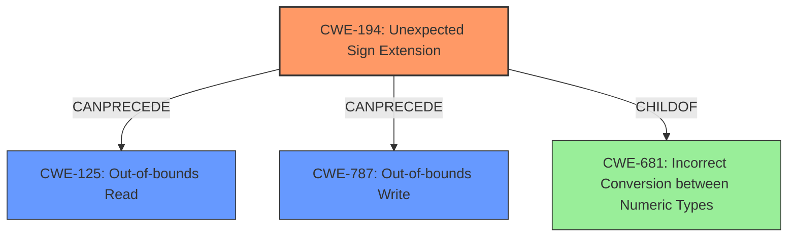

# Final Resolution for CVE-2021-32629

# Summary
| CWE ID  | CWE Name                                     | Confidence | CWE Abstraction Level | CWE Vulnerability Mapping Label | CWE-Vulnerability Mapping Notes |
|---------|----------------------------------------------|------------|-----------------------|---------------------------------|---------------------------------|
| CWE-194 | Unexpected Sign Extension                   | 0.95       | Variant               | Allowed                         | Primary CWE                     |
| CWE-125 | Out-of-bounds Read                           | 0.80       | Base                  | Allowed                         | Secondary Candidate             |
| CWE-787 | Out-of-bounds Write                          | 0.60       | Base                  | Allowed                         | Secondary Candidate             |

## Evidence and Confidence

*   **Confidence Score:** 0.85
*   **Evidence Strength:** HIGH

## Relationship Analysis
The primary **WEAKNESS** is identified as **CWE-194 (Unexpected Sign Extension)**, which is a variant-level CWE, providing a specific description of the error. It's directly linked to the vulnerability description which explicitly mentions a "sign-extend instead of zero-extend". While **CWE-681 (Incorrect Conversion between Numeric Types)** is a parent class of **CWE-194**, it's less specific and therefore not included. The consequences of the sign extension are out-of-bounds reads (**CWE-125**) and potentially writes (**CWE-787**), forming a chain where the incorrect conversion leads to memory access violations. **CWE-125** is a more direct consequence as supported by the text "If the heap bound is larger than 2GiB, then it would be possible to read memory from a computable range dependent on the size of the heaps bound."

## Vulnerability Chain
The vulnerability chain starts with the **ROOTCAUSE**: an **unexpected sign extension (CWE-194)** during the conversion of a value loaded from the stack. This occurs when an i32 value is greater than or equal to 0x8000_0000, spilled and reloaded by the register allocator, produced by an instruction that zeroes the upper 32 bits of its destination, and then zero-extended to 64 bits. This leads to a memory address calculation using the incorrectly sign-extended value, resulting in an **out-of-bounds read (CWE-125)** before the start of the heap. The potential for a sandbox escape also suggests a possible **out-of-bounds write (CWE-787)**. The absence of proper bounds checking exacerbates the problem.

## Summary of Analysis
The initial analysis and criticism both agree that **CWE-194 (Unexpected Sign Extension)** is the primary **WEAKNESS**. The vulnerability description explicitly mentions "The bug in question performs a sign-extend instead of a zero-extend on a value loaded from the stack," directly supporting this classification. The relationship analysis reveals that **CWE-194** is a specific variant of **CWE-681 (Incorrect Conversion between Numeric Types)**, but **CWE-194** is more descriptive and thus more appropriate.

The criticism correctly points out that the justification for **CWE-787 (Out-of-bounds Write)** is weaker than that for **CWE-125 (Out-of-bounds Read)**. While a sandbox escape *could* involve writing, the description focuses primarily on reading memory. I have lowered the confidence score for **CWE-787** to reflect this.

The selection of **CWE-194** is at the optimal level of specificity as it directly describes the **ROOTCAUSE**. **CWE-125** and **CWE-787** are included as secondary CWEs to reflect the potential consequences of the sign extension. The retriever scores were considered, but the suggested alternative CWEs (like **CWE-476 (NULL Pointer Dereference)**) did not have strong support in the vulnerability description.

The final decision is based on a combination of content matching, relationship analysis, and evidence from the vulnerability description.