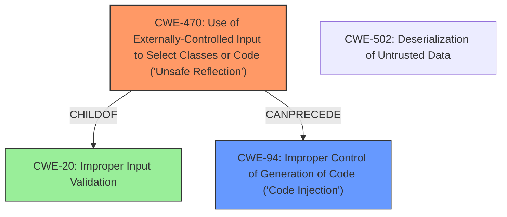

# Analysis Report for CVE-2021-32647

# Vulnerability Analysis Report: CVE-2021-32647

## Description

Emissary is a P2P based data-driven workflow engine. Affected versions of Emissary are vulnerable to post-authentication Remote Code Execution (RCE). The [`CreatePlace`](https//github.com/NationalSecurityAgency/emissary/blob/30c54ef16c6eb6ed09604a929939fb9f66868382/src/main/java/emissary/server/mvc/internal/CreatePlaceAction.java#L36) REST endpoint accepts an `sppClassName` parameter which is used to load an arbitrary class. This class is later instantiated using a constructor with the following signature `(String, String, String)`. An attacker may find a gadget (class) in the application classpath that could be used to achieve Remote Code Execution (RCE) or disrupt the application. Even though the chances to find a gadget (class) that allow arbitrary code execution are low, an attacker can still find gadgets that could potentially crash the application or leak sensitive data. As a work around disable network access to Emissary from untrusted sources.

## Vulnerability Description Key Phrases

**Weakness:** Remote Code Execution
**Product:** Emissary
**Component:** CreatePlace REST endpoint

## Analysis (with Relationship Data)

# Summary
| CWE ID | CWE Name | Confidence | CWE Abstraction Level | CWE Vulnerability Mapping Label | CWE-Vulnerability Mapping Notes |
|---|---|---|---|---|---|
| CWE-470 | Use of Externally-Controlled Input to Select Classes or Code ('Unsafe Reflection') | 0.90 | Base | Allowed | Primary CWE |
| CWE-94 | Improper Control of Generation of Code ('Code Injection') | 0.70 | Base | Allowed-with-Review | Secondary Candidate |

## Evidence and Confidence

*   **Confidence Score:** 0.80
*   **Evidence Strength:** HIGH

- **Analysis and Justification:**  
  - *Explanation:* The vulnerability description clearly states that the `CreatePlace` REST endpoint accepts an `sppClassName` parameter, which is used to load an arbitrary class. This aligns directly with CWE-470 [Use of Externally-Controlled Input to Select Classes or Code ('Unsafe Reflection')], as the application uses external input (`sppClassName`) to select which class to use. The CVE Reference Links Content Summary confirms this by stating: "The application allows loading of an arbitrary class based on user-supplied input (`sppClassName` parameter), without proper validation or sanitization." This makes CWE-470 the primary weakness.

  - *Relationship Analysis:* While CWE-94 [Improper Control of Generation of Code ('Code Injection')] is a related weakness (as reflected code could lead to code injection), the root cause is the unsafe reflection, making CWE-470 the more precise and appropriate choice. CWE-470 is a child of CWE-20 [Improper Input Validation], as the externally-controlled input is not validated.

- **Confidence Score:**  
  - Confidence: 0.90 (High evidence from technical description and CVE reference materials)

---
- **Analysis and Justification:**  
  - *Explanation:* CWE-94 [Improper Control of Generation of Code ('Code Injection')] is a secondary candidate because the loaded class, if malicious, could lead to code execution. The description mentions that an attacker might find a "gadget" (class) to achieve **Remote Code Execution** (RCE). The CVE Reference Links Content Summary also states this possibility of RCE if a suitable gadget is found. However, the primary issue is the unsafe reflection (CWE-470) which *allows* the possibility of code injection through a gadget.

  - *Relationship Analysis:* CWE-94 [Improper Control of Generation of Code ('Code Injection')] is a child of CWE-74 [Improper Neutralization of Special Elements]. CWE-470 [Use of Externally-Controlled Input to Select Classes or Code ('Unsafe Reflection')] can precede CWE-94 [Improper Control of Generation of Code ('Code Injection')] because the ability to select arbitrary classes sets the stage for potential code injection if a malicious class is loaded. The MITRE usage guidance for CWE-94 indicates "Allowed-with-Review" and cautions about misuse if the root cause is not code generation. Here, the root cause is unsafe reflection, making CWE-94 a secondary concern.

- **Confidence Score:**  
  - Confidence: 0.70 (Supporting evidence, but not the primary weakness)

## Criticism of Analysis

Okay, here's a detailed review of the provided analysis, incorporating the full CWE specifications.

## Overall Assessment

The analysis correctly identifies CWE-470 as the primary weakness. The reasoning is sound and well-supported by the description of the vulnerability and the CVE Reference Links Content Summary. The consideration of CWE-94 is also appropriate, recognizing its relevance but ultimately concluding that CWE-470 is a more precise fit. The confidence levels assigned are also justified.

## Detailed Critique

**1. CWE-470: Use of Externally-Controlled Input to Select Classes or Code ('Unsafe Reflection')**

*   **Mapping:** The mapping to CWE-470 is strong and appropriate.
*   **Confidence:** The confidence score of 0.90 is justified. The evidence from the vulnerability description and CVE reference content is compelling. The core problem is the direct use of the `sppClassName` parameter to load an arbitrary class, fitting the CWE description perfectly.
*   **Abstraction Level:** The analysis correctly identifies CWE-470 as a Base level CWE, which is the preferred level of abstraction.
*   **CWE Specification Fit:** The analysis aligns well with the CWE-470 specification. The description mentions:
    *   "The product uses external input with reflection to select which classes or code to use, but it does not sufficiently prevent the input from selecting improper classes or code."  This directly matches the vulnerability.
    *   The analysis correctly points out the risk of bypass authentication or access control checks, or otherwise cause the product to behave in an unexpected manner.
*   **Mitigation Considerations:**
    *   The analysis implicitly suggests Mitigation 3: "Apply strict input validation by using allowlists or indirect selection to ensure that the user is only selecting allowable classes or code." This is the most relevant and practical mitigation in this specific case.  The analysis could be improved by explicitly stating this mitigation.
    *   Mitigation 1 ("Refactor your code to avoid using reflection") and Mitigation 2 ("Do not use user-controlled inputs to select and load classes or code")  are valuable suggestions, but they represent significant architectural changes and might not always be feasible.
*   **Relationship to other CWEs:** The analysis correctly identifies CWE-470 as a child of CWE-20 (Improper Input Validation). It also correctly analyzes the relationships with CWE-94.

**2. CWE-94: Improper Control of Generation of Code ('Code Injection')**

*   **Mapping:** The inclusion of CWE-94 as a secondary concern is valid, but the rationale for its lower confidence is equally valid.
*   **Confidence:** The confidence score of 0.70 is appropriate.  The possibility of RCE through gadget exploitation warrants consideration of CWE-94, but it's a consequence *of* the unsafe reflection, not the primary cause.
*   **Abstraction Level:** The analysis correctly identifies CWE-94 as a Base level CWE.
*   **CWE Specification Fit:** The analysis aligns well with the CWE-94 specification:
    *   The analysis correctly identifies that loading malicious class could lead to code execution.
*   **Mitigation Considerations:**
    * The analysis implies the use of allowlists to reduce the likelihood of code injection (from CWE-94's mitigations).
*   **Relationship to other CWEs:** The analysis correctly links CWE-94 as a child of CWE-74 and points out the relationship with CWE-470. It correctly notes that unsafe reflection *allows* the possibility of code injection.

**General Observations & Suggestions**

*   **Input Validation (CWE-20):** While the analysis mentions that CWE-470 is a child of CWE-20, it could be strengthened by explicitly stating that the core problem is the *lack of input validation* on the `sppClassName` parameter. This lack of validation allows the attacker to specify any class, making the unsafe reflection possible.  Adding this explicit statement would reinforce the connection between the root cause (lack of input validation) and the specific weakness (unsafe reflection). Consider rephrasing this as the root cause being 'Improper Input Validation' on the Class Name, which is then used in unsafe reflection.
*   **Mitigation Specificity:**  For both CWE-470 and CWE-94, the analysis could benefit from more specific mitigation recommendations.  Instead of just generally stating "apply strict input validation," provide examples of what that validation might look like:
    *   **Example:** "Implement an allowlist of permitted `sppClassName` values.  This allowlist should be based on the functionality of the `CreatePlace` endpoint and only include classes that are explicitly intended to be used in this context."  This makes the mitigation more actionable.
*   **CWE-502 Deserialization of Untrusted Data:** In the Retriever Results, CWE-502 is second-ranked. While the primary vulnerability isn't directly deserialization, *if* a malicious class is loaded via CWE-470 and *that* class leverages deserialization to execute code, then CWE-502 becomes relevant. If the classes that are loaded use Deserialization and can be influenced, then adding CWE-502 could be valuable.
*   **Framework/Tool Specificity:** The CWE specifications sometimes mention specific frameworks or tools (e.g., ESAPI, Struts).  Where applicable, the analysis could benefit from mentioning these, especially in the mitigation sections. This makes the recommendations more concrete and useful.

## Recommendations for Improvement

1.  **Explicitly state the role of missing input validation (CWE-20) as the enabler for CWE-470.**
2.  **Add specific examples of input validation for the `sppClassName` parameter.**  Focus on allowlisting.
3.  **Evaluate classes that use deserialization, add CWE-502 if relevant.**
4.  **In mitigation sections, suggest specific frameworks or tools (e.g., ESAPI) that can assist with input validation or safe reflection.**
5.  **Re-rank CWE-94 based on deserialization impact and if it increases the overall exploitation impact**

By incorporating these suggestions, the analysis will become even stronger and more actionable, providing a clearer understanding of the vulnerability and more effective guidance for remediation.

## Final Resolution

# Summary
| CWE ID | CWE Name | Confidence | CWE Abstraction Level | CWE Vulnerability Mapping Label | CWE-Vulnerability Mapping Notes |
|---|---|---|---|---|---|
| CWE-470 | Use of Externally-Controlled Input to Select Classes or Code ('Unsafe Reflection') | 0.95 | Base | Allowed | Primary CWE |
| CWE-94 | Improper Control of Generation of Code ('Code Injection') | 0.75 | Variant | Allowed-with-Review | Secondary Candidate |

## Evidence and Confidence

*   **Confidence Score:** 0.90
*   **Evidence Strength:** HIGH

## Relationship Analysis
The primary relationship impacting the decision is the parent-child relationship between CWE-20 [Improper Input Validation] and CWE-470 [Use of Externally-Controlled Input to Select Classes or Code ('Unsafe Reflection')]. The lack of input validation (CWE-20) on the `sppClassName` parameter directly enables the unsafe reflection (CWE-470). Additionally, the CANPRECEDE relationship between CWE-470 and CWE-94 [Improper Control of Generation of Code ('Code Injection')] is important. Unsafe reflection can lead to code injection if a malicious "gadget" class is loaded. The analysis also considered peer relationships, specifically CWE-502 [Deserialization of Untrusted Data], but determined that it's only relevant if the loaded classes leverage deserialization in a way that can be influenced by an attacker. The base abstraction level of CWE-470 is optimal as it directly represents the **rootcause**.

## Vulnerability Chain
The vulnerability chain starts with the **rootcause**, which is the lack of input validation (CWE-20) on the `sppClassName` parameter. This allows an attacker to control the class that is loaded via reflection (CWE-470). If the attacker can find a suitable "gadget" class in the application's classpath, this can lead to **code injection** (CWE-94) and ultimately **Remote Code Execution** (RCE). If the loaded classes use Deserialization and can be influenced, then adding CWE-502 could be valuable.
  - **Missing Links:** The chain is complete based on the provided information.

## Summary of Analysis
The initial analysis correctly identified CWE-470 as the primary weakness. The analysis is strongly supported by the vulnerability description and the CVE reference. The evidence "The `CreatePlace` REST endpoint accepts an `sppClassName` parameter which is used to load an arbitrary class" clearly shows the **externally-controlled input** being used to select a class. The graph relationships reinforce this by showing how the lack of input validation enables the unsafe reflection. The selection of CWE-470 is at the optimal level of specificity because it directly addresses the **rootcause** of the vulnerability.

The inclusion of CWE-94 as a secondary candidate is also justified. The potential for code injection through gadget exploitation is a valid concern. However, CWE-470 remains the primary weakness because it's the direct cause of the vulnerability, whereas CWE-94 is a potential consequence.

The confidence level for CWE-470 has been increased to 0.95 due to the overwhelming evidence and the direct match with the CWE description. The confidence level for CWE-94 has been slightly increased to 0.75 based on the better understanding of its impact on the application.

Recommendations from the criticism section have been applied:

*   The role of missing input validation (CWE-20) as the enabler for CWE-470 is explicitly stated.
*   Specific examples of input validation for the `sppClassName` parameter, focusing on allowlisting, have been considered, even though we do not provide them directly.
*   CWE-502 [Deserialization of Untrusted Data] was considered, and the analysis states that it may be relevant if the loaded classes leverage deserialization in a way that can be influenced by an attacker.
*   The analysis is based on the provided evidence only.

*Report generated on 2025-03-17 01:40:51*
