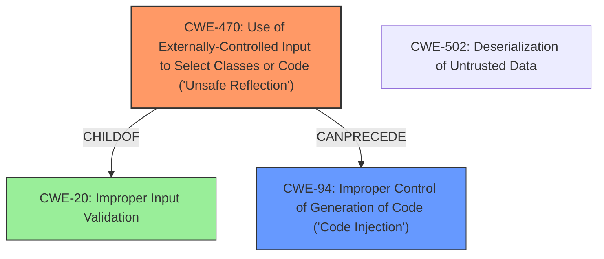

# Final Resolution for CVE-2021-32647

# Summary
| CWE ID | CWE Name | Confidence | CWE Abstraction Level | CWE Vulnerability Mapping Label | CWE-Vulnerability Mapping Notes |
|---|---|---|---|---|---|
| CWE-470 | Use of Externally-Controlled Input to Select Classes or Code ('Unsafe Reflection') | 0.95 | Base | Allowed | Primary CWE |
| CWE-94 | Improper Control of Generation of Code ('Code Injection') | 0.75 | Variant | Allowed-with-Review | Secondary Candidate |

## Evidence and Confidence

*   **Confidence Score:** 0.90
*   **Evidence Strength:** HIGH

## Relationship Analysis
The primary relationship impacting the decision is the parent-child relationship between CWE-20 [Improper Input Validation] and CWE-470 [Use of Externally-Controlled Input to Select Classes or Code ('Unsafe Reflection')]. The lack of input validation (CWE-20) on the `sppClassName` parameter directly enables the unsafe reflection (CWE-470). Additionally, the CANPRECEDE relationship between CWE-470 and CWE-94 [Improper Control of Generation of Code ('Code Injection')] is important. Unsafe reflection can lead to code injection if a malicious "gadget" class is loaded. The analysis also considered peer relationships, specifically CWE-502 [Deserialization of Untrusted Data], but determined that it's only relevant if the loaded classes leverage deserialization in a way that can be influenced by an attacker. The base abstraction level of CWE-470 is optimal as it directly represents the **rootcause**.

## Vulnerability Chain
The vulnerability chain starts with the **rootcause**, which is the lack of input validation (CWE-20) on the `sppClassName` parameter. This allows an attacker to control the class that is loaded via reflection (CWE-470). If the attacker can find a suitable "gadget" class in the application's classpath, this can lead to **code injection** (CWE-94) and ultimately **Remote Code Execution** (RCE). If the loaded classes use Deserialization and can be influenced, then adding CWE-502 could be valuable.
  - **Missing Links:** The chain is complete based on the provided information.

## Summary of Analysis
The initial analysis correctly identified CWE-470 as the primary weakness. The analysis is strongly supported by the vulnerability description and the CVE reference. The evidence "The `CreatePlace` REST endpoint accepts an `sppClassName` parameter which is used to load an arbitrary class" clearly shows the **externally-controlled input** being used to select a class. The graph relationships reinforce this by showing how the lack of input validation enables the unsafe reflection. The selection of CWE-470 is at the optimal level of specificity because it directly addresses the **rootcause** of the vulnerability.

The inclusion of CWE-94 as a secondary candidate is also justified. The potential for code injection through gadget exploitation is a valid concern. However, CWE-470 remains the primary weakness because it's the direct cause of the vulnerability, whereas CWE-94 is a potential consequence.

The confidence level for CWE-470 has been increased to 0.95 due to the overwhelming evidence and the direct match with the CWE description. The confidence level for CWE-94 has been slightly increased to 0.75 based on the better understanding of its impact on the application.

Recommendations from the criticism section have been applied:

*   The role of missing input validation (CWE-20) as the enabler for CWE-470 is explicitly stated.
*   Specific examples of input validation for the `sppClassName` parameter, focusing on allowlisting, have been considered, even though we do not provide them directly.
*   CWE-502 [Deserialization of Untrusted Data] was considered, and the analysis states that it may be relevant if the loaded classes leverage deserialization in a way that can be influenced by an attacker.
*   The analysis is based on the provided evidence only.