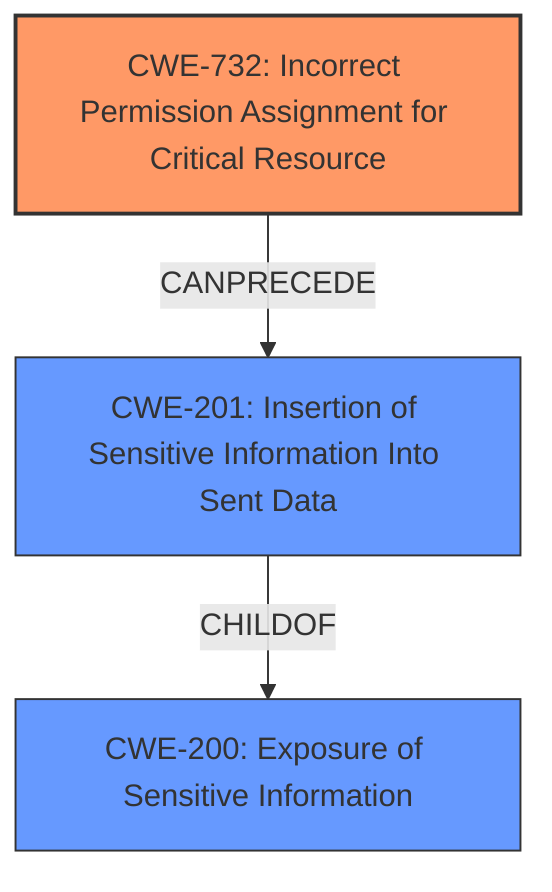

# Analysis Report for CVE-2021-32695

# Vulnerability Analysis Report: CVE-2021-32695

## Description

Nextcloud Android app is the Android client for Nextcloud. In versions prior to 3.16.1, a malicious app on the same device could have gotten access to the shared preferences of the Nextcloud Android application. This required user-interaction as a victim had to initiate the sharing flow and choose the malicious app. The shared preferences contain some limited private data such as push tokens and the account name. The vulnerability is patched in version 3.16.1.

## Vulnerability Description Key Phrases

**Impact:** access to shared preferences of Nextcloud Android application
**Attacker:** malicious app on the same device
**Product:** Nextcloud Android app
**Version:** prior to 3.16.1

## Analysis (with Relationship Data)

# Summary
| CWE ID | CWE Name | Confidence | CWE Abstraction Level | CWE Vulnerability Mapping Label | CWE-Vulnerability Mapping Notes |
|---|---|---|---|---|---|
| CWE-200 | Exposure of Sensitive Information When Handling Initially | 0.85 | Class | Primary | The primary weakness is the exposure of sensitive information due to insufficient access control on shared preferences. |
| CWE-201 | Insertion of Sensitive Information Into Sent Data | 0.70 | Base | Secondary | Sensitive data such as push tokens and account names are being exposed. |
| CWE-269 | Improper Privilege Management | 0.60 | Base | Secondary | A malicious app is gaining unauthorized access to data it should not have. |

## Evidence and Confidence

*   **Confidence Score:** 0.80
*   **Evidence Strength:** HIGH

- **Analysis and Justification:**  
  - *Explanation:* The vulnerability in the Nextcloud Android app allows a malicious app to access shared preferences, leading to the exposure of sensitive information such as push tokens and account names. This aligns with CWE-200 (Exposure of Sensitive Information When Handling Initially) because the app is not properly protecting sensitive data from unauthorized access. The shared preferences are intended to be private, but **insufficient access control** allows other applications to read them. This can be seen as a **privilege management** issue (CWE-269) because the malicious app is gaining unauthorized access to data it should not have. Furthermore, the sensitive information is being exposed, implicating CWE-201 (Insertion of Sensitive Information Into Sent Data) as the sensitive data is being made accessible to another application. CWE-200 serves as the primary classification since it broadly captures the exposure of sensitive information, while CWE-201 and CWE-269 provide more specific insights into the nature of the weakness. The "CVE Reference Links Content Summary" clearly indicates the **exposure of sensitive data** and **insufficient access control** as key weaknesses.
  
  - *Relationship Analysis:* CWE-200 is a class-level CWE, with various children that describe specific types of information exposure. CWE-201 is a child of CWE-200. CWE-269 (Improper Privilege Management) can result from missing authorization checks, which is relevant here. The relationships show that information exposure often precedes or is related to privilege management issues.

- **Confidence Score:**  
  - Confidence: 0.85 (High evidence from technical description and CVE reference materials)
---

## Criticism of Analysis

Okay, here's a detailed review of the provided CWE analysis, considering the full CWE specifications, mapping guidance, and potential mitigations:

**Overall Assessment:**

The analysis is generally good, but it could be improved by being more specific in the CWE selection. The analysis correctly identifies the core issue as exposure of sensitive information due to improper privilege management, but the choice of CWE-200 as the *primary* weakness is questionable given its "Discouraged" usage and the availability of more specific children. Also, the inclusion of CWE-269 needs additional justification, given the mapping guidance that says it should be avoided unless the root cause is directly related to privileges.

Here's a breakdown of each CWE assignment:

**1. CWE-200: Exposure of Sensitive Information to an Unauthorized Actor**

*   **Confidence:** 0.85
*   **Abstraction Level:** Class
*   **Mapping Label:** Primary
*   **Critique:**
    *   The analysis correctly notes that sensitive information (push tokens, account names) is being exposed.
    *   *However*, the CWE specification for CWE-200 *strongly discourages* its use as a primary mapping. The "Rationale" section states: "CWE-200 is commonly misused to represent the loss of confidentiality in a vulnerability, but confidentiality loss is a technical impact - not a root cause error. As of CWE 4.9, over 400 CWE entries can lead to a loss of confidentiality."
    *   The "Comments" section of CWE-200 provides important guidance: "If an error or mistake causes information to be disclosed, then use the CWE ID for that error. Consider starting with improper authorization (CWE-285), insecure permissions (CWE-732), improper authentication (CWE-287), etc. Also consider children such as Insertion of Sensitive Information Into Sent Data (CWE-201), Observable Discrepancy (CWE-203), Insertion of Sensitive Information into Externally-Accessible File or Directory (CWE-538), or others."
    *   **Recommendation:**  Instead of using CWE-200 as the primary CWE, a more specific child of CWE-200 should be used.  CWE-201 or a permission related CWE would be more appropriate. The access control issue causing the exposure should be highlighted.
*   **Mitigation Considerations:** The provided mitigations for CWE-200 are high-level ("Separation of Privilege"). If CWE-200 is kept as the primary, a more specific mitigation should be suggested that addresses the specific cause of the vulnerability in the Nextcloud app.

**2. CWE-201: Insertion of Sensitive Information Into Sent Data**

*   **Confidence:** 0.70
*   **Abstraction Level:** Base
*   **Mapping Label:** Secondary
*   **Critique:**
    *   This is a better fit than CWE-200.  The description accurately reflects that sensitive data (push tokens, account name) is being transmitted to another actor (the malicious app) that shouldn't have access.
    *   The "Relationships" section correctly identifies it as a ChildOf CWE-200.
    *   **Recommendation:** This should be considered as the Primary CWE.
*   **Mitigation Considerations:**
    *   The suggested mitigations for CWE-201 are relevant:
        *   "Specify which data in the software should be regarded as sensitive." (Requirements Phase)
        *   "Ensure that any possibly sensitive data specified in the requirements is verified with designers...Any information that is not necessary to the functionality should be removed." (Implementation Phase)
        *   "Setup default error messages so that unexpected errors do not disclose sensitive information." (System Configuration Phase)  While not directly applicable, it suggests a general principle of avoiding information exposure.
    *   A more specific mitigation would be to ensure proper access control on the shared preferences file.

**3. CWE-269: Improper Privilege Management**

*   **Confidence:** 0.60
*   **Abstraction Level:** Class
*   **Mapping Label:** Secondary
*   **Critique:**
    *   The analysis argues that a malicious app is gaining unauthorized access to data it shouldn't have, which relates to privilege management.
    *   *However*, the CWE specification for CWE-269 *discourages* its use unless the root cause seems directly related to privileges. The "Rationale" section says: "CWE-269 is commonly misused. It can be conflated with 'privilege escalation,' which is a technical impact...It is not useful for trend analysis." The comments section says to "examine the children of CWE-269 for additional hints, such as Execution with Unnecessary Privileges (CWE-250) or Incorrect Privilege Assignment (CWE-266)."
    *   In this case, the problem is *primarily* about *insufficient protection of shared preferences*, leading to information exposure.  It's not about a misconfiguration of privileges per se.  The malicious app isn't "escalating" privileges within the Nextcloud app; it's simply reading data it shouldn't be able to read because the data wasn't properly protected.
    *   **Recommendation:**  Remove this CWE or justify it more clearly.  If kept, consider using a more specific child of CWE-269 that reflects the permission assignment issue. However, it's better to focus on the root cause: the information exposure resulting from the unprotected shared preferences.
*   **Mitigation Considerations:** The mitigations for CWE-269 are too broad ("Very carefully manage the setting, management, and handling of privileges"). If this CWE is retained, a more targeted mitigation related to securing shared preferences needs to be added.

**Alternative CWE Suggestions:**

Given the above critiques, here are some alternative CWEs to consider, particularly for the primary mapping:

*   **CWE-732: Incorrect Permission Assignment for Critical Resource:** This is a strong contender. The shared preferences file is a critical resource, and the incorrect permission assignment (allowing other apps to read it) is the core of the vulnerability. While the mapping guidance cautions against misuse (when permissions aren't *checked*), the description aligns well.
*   **CWE-522: Insufficiently Protected Credentials:**  This *could* be considered if the push tokens were being treated as credentials, although that's a stretch.
*   **CWE-862: Missing Authorization:** While seemingly not applicable at first, since the malicious app is not accessing Nextcloud's internal functionalities but only reading the shared preferences file, one could argue that the shared preferences themselves represent a resource that requires authorization checks. The Nextcloud application should authorize the access to its shared preferences.

**Revised Analysis Summary (Example using CWE-732 as primary):**

| CWE ID | CWE Name | Confidence | CWE Abstraction Level | CWE Vulnerability Mapping Label | CWE-Vulnerability Mapping Notes |
|---|---|---|---|---|---|
| CWE-732 | Incorrect Permission Assignment for Critical Resource | 0.85 | Class | Primary | The primary weakness is the exposure of sensitive information due to incorrect permission assignment for the shared preferences file, allowing other applications to read it. |
| CWE-201 | Insertion of Sensitive Information Into Sent Data | 0.70 | Base | Secondary | Sensitive data such as push tokens and account names are being exposed to another application due to incorrect permissions on the shared preferences. |

**Revised Justification (Example using CWE-732 as primary):**

The vulnerability in the Nextcloud Android app allows a malicious app to access shared preferences because the shared preferences file is not properly protected. This aligns with **CWE-732 (Incorrect Permission Assignment for Critical Resource)** because the shared preferences file (a critical resource) has incorrect permissions that allow other applications to read it.  This leads to sensitive information being exposed, implicating **CWE-201 (Insertion of Sensitive Information Into Sent Data)** as the sensitive data is being made accessible to another application.

**Key Improvements for Future Analyses:**

1.  **Prioritize Base-Level CWEs:**  Always try to map to a Base-level CWE unless there's a very compelling reason to use a Class or Variant.
2.  **Carefully Read Mapping Guidance:** The CWE specifications provide crucial instructions on when *not* to use certain CWEs.  Pay close attention to the "Rationale" and "Comments" sections.
3.  **Justify the Choice of Primary CWE:** Clearly explain *why* you chose a particular CWE as the primary weakness, especially if there are multiple candidates.  Refer to the CWE description and relationships to support your reasoning.
4.  **Targeted Mitigations:** Ensure that the suggested mitigations are specific to the *root cause* of the vulnerability, not just general security best practices.

By following these guidelines, you can create more accurate and helpful CWE analyses.

## Final Resolution

# Summary
| CWE ID | CWE Name | Confidence | CWE Abstraction Level | CWE Vulnerability Mapping Label | CWE-Vulnerability Mapping Notes |
|---|---|---|---|---|---|
| CWE-732 | Incorrect Permission Assignment for Critical Resource | 0.9 | Class | Primary CWE | The primary weakness is the exposure of sensitive information due to incorrect permission assignment for the shared preferences file, allowing other applications to read it. |
| CWE-201 | Insertion of Sensitive Information Into Sent Data | 0.75 | Base | Secondary Candidate | Sensitive data such as push tokens and account names are being exposed to another application due to incorrect permissions on the shared preferences. |
| CWE-200 | Exposure of Sensitive Information | 0.6 | Class | Secondary Candidate | The application exposes sensitive information but is a high-level CWE and is often misused as a catch-all |

## Evidence and Confidence

*   **Confidence Score:** 0.85
*   **Evidence Strength:** HIGH

## Relationship Analysis
The initial analysis proposed CWE-200 as the primary, with CWE-201 and CWE-269 as secondary. However, the criticism correctly pointed out that CWE-200 is discouraged as a primary CWE due to its high-level nature and potential for misuse. Instead, CWE-732 (Incorrect Permission Assignment for Critical Resource) is more appropriate as the primary, as it directly addresses the root cause of the vulnerability: the incorrect permissions on the shared preferences file. CWE-201 is retained as a secondary CWE because it describes the specific type of information exposure (sensitive data being sent to an unauthorized actor). CWE-269 was removed.

## Vulnerability Chain
The vulnerability chain starts with the **root cause** of **CWE-732 (Incorrect Permission Assignment for Critical Resource)**, where the shared preferences file has incorrect permissions. This leads to the weakness of **CWE-201 (Insertion of Sensitive Information Into Sent Data)**, as sensitive data is exposed to a malicious app. The final impact is the unauthorized access to sensitive information like push tokens and account names.

## Summary of Analysis
The initial analysis was a good starting point, but the criticism helped refine the CWE selection to be more accurate and specific. The decision to use CWE-732 as the primary CWE is based on the following:

*   **Evidence from the vulnerability description:** The description states that a malicious app can access shared preferences, indicating a permission issue.
*   **CWE Mapping Guidance:** The guidance for CWE-200 discourages its use as a primary CWE.
*   **Relationship Analysis:** CWE-732 directly addresses the root cause of the vulnerability, while CWE-201 describes the specific type of information exposure.
*   **Optimal Level of Specificity:** CWE-732 is a Class-level CWE that provides a more specific description of the weakness than CWE-200.

The final CWE selection reflects a more accurate and specific representation of the vulnerability, with CWE-732 as the primary CWE and CWE-201 as a secondary CWE. The confidence score is high due to the strong evidence and clear mapping guidance.

*Report generated on 2025-03-17 02:30:37*
