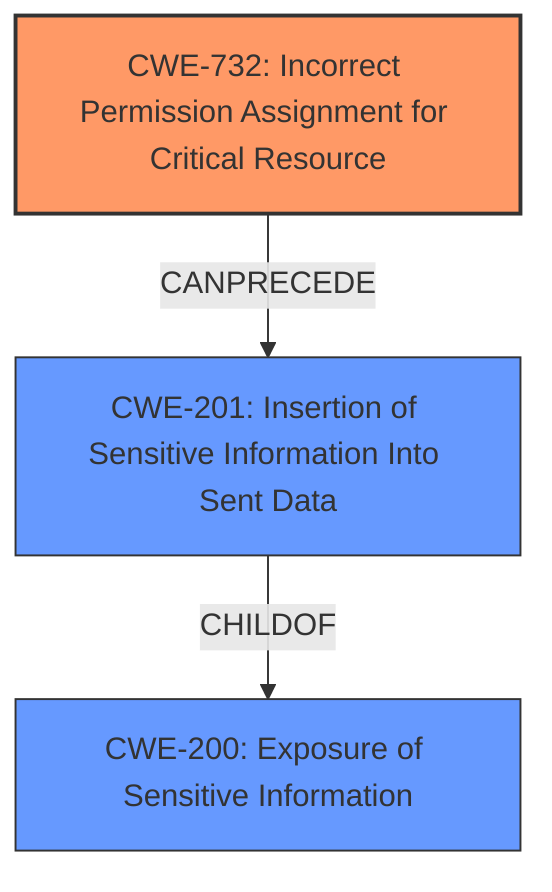

# Final Resolution for CVE-2021-32695

# Summary
| CWE ID | CWE Name | Confidence | CWE Abstraction Level | CWE Vulnerability Mapping Label | CWE-Vulnerability Mapping Notes |
|---|---|---|---|---|---|
| CWE-732 | Incorrect Permission Assignment for Critical Resource | 0.9 | Class | Primary CWE | The primary weakness is the exposure of sensitive information due to incorrect permission assignment for the shared preferences file, allowing other applications to read it. |
| CWE-201 | Insertion of Sensitive Information Into Sent Data | 0.75 | Base | Secondary Candidate | Sensitive data such as push tokens and account names are being exposed to another application due to incorrect permissions on the shared preferences. |
| CWE-200 | Exposure of Sensitive Information | 0.6 | Class | Secondary Candidate | The application exposes sensitive information but is a high-level CWE and is often misused as a catch-all |

## Evidence and Confidence

*   **Confidence Score:** 0.85
*   **Evidence Strength:** HIGH

## Relationship Analysis
The initial analysis proposed CWE-200 as the primary, with CWE-201 and CWE-269 as secondary. However, the criticism correctly pointed out that CWE-200 is discouraged as a primary CWE due to its high-level nature and potential for misuse. Instead, CWE-732 (Incorrect Permission Assignment for Critical Resource) is more appropriate as the primary, as it directly addresses the root cause of the vulnerability: the incorrect permissions on the shared preferences file. CWE-201 is retained as a secondary CWE because it describes the specific type of information exposure (sensitive data being sent to an unauthorized actor). CWE-269 was removed.

## Vulnerability Chain
The vulnerability chain starts with the **root cause** of **CWE-732 (Incorrect Permission Assignment for Critical Resource)**, where the shared preferences file has incorrect permissions. This leads to the weakness of **CWE-201 (Insertion of Sensitive Information Into Sent Data)**, as sensitive data is exposed to a malicious app. The final impact is the unauthorized access to sensitive information like push tokens and account names.

## Summary of Analysis
The initial analysis was a good starting point, but the criticism helped refine the CWE selection to be more accurate and specific. The decision to use CWE-732 as the primary CWE is based on the following:

*   **Evidence from the vulnerability description:** The description states that a malicious app can access shared preferences, indicating a permission issue.
*   **CWE Mapping Guidance:** The guidance for CWE-200 discourages its use as a primary CWE.
*   **Relationship Analysis:** CWE-732 directly addresses the root cause of the vulnerability, while CWE-201 describes the specific type of information exposure.
*   **Optimal Level of Specificity:** CWE-732 is a Class-level CWE that provides a more specific description of the weakness than CWE-200.

The final CWE selection reflects a more accurate and specific representation of the vulnerability, with CWE-732 as the primary CWE and CWE-201 as a secondary CWE. The confidence score is high due to the strong evidence and clear mapping guidance.