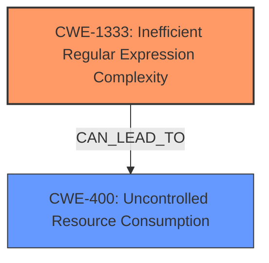

# Final Resolution for CVE-2021-32740

# Summary
| CWE ID | CWE Name | Confidence | CWE Abstraction Level | CWE Vulnerability Mapping Label | CWE-Vulnerability Mapping Notes |
|---|---|---|---|---|---|
| CWE-1333 | Inefficient Regular Expression Complexity | 0.95 | Base | Allowed | Primary CWE: The vulnerability is caused by catastrophic backtracking in a regular expression. |

## Evidence and Confidence

*   **Confidence Score:** 0.95
*   **Evidence Strength:** HIGH

## Relationship Analysis
The primary relationship influencing the decision is the direct match between the vulnerability description (ReDoS due to catastrophic backtracking) and the definition of CWE-1333. While CWE-400 (Uncontrolled Resource Consumption) represents the impact, it's a Class-level CWE and less specific than CWE-1333. There are no direct relationships for CWE-1333 in the provided data, but the analysis considers its potential to lead to resource exhaustion (CWE-400).

## Vulnerability Chain
The vulnerability chain starts with the **ROOTCAUSE** being **CWE-1333** (Inefficient Regular Expression Complexity). This leads to excessive CPU consumption due to catastrophic backtracking, resulting in a denial-of-service condition. The **WEAKNESS** is the inefficient regular expression itself.

## Summary of Analysis
The initial analysis and criticism both strongly support CWE-1333 as the primary CWE. The vulnerability description explicitly mentions a maliciously crafted template leading to uncontrolled resource consumption and denial of service, which aligns perfectly with the concept of ReDoS and catastrophic backtracking described in CWE-1333. The evidence is strong, and the mapping guidance allows for the use of this Base-level CWE. The decision to exclude CWE-400 is based on its discouraged usage and the availability of a more specific CWE (CWE-1333) that accurately captures the root cause. The retriever results further support this decision, with CWE-1333 having a high relevance score. The chosen CWE is at the optimal level of specificity because it directly addresses the algorithmic inefficiency that triggers the vulnerability.