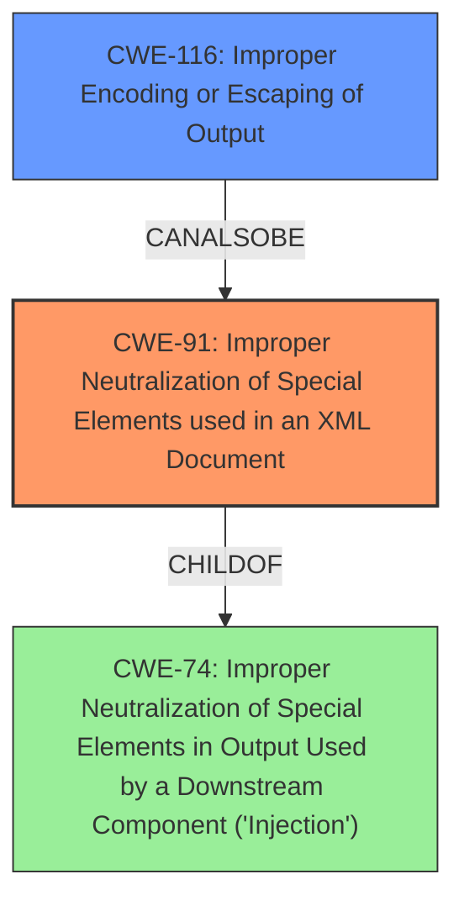

# Final Resolution for CVE-2021-32796

# Summary
| CWE ID | CWE Name | Confidence | CWE Abstraction Level | CWE Vulnerability Mapping Label | CWE-Vulnerability Mapping Notes |
|---|---|---|---|---|---|
| CWE-91 | Improper Neutralization of Special Elements used in an XML Document | 0.85 | Base | Allowed | Primary CWE: The product does not properly neutralize special elements that are used in XML, allowing attackers to modify the syntax, content, or commands of the XML before it is processed by an end system. |
| CWE-116 | Improper Encoding or Escaping of Output | 0.75 | Class | Allowed-with-Review | Secondary Candidate: The product prepares a structured message for communication with another component, but encoding or escaping of the data is either missing or done incorrectly. |

## Evidence and Confidence

*   **Confidence Score:** 0.80
*   **Evidence Strength:** HIGH

## Relationship Analysis
- Parent-child hierarchical relationships: CWE-91 is a base CWE and doesn't have any direct parent-child relationships impacting the decision. CWE-116 is a Class CWE.
- Chain relationships showing progression of vulnerability: The chain involves improper handling of XML elements leading to potential misinterpretation by downstream applications.
- Peer relationships that offered alternative classifications: Several CWEs related to injection and improper neutralization were considered, like CWE-78, CWE-79, CWE-643, and CWE-652, but deemed less appropriate.
- How abstraction levels influenced your selection: The decision favored the Base-level CWE-91 for its specificity regarding XML neutralization, while CWE-116, a Class-level CWE, was considered as a secondary contributing factor.

## Vulnerability Chain
The chain of events leading to the vulnerability is as follows:
1.  The `xmldom` library processes XML documents.
2.  The library fails to properly escape special characters during serialization of elements removed from their ancestor (**ROOTCAUSE**: CWE-91, Improper Neutralization of Special Elements used in an XML Document).
3.  This results in improper encoding or escaping of the XML output (**WEAKNESS**: CWE-116, Improper Encoding or Escaping of Output).
4.  Downstream applications receive the malformed XML, leading to unexpected syntactic changes and potential misinterpretation or exploitation.

## Summary of Analysis
The initial analysis identified CWE-116 as the primary weakness and CWE-91 as a secondary one. The criticism suggested re-evaluating the abstraction level of CWE-116 and exploring more specific Base-level CWEs related to XML output.

After considering the criticism and re-evaluating the evidence, I've determined that **CWE-91 (Improper Neutralization of Special Elements used in an XML Document) is the more appropriate primary CWE**. The vulnerability description specifically mentions the failure to correctly escape special characters (`<`, `&`, `"`) during XML serialization, which directly aligns with the description of CWE-91. The fact that the issue is specifically in XML serialization, not a general encoding problem, makes CWE-91 a better fit.

CWE-116 remains a valid secondary CWE because the improper neutralization leads to improper encoding of the output. However, it is a consequence of the root cause (CWE-91) rather than the primary issue itself.

The graph relationships influenced the decision by highlighting that CWE-91 is a Base-level CWE specifically addressing XML, while CWE-116 is a more general Class-level CWE. The mapping guidance for both CWEs allows their usage, but the higher specificity of CWE-91 makes it the preferred choice. The available evidence strongly supports the conclusion that the vulnerability stems from the improper handling of special elements within the XML structure.

The selected CWEs are at the optimal level of specificity because CWE-91 directly describes the root cause related to XML, and CWE-116 captures the broader consequence of improper encoding. More specific children of CWE-116 were considered, but none precisely matched the scenario.