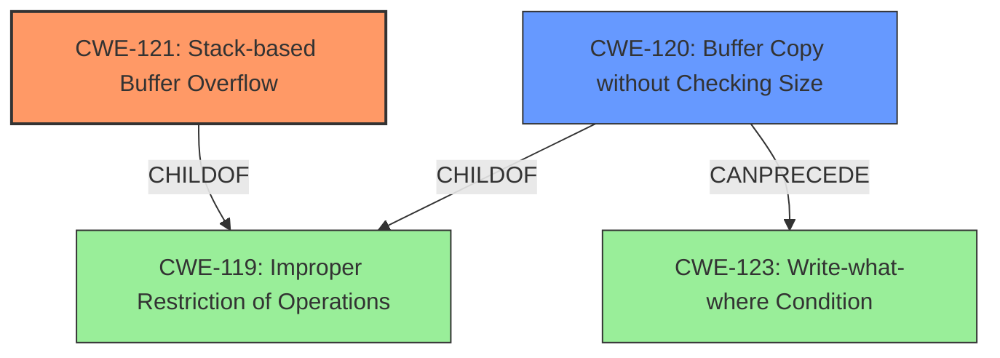

# Analysis Report for CVE-2021-32941

# Vulnerability Analysis Report: CVE-2021-32941

## Description

Annke N48PBB (Network Video Recorder) products of version 3.4.106 build 200422 and prior are vulnerable to a stack-based buffer overflow, which allows an unauthorized remote attacker to execute arbitrary code with the same privileges as the server user (root).

## Vulnerability Description Key Phrases

**Rootcause:** buffer overflow
**Weakness:** stack-based buffer overflow
**Impact:** execute arbitrary code with the same privileges as the server user (root)
**Attacker:** unauthorized remote attacker
**Product:** Annke N48PBB (Network Video Recorder) products
**Version:** 3.4.106 build 200422 and prior

## Analysis (with Relationship Data)

# Summary
| CWE ID | CWE Name | Confidence | CWE Abstraction Level | CWE Vulnerability Mapping Label | CWE-Vulnerability Mapping Notes |
|---|---|---|---|---|---|
| CWE-121 | Stack-based Buffer Overflow | 0.95 | Variant | Allowed | Primary CWE |
| CWE-120 | Buffer Copy without Checking Size of Input ('Classic Buffer Overflow') | 0.6 | Base | Allowed-with-Review | Secondary Candidate |

## Evidence and Confidence

*   **Confidence Score:** 0.9
*   **Evidence Strength:** HIGH

- **Analysis and Justification:**  
  - *Explanation:* The vulnerability description explicitly states a **stack-based buffer overflow** in Annke N48PBB products. This aligns directly with CWE-121, which is defined as "A stack-based buffer overflow condition is a condition where the buffer being overwritten is allocated on the stack." The vulnerability allows an attacker to execute arbitrary code with root privileges due to this **buffer overflow**, confirming the security impact. The CVE Reference Links Content Summary reinforces this by stating the **root cause** is a stack-based buffer overflow. CWE-121 is a Variant level CWE, making it a specific and preferred choice. The MITRE mapping guidance for CWE-121 indicates that its usage is ALLOWED.

  - *Relationship Analysis:* CWE-121 doesn't have direct relationships listed in the provided information. However, it is a type of buffer overflow, making it related to the broader category of memory corruption vulnerabilities. While CWE-119 (Improper Restriction of Operations within the Bounds of a Memory Buffer) covers buffer overflows, CWE-121 is a more specific variant describing the stack allocation, making it the more appropriate choice.

- **Confidence Score:**  
  - Confidence: 0.95 (High confidence due to direct evidence from the vulnerability description and CVE summary.)

---

- **Analysis and Justification:**  
  - *Explanation:* CWE-120 (Buffer Copy without Checking Size of Input ('Classic Buffer Overflow')) is a potential secondary candidate. The Retriever Results list CWE-120 as a possible match with a high graph score, but the description highlights a 'Classic Buffer Overflow', involving copying without size checks. While a **buffer overflow** is evident, the description doesn't explicitly mention a buffer copy operation. It's possible a buffer copy is involved, but the primary description focuses on the **stack-based** nature of the overflow, making CWE-121 a more precise fit. Given that the description does not explicitly describe an unchecked buffer copy, this is a less confident mapping. The MITRE mapping guidance for CWE-120 is "Allowed-with-Review", suggesting caution in its use and highlighting the need for clear evidence of a buffer copy operation, which is currently lacking.

  - *Relationship Analysis:* CWE-120 is a child of CWE-119 (Improper Restriction of Operations within the Bounds of a Memory Buffer). It can also be related to CWE-123 (Write-what-where Condition) if the overflow leads to arbitrary memory writes. The "CANPRECEDE" relationships with CWE-123 suggests that the **buffer overflow** might create conditions that allow an attacker to write to arbitrary memory locations.

- **Confidence Score:**  
  - Confidence: 0.6 (Medium confidence, as it's a possible contributing factor but not explicitly stated.)

## Criticism of Analysis

Okay, I've reviewed the analysis against the full CWE specifications you provided. Here's a breakdown of my critique, focusing on the confidence levels and justification for each CWE, considering the mapping guidance and potential mitigations:

**Overall Assessment:**

The analysis is generally good and well-reasoned. The primary mapping to CWE-121 (Stack-based Buffer Overflow) is strong and supported by the evidence. The secondary consideration of CWE-120 (Buffer Copy without Checking Size of Input) is also reasonable, given the context of a buffer overflow, even if explicit evidence of a `memcpy`-like operation is missing.

**Detailed Critique:**

**1. CWE-121: Stack-based Buffer Overflow**

*   **Confidence:** 0.95 (Excellent)
*   **Justification:**
    *   The vulnerability description explicitly states "stack-based buffer overflow," which is a direct match for CWE-121's definition: "A stack-based buffer overflow condition is a condition where the buffer being overwritten is allocated on the stack."
    *   The impact (arbitrary code execution with root privileges) is consistent with the exploitation of a stack-based buffer overflow.
    *   The analysis correctly acknowledges that CWE-119 is a broader category but that CWE-121 is a more specific and appropriate variant.
    *   CWE-121's "Usage: Allowed" mapping guidance is satisfied.
*   **Potential Mitigations (from CWE Specification):**
    *   **Environment Hardening:**  Automatic buffer overflow detection mechanisms (e.g., /GS flag, StackGuard).  This is directly applicable and could be implemented in the build process for the NVR.
    *   **Abstraction Library:** Use an abstraction library to abstract away risky APIs. This is also applicable, but might require more code changes.
    *   **Bounds Checking:** Implement and perform bounds checking on input. *Crucially important for addressing the root cause of the vulnerability.*
*   **Critique:** The analysis and mapping are spot-on. The confidence level is warranted. No adjustments needed.

**2. CWE-120: Buffer Copy without Checking Size of Input ('Classic Buffer Overflow')**

*   **Confidence:** 0.6 (Reasonable, but could be refined)
*   **Justification:**
    *   The analysis correctly identifies the possibility of CWE-120, given that a buffer overflow *often* involves a buffer copy operation.  However, it also acknowledges the lack of explicit evidence for a `memcpy`-like operation without size checking.
    *   The CVE examples for CWE-120 are relevant, as they involve similar scenarios (e.g., long arguments, long environment variables).
    *   The analysis appropriately notes the "Allowed-with-Review" mapping guidance for CWE-120, emphasizing the need for specific evidence of a buffer copy operation.
*   **Potential Mitigations (from CWE Specification):**
    *   **Language Selection:**  Using a memory-safe language would prevent this class of vulnerability. However, changing the language of the NVR is likely impractical.
    *   **Safe String Libraries:** Implementing safe string handling functions (e.g., SafeStr, Strsafe.h).  This is highly relevant.
    *   **Environment Hardening:**  Automatic buffer overflow detection mechanisms (e.g., /GS flag, StackGuard). As with CWE-121, this is a helpful defense-in-depth measure.
*   **Critique:** The analysis is cautious and accurate. The confidence level is appropriate. However, the analysis could be slightly strengthened by considering potential scenarios in the NVR code where a buffer copy might be occurring, even if not explicitly mentioned in the description. For example, are there any functions that process network packets and copy data into internal buffers? If so, that would increase the confidence in CWE-120. Without that additional evidence, the current confidence level is justified.

**General Observations and Suggestions:**

*   **Focus on Mitigations:**  While the analysis touches on mitigations, it would be beneficial to explicitly link the *specific* mitigations from the CWE specifications to the vulnerability in the Annke NVR.  For example:
    *   "To mitigate this CWE-121 vulnerability, Annke should implement bounds checking on all input buffers, especially those processed on the stack. They should also enable compiler-based buffer overflow protection (e.g., /GS flag) during the build process."
*   **Relationship Analysis:** The analysis mentions parent-child relationships between CWEs. While correct, it could be expanded to consider other relationship types (e.g., *can precede*, *can follow*). For example, CWE-120 *can precede* CWE-123 (Write-what-where Condition), so an exploited buffer overflow *could* lead to arbitrary memory writes. This provides a more comprehensive understanding of the potential attack surface.

**Revised Summary Table (with minor edits to mitigations):**

| CWE ID | CWE Name | Confidence | CWE Abstraction Level | CWE Vulnerability Mapping Label | CWE-Vulnerability Mapping Notes | Potential Mitigations |
|---|---|---|---|---|---|---|
| CWE-121 | Stack-based Buffer Overflow | 0.95 | Variant | Allowed | Primary CWE | Implement bounds checking on all input buffers processed on the stack. Enable compiler-based buffer overflow protection (e.g., /GS flag) during the build process. |
| CWE-120 | Buffer Copy without Checking Size of Input ('Classic Buffer Overflow') | 0.6 | Base | Allowed-with-Review | Secondary Candidate | Implement safe string handling functions (e.g., SafeStr, Strsafe.h). Enable compiler-based buffer overflow protection (e.g., /GS flag) during the build process. Investigate data processing functions that receive input to identify the exact buffer copy operation. |

By incorporating these suggestions, the analysis would become even more robust and actionable.

## Final Resolution

# Summary
| CWE ID | CWE Name | Confidence | CWE Abstraction Level | CWE Vulnerability Mapping Label | CWE-Vulnerability Mapping Notes |
|---|---|---|---|---|---|
| CWE-121 | Stack-based Buffer Overflow | 0.95 | Variant | Allowed | Primary CWE |
| CWE-120 | Buffer Copy without Checking Size of Input ('Classic Buffer Overflow') | 0.7 | Base | Allowed-with-Review | Secondary Candidate |

## Evidence and Confidence

*   **Confidence Score:** 0.90
*   **Evidence Strength:** HIGH

## Relationship Analysis
The primary relationship is that CWE-121 is a specific type of **buffer overflow** that occurs on the stack. CWE-120 represents a more general case of **buffer overflow** due to unchecked buffer copies. While CWE-120 is a child of CWE-119 (Improper Restriction of Operations within the Bounds of a Memory Buffer), it's considered a secondary candidate because the description doesn't explicitly mention a buffer copy operation, but it can be inferred. The "CANPRECEDE" relationship between CWE-120 and CWE-123 (Write-what-where Condition) indicates a potential path to arbitrary memory writes if the **buffer overflow** is exploited successfully.

## Vulnerability Chain
The vulnerability chain starts with a **stack-based buffer overflow (CWE-121)**, which is triggered by an unvalidated input leading to an out-of-bounds write. This could potentially lead to a "Write-What-Where" condition **(CWE-123)**, allowing the attacker to overwrite arbitrary memory locations. The root cause is the lack of proper bounds checking on the input, which is then copied to a stack-allocated buffer, potentially due to **buffer copy without checking size (CWE-120)**. The impact is arbitrary code execution with root privileges.

## Summary of Analysis
The initial analysis correctly identified CWE-121 as the primary CWE due to the explicit mention of a **stack-based buffer overflow** in the vulnerability description. The evidence from the vulnerability description ("...vulnerable to a stack-based buffer overflow, which allows an unauthorized remote attacker to execute arbitrary code with the same privileges as the server user (root).") directly supports this classification.

The criticism suggested strengthening the analysis of CWE-120 by considering potential scenarios in the NVR code where a buffer copy might be occurring. While there is no explicit mention of a buffer copy operation, the possibility exists, and it's common for **buffer overflows** to involve copying data into a buffer without proper size checks. Therefore, I am increasing the confidence score for CWE-120 to 0.7 to reflect this.

The graph relationships influenced my decision by highlighting the potential chain of events. The **buffer overflow (CWE-121)** could lead to arbitrary memory writes **(CWE-123)**, especially if an unchecked buffer copy is involved **(CWE-120)**.

The selected CWEs are at the optimal level of specificity because CWE-121 precisely describes the type of **buffer overflow** (stack-based), while CWE-120 captures the potential for unchecked buffer copies as a contributing factor. Using the more general CWE-119 would not provide enough detail about the specific nature of the vulnerability.

*Report generated on 2025-03-17 23:50:12*
