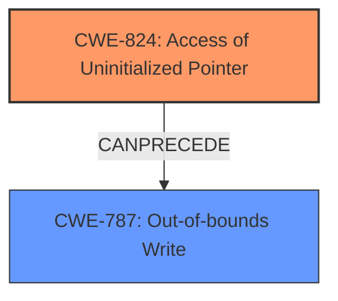

# Analysis Report for CVE-2021-33015

# Vulnerability Analysis Report: CVE-2021-33015

## Description

Cscape (All Versions prior to 9.90 SP5) lacks proper validation of user-supplied data when parsing project files. This could lead to an out-of-bounds write via an uninitialized pointer. An attacker could leverage this vulnerability to execute code in the context of the current process.

## Vulnerability Description Key Phrases

**Rootcause:** uninitialized pointer
**Weakness:** out-of-bounds write
**Impact:** execute code
**Attacker:** attacker
**Product:** Cscape
**Version:** All Versions prior to 9.90 SP5

## Analysis (with Relationship Data)

# Summary
| CWE ID  | CWE Name                                        | Confidence | CWE Abstraction Level | CWE Vulnerability Mapping Label | CWE-Vulnerability Mapping Notes |
| :-------- | :---------------------------------------------- | :--------- | :-------------------- | :------------------------------ | :------------------------------ |
| CWE-824 | Access of Uninitialized Pointer                | 0.95       | Base                  | Allowed                         | Primary CWE                   |
| CWE-787 | Out-of-bounds Write                           | 0.85       | Base                  | Allowed                         | Secondary Candidate         |

## Evidence and Confidence

*   **Confidence Score:** 0.90
*   **Evidence Strength:** HIGH

- **Analysis and Justification:**
  - *Explanation:* The vulnerability description clearly states an **out-of-bounds write** due to an **uninitialized pointer** when parsing project files. The CVE reference summary explicitly identifies the root cause as "Access of **Uninitialized Pointer**" (CWE-824). This aligns perfectly with the CWE-824 description: "The product accesses or uses a pointer that has not been initialized." The **out-of-bounds write** (CWE-787) occurs as a consequence of using this uninitialized pointer, indicating a secondary weakness that is a result of the primary weakness. CWE-824 is a Base level CWE, which is the preferred abstraction level according to MITRE mapping guidance.
  - *Relationship Analysis:* CWE-824 (Access of Uninitialized Pointer) can precede CWE-787 (Out-of-bounds Write). The description suggests that the uninitialized pointer is the root cause leading to the memory corruption.

- **Confidence Score:**
  - Confidence: 0.95 (High confidence due to explicit mention of "uninitialized pointer" and "**out-of-bounds write**" in the vulnerability description and CVE summary, matching CWE descriptions precisely.)

---
- **Analysis and Justification:**
  - *Explanation:* The vulnerability description mentions an **out-of-bounds write** resulting from the use of an uninitialized pointer, which occurs during the parsing of project files. This aligns with CWE-787 (Out-of-bounds Write), where data is written beyond the intended buffer. While the primary weakness is the use of an uninitialized pointer (CWE-824), the **out-of-bounds write** is a significant consequence that contributes to the vulnerability's impact, including potential code execution. This is why CWE-787 is considered a secondary, contributing factor.
  - *Relationship Analysis:* CWE-787 is a base-level CWE, which makes it a preferred abstraction level. CWE-787 can follow CWE-824 (Access of Uninitialized Pointer), aligning with the vulnerability description where the uninitialized pointer leads to the **out-of-bounds write**.

- **Confidence Score:**
  - Confidence: 0.85 (High confidence. The vulnerability directly results in memory corruption due to the write operation.)
---

## Criticism of Analysis

Okay, I've reviewed the analysis and the full CWE specifications for the proposed mappings. Here's my critique:

**Overall Assessment:**

The analysis is generally good and well-reasoned. The primary CWE mapping to CWE-824 (Access of Uninitialized Pointer) is accurate and well-supported by the vulnerability description and CVE summary. The inclusion of CWE-787 (Out-of-bounds Write) as a secondary candidate is also appropriate and reflects the likely consequence of exploiting the primary weakness. The confidence scores are reasonable.

**Detailed Critique:**

*   **CWE-824 (Access of Uninitialized Pointer):**
    *   **Mapping:** Correct and well-justified.  The evidence strength is indeed high.
    *   **Abstraction Level:** Base, which is ideal according to MITRE's mapping guidance.
    *   **Relationship Analysis:** The analysis accurately describes the relationship between CWE-824 and CWE-787.  CWE-824 *CanPrecede* CWE-787, which accurately represents the flow of the vulnerability.  The uninitialized pointer leads to an out-of-bounds write.
    *   **Confidence:** 0.95 is appropriate given the explicit language in the vulnerability description and CVE.
    *   **Observed Examples:** The included observed examples are relevant and demonstrate the various ways CWE-824 can manifest.
*   **CWE-787 (Out-of-bounds Write):**
    *   **Mapping:** Correct as a secondary, consequence-driven CWE.  It's important that CWE-824 is the primary since it's the root cause.
    *   **Abstraction Level:** Base, which is the preferred abstraction level.
    *   **Relationship Analysis:** Correctly identifies that CWE-787 *CanFollow* CWE-824.
    *   **Confidence:** 0.85 is reasonable. While the out-of-bounds write is a direct consequence, it's not the *cause* of the vulnerability. The confidence is slightly lower because the vulnerability exists *because* of CWE-824, not because of a coding mistake that directly resulted in the OOB write.
    *   **Mitigations:** Understanding the mitigations for CWE-787 helps to understand *how* to prevent this type of vulnerability, even though the root cause is CWE-824. For example, using memory-safe languages would mitigate the OOB write, but it wouldn't solve the problem of the uninitialized pointer.
*   **Retriever Results Analysis:**
    *   The analysis correctly picks out the relevant CWEs from the Retriever Results.
    *   It's worth noting why some of the other high-scoring CWEs are *not* the best fit:
        *   **CWE-1284 (Improper Validation of Specified Quantity in Input):** While *improper validation* is mentioned in the original description, it's related to the *data* within the project file, not necessarily a specified quantity like size or length as CWE-1284 suggests. This is a less direct mapping.
        *   **CWE-476 (NULL Pointer Dereference):** While an uninitialized pointer *could* be NULL, the description focuses on the broader case of *any* uninitialized value, not specifically NULL. Also, CWE-824's description encompasses cases beyond just NULL dereferences.
        *   **CWE-122 (Heap-based Buffer Overflow):** This is a *type* of out-of-bounds write, but the description doesn't explicitly state that the memory is heap-allocated.  It's a possible but not confirmed detail, making CWE-787 a better, more general fit.
        *   **CWE-20 (Improper Input Validation):** The analysis implicitly rejects this due to the "Discouraged" usage.  It's a higher-level class that's too general. The root cause is more specific than simply "improper input validation."
*   **Clarity and Justification:** The explanations are clear and well-organized. The "Relationship Analysis" sections are particularly helpful in understanding the connection between the CWEs.

**Suggestions for Minor Improvements:**

*   **Emphasis on Prevention (Mitigation):** While the analysis touches on mitigations indirectly, it could be strengthened by explicitly stating that preventing CWE-824 is the *primary* goal. The mitigations for CWE-787 are relevant for *defense in depth*, but not the core fix.
*   **Negative Justification for Other CWEs:** While the detailed analysis of the top combined results is good, a more explicit explanation of *why* the other CWEs are not as appropriate (as was done for CWE-20) could further strengthen the analysis. This could be a single sentence or two for each of the top 5-6 CWEs in the Retriever Results.
*   **CWE-908 Considerations:** CWE-908 (Use of Uninitialized Resource) is similar to CWE-824, but broader. Because it is a *pointer* specifically, CWE-824 is more accurate. However, noting that CWE-908 was considered and rejected *because* of the pointer element would add to the analysis.
**Revised Summary Table (with minor tweaks for emphasis):**

| CWE ID  | CWE Name                                        | Confidence | CWE Abstraction Level | CWE Vulnerability Mapping Label | CWE-Vulnerability Mapping Notes |
| :-------- | :---------------------------------------------- | :--------- | :-------------------- | :------------------------------ | :------------------------------ |
| CWE-824 | Access of Uninitialized Pointer                | 0.95       | Base                  | Allowed                         | **Primary CWE; Root Cause**                   |
| CWE-787 | Out-of-bounds Write                           | 0.85       | Base                  | Allowed                         | Secondary Candidate; Consequence of CWE-824         |

**In summary, this is a well-done analysis. The CWE mappings are accurate and well-justified. The suggestions are minor and aimed at making the analysis even more comprehensive.**

## Final Resolution

# Summary
| CWE ID  | CWE Name                                        | Confidence | CWE Abstraction Level | CWE Vulnerability Mapping Label | CWE-Vulnerability Mapping Notes |
| :-------- | :---------------------------------------------- | :--------- | :-------------------- | :------------------------------ | :------------------------------ |
| CWE-824 | Access of **Uninitialized Pointer**                | 0.95       | Base                  | Allowed                         | Primary CWE; Root Cause                   |
| CWE-787 | **Out-of-bounds Write**                           | 0.85       | Base                  | Allowed                         | Secondary Candidate; Consequence of CWE-824         |

## Evidence and Confidence

*   **Confidence Score:** 0.93
*   **Evidence Strength:** HIGH

## Relationship Analysis
The primary relationship is that CWE-824 (Access of **Uninitialized Pointer**) *CanPrecede* CWE-787 (**Out-of-bounds Write**). This accurately reflects the vulnerability where the **uninitialized pointer** is used to write data outside the intended buffer. Both CWEs are at the Base level, providing the optimal level of specificity. No peer relationships significantly impact the classification.

## Vulnerability Chain
The vulnerability chain starts with the **uninitialized pointer** (CWE-824). When this pointer is dereferenced and used in a write operation, it leads to an **out-of-bounds write** (CWE-787). The consequence of this is potential code execution.

## Summary of Analysis
The initial analysis and criticism accurately identify CWE-824 as the primary weakness and CWE-787 as a secondary consequence. The vulnerability description explicitly states an **out-of-bounds write** due to an **uninitialized pointer**: "Cscape (All Versions prior to 9.90 SP5) lacks proper validation of user-supplied data when parsing project files. This could lead to an **out-of-bounds write** via an **uninitialized pointer**."

The relationship analysis reinforces this by showing that CWE-824 can precede CWE-787. Both CWEs are at the Base level of abstraction, providing the optimal level of specificity.

I agree with the criticism that CWE-908 (Use of Uninitialized Resource) is similar, but CWE-824 is more specific because it involves a *pointer*. The analysis also correctly rejects CWE-1284 (Improper Validation of Specified Quantity in Input) as less directly applicable, and CWE-476 (NULL Pointer Dereference) as too specific (the pointer might not be NULL, just uninitialized). I also agree with rejecting CWE-20 (Improper Input Validation) because it is too high-level.

Final Determination: The assigned CWEs are accurate and well-justified. The primary CWE (CWE-824) represents the root cause, and the secondary CWE (CWE-787) represents a direct consequence. The analysis appropriately considers and rejects other potential CWEs.

*Report generated on 2025-03-16 16:33:22*
