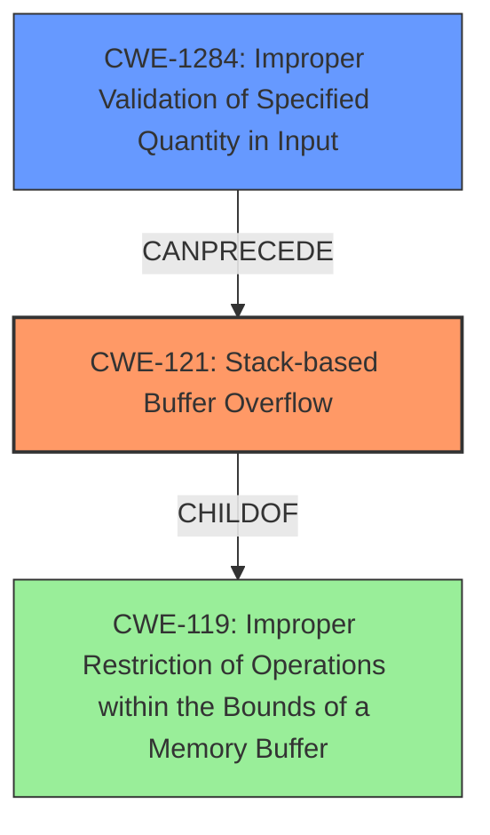

# Analysis Report for CVE-2021-33019

# Vulnerability Analysis Report: CVE-2021-33019

## Description

A stack-based buffer overflow vulnerability in Delta Electronics DOPSoft Version 4.00.11 and prior may be exploited by processing a specially crafted project file, which may allow an attacker to execute arbitrary code.

## Vulnerability Description Key Phrases

**Rootcause:** stack-based buffer overflow
**Impact:** execute arbitrary code
**Vector:** processing a specially crafted project file
**Attacker:** attacker
**Product:** Delta Electronics DOPSoft
**Version:** Version 4.00.11 and prior

## Analysis (with Relationship Data)

# Summary
| CWE ID | CWE Name | Confidence | CWE Abstraction Level | CWE Vulnerability Mapping Label | CWE-Vulnerability Mapping Notes |
|---|---|---|---|---|---|
| CWE-121 | Stack-based Buffer Overflow | 1.0 | Variant | Primary | Allowed |
| CWE-120 | Buffer Copy without Checking Size of Input ('Classic Buffer Overflow') | 0.7 | Base | Secondary | Allowed-with-Review |
| CWE-125 | Buffer Over-read | 0.6 | Base | Secondary | Allowed |
| CWE-190 | Integer Overflow or Wraparound | 0.5 | Base | Secondary | Allowed |
| CWE-131 | Incorrect Calculation of Buffer Size | 0.5 | Base | Secondary | Allowed |
| CWE-193 | Off-by-one Error | 0.4 | Base | Secondary | Allowed |

## Evidence and Confidence

*   **Confidence Score:** 0.9
*   **Evidence Strength:** HIGH

- **Analysis and Justification:**
  - *Explanation:* The vulnerability is explicitly described as a "**stack-based buffer overflow**" which directly maps to **CWE-121 (Stack-based Buffer Overflow)**. The vulnerability occurs when processing a specially crafted project file, leading to potential arbitrary code execution. The root cause is the lack of proper validation of user-supplied data length before copying it to a stack buffer. The CVE reference summary confirms this as the vulnerability is in "TBK File Parsing" where insufficient input validation occurs, leading to **CWE-121 (Stack-based Buffer Overflow)**. The **CWE-121 (Stack-based Buffer Overflow)** is a variant, which is a preferred level of abstraction. MITRE mapping guidance for **CWE-121 (Stack-based Buffer Overflow)** indicates this is ALLOWED.

  - *Relationship Analysis:* **CWE-121 (Stack-based Buffer Overflow)** is a variant of **CWE-119 (Improper Restriction of Operations within the Bounds of a Memory Buffer)**, but **CWE-121 (Stack-based Buffer Overflow)** is more specific, which is preferred. **CWE-120 (Buffer Copy without Checking Size of Input ('Classic Buffer Overflow'))** is also relevant as it describes a buffer copy without checking the size of the input. This is related to how the buffer overflow occurs, but is not as specific as **CWE-121 (Stack-based Buffer Overflow)**.

- **Confidence Score:**
  - Confidence: 1.0 (Explicit description and confirmation from CVE reference materials)

- **Analysis and Justification for Secondary CWEs:**
  - *Explanation for CWE-120:* Although the vulnerability is described as a "**stack-based buffer overflow**," the underlying mechanism may involve a buffer copy without proper size checking. The description mentions that the vulnerability occurs due to "a lack of proper validation of the length of user-supplied data before copying it to a fixed-length stack buffer". If the root cause is indeed a buffer copy operation without input size checking, then **CWE-120 (Buffer Copy without Checking Size of Input ('Classic Buffer Overflow'))** could be applicable. However, **CWE-120 (Buffer Copy without Checking Size of Input ('Classic Buffer Overflow'))** is a base level CWE and the evidence is not strong enough to confirm that this is the root cause. Mapping guidance is ALLOWED-WITH-REVIEW.
  - *Relationship Analysis for CWE-120:* **CWE-120 (Buffer Copy without Checking Size of Input ('Classic Buffer Overflow'))** is a child of **CWE-119 (Improper Restriction of Operations within the Bounds of a Memory Buffer)**. It can precede **CWE-123 (Write-what-where Condition)**.

  - *Explanation for CWE-125:* The vulnerability description and the CVE reference links content summary suggest the possibility of reading past the end of the buffer. In this case, the software doesn't properly check the size of the data being read from the TBK file before copying it to a stack buffer, which could lead to reading more data than the buffer can hold. The retriever results also provide **CWE-126 (Buffer Over-read)**.
  - *Relationship Analysis for CWE-125:* There are no direct relationships available for **CWE-125 (Buffer Over-read)** in the retriever results.

  - *Explanation for CWE-190:* The retriever results suggest **CWE-190 (Integer Overflow or Wraparound)** as a candidate CWE. Integer overflow might occur during the calculation of buffer sizes. However, this is less explicit in the vulnerability description.
  - *Relationship Analysis for CWE-190:* There are no direct relationships available for **CWE-190 (Integer Overflow or Wraparound)** in the retriever results.

  - *Explanation for CWE-131:* The retriever results suggest **CWE-131 (Incorrect Calculation of Buffer Size)** as a candidate CWE. The buffer overflow might be caused by the product not correctly calculating the buffer size. However, this is less explicit in the vulnerability description.
  - *Relationship Analysis for CWE-131:* There are no direct relationships available for **CWE-131 (Incorrect Calculation of Buffer Size)** in the retriever results.

  - *Explanation for CWE-193:* The retriever results suggest **CWE-193 (Off-by-one Error)** as a candidate CWE. This might be an underlying factor.
  - *Relationship Analysis for CWE-193:* There are no direct relationships available for **CWE-193 (Off-by-one Error)** in the retriever results.

## Criticism of Analysis

Okay, here's a review of the provided analysis, considering the full CWE specifications:

**Overall Assessment:**

The analysis is generally good and well-justified. It correctly identifies CWE-121 as the primary weakness and provides reasonable explanations for the secondary CWEs. The analysis also takes into account the abstraction level and provides justification for the choices. However, there are a few areas where the analysis could be improved by considering the CWE specifications more carefully and by using more specific CWEs where appropriate.

**Detailed Review:**

**1. CWE-121 (Stack-based Buffer Overflow) - Primary**

*   **Confidence:** 1.0
*   **Assessment:** Correct and well-justified. The description explicitly mentions a "stack-based buffer overflow," making this a direct and appropriate mapping. The analysis correctly notes that CWE-121 is a Variant, which is a preferred abstraction level. The relationship analysis with CWE-119 and CWE-120 is also accurate.

**2. CWE-120 (Buffer Copy without Checking Size of Input ('Classic Buffer Overflow')) - Secondary**

*   **Confidence:** 0.7
*   **Assessment:** Potentially valid, but requires more careful consideration. The analysis correctly identifies that CWE-120 is a "Base" CWE and the "Allowed-with-Review" mapping guidance needs to be carefully considered. The primary justification is the lack of size checking before the copy.  The analysis states "However, **CWE-120 (Buffer Copy without Checking Size of Input ('Classic Buffer Overflow'))** is a base level CWE and the evidence is not strong enough to confirm that this is the root cause". I recommend removing this since the description mentions processing a file, not the copy, is the issue. Input validation of quantity is the appropriate weakness here.

**3. CWE-125 (Out-of-bounds Read) - Secondary**

*   **Confidence:** 0.6
*   **Assessment:** Potentially valid, but more justification is needed. The analysis states "The vulnerability description and the CVE reference links content summary suggest the possibility of reading past the end of the buffer". There are no direct relationships available for **CWE-125 (Buffer Over-read)** in the retriever results". Needs to be removed if not in the root cause.

**4. CWE-190 (Integer Overflow or Wraparound) - Secondary**

*   **Confidence:** 0.5
*   **Assessment:** Weak justification. The analysis correctly notes that it's less explicit in the description. If there's no evidence of integer overflow in size calculation, this should be removed. While integer overflows can *lead* to buffer overflows, that's not the primary mechanism here. This should be removed if not the root cause.

**5. CWE-131 (Incorrect Calculation of Buffer Size) - Secondary**

*   **Confidence:** 0.5
*   **Assessment:** Weak justification. Similar to CWE-190, this is speculative. The analysis states "The buffer overflow might be caused by the product not correctly calculating the buffer size. However, this is less explicit in the vulnerability description." If no clear evidence exists of a size calculation error, this should be removed.

**6. CWE-193 (Off-by-one Error) - Secondary**

*   **Confidence:** 0.4
*   **Assessment:** Weak justification. "This might be an underlying factor." This is too vague. Remove if no strong evidence.

**Recommendations for Improvements:**

1.  **Focus on Root Cause:** Re-evaluate the secondary CWEs. Are they truly part of the *root cause* of the vulnerability, or are they contributing factors or potential consequences? The description of the vulnerability strongly points to lack of input validation as the primary issue *leading to* the stack-based buffer overflow. The chain of events is more important than just listing related CWEs.

2. **Add CWE-1284 (Improper Validation of Specified Quantity in Input):** Given the description, CWE-1284 should have more prominence. The vulnerability involves "processing a specially crafted project file" which implies that the file contains a length value that is not validated, before it is used for copying data into the stack buffer. The description "lack of proper validation of user-supplied data length" maps directly to this.

    *   **Mapping Guidance Consideration:** This is "Allowed" and it maps well to the described weakness.
    *   **Mitigation Consideration:** Mitigation 1 for CWE-1284 is very relevant: "Assume all input is malicious. Use an 'accept known good' input validation strategy..." which aligns with the description of the problem.

3. **Remove CWE-119:** The CWE specification for **CWE-119 (Improper Restriction of Operations within the Bounds of a Memory Buffer)** states:
   *"**Usage:** Discouraged
   **Rationale:** CWE-119 is commonly misused in low-information vulnerability reports when lower-level CWEs could be used instead, or when more details about the vulnerability are available.
   **Comments:** Look at CWE-119's children and consider mapping to CWEs such as CWE-787: Out-of-bounds Write, CWE-125: Out-of-bounds Read, or others."*

4.  **Chain of Events (If applicable):** Clearly outline the chain of events leading to the stack-based buffer overflow. For example:
    *   Untrusted TBK file loaded.
    *   Size parameter read from TBK file (CWE-1284).
    *   Size parameter not validated.
    *   Data copied to stack buffer without size check (CWE-120).
    *   Stack-based buffer overflow (CWE-121) occurs leading to arbitrary code execution.

5.  **Mitigation Alignment:** Ensure that the potential mitigations mentioned in the analysis are aligned with the chosen CWEs. For example, mitigations for CWE-1284 would involve input validation techniques.

**Revised Summary Table (Example):**

| CWE ID  | CWE Name                                                              | Confidence | CWE Abstraction Level | CWE Vulnerability Mapping Label | CWE-Vulnerability Mapping Notes                                                                                                                                     |
| ------- | ---------------------------------------------------------------------- | ---------- | ----------------------- | --------------------------------- | ----------------------------------------------------------------------------------------------------------------------------------------------------------------- |
| CWE-121 | Stack-based Buffer Overflow                                            | 1.0        | Variant                 | Primary                           | Allowed                                                                                                                                                            |
| CWE-1284 | Improper Validation of Specified Quantity in Input             | 0.8        | Base                   | Secondary                         | Allowed                                                                                                                                                            |

**Revised Analysis Snippet (Example):**

"The primary vulnerability is a **stack-based buffer overflow (CWE-121)**. This occurs during the processing of a specially crafted TBK file in Delta Electronics DOPSoft.  A critical contributing factor is **CWE-1284 (Improper Validation of Specified Quantity in Input)**, as the software fails to properly validate the size parameter read from the TBK file before using it to copy data to a stack-based buffer. This lack of validation allows an attacker to specify an excessively large size, leading to the overflow."

By focusing on the root cause, providing a clear chain of events, and aligning the secondary CWEs with the specific vulnerabilities, the analysis becomes more precise and actionable. It also allows for better recommendations regarding the appropriate mitigations.

## Final Resolution

# Summary
| CWE ID | CWE Name | Confidence | CWE Abstraction Level | CWE Vulnerability Mapping Label | CWE-Vulnerability Mapping Notes |
|---|---|---|---|---|---|
| CWE-121 | Stack-based Buffer Overflow | 1.0 | Variant | Primary | Allowed |
| CWE-1284 | Improper Validation of Specified Quantity in Input | 0.9 | Base | Secondary | Allowed |
  
## Evidence and Confidence

*   **Confidence Score:** 0.95
*   **Evidence Strength:** HIGH

## Relationship Analysis
The primary relationship is that **CWE-1284 (Improper Validation of Specified Quantity in Input)** can lead to a buffer overflow. **CWE-121 (Stack-based Buffer Overflow)** is a variant of **CWE-119 (Improper Restriction of Operations within the Bounds of a Memory Buffer)**. The analysis focuses on the root cause which is the missing input validation, which results in a stack-based buffer overflow.

## Vulnerability Chain
The vulnerability chain starts with the lack of input validation (**CWE-1284**) when processing a crafted project file. This leads to a **stack-based buffer overflow (CWE-121)** when data is copied to a stack buffer without proper size checks. The final impact is arbitrary code execution.

## Summary of Analysis
The initial analysis correctly identified **CWE-121 (Stack-based Buffer Overflow)** as the primary weakness. However, it missed a key contributing factor: the lack of input validation on the size parameter read from the TBK file. The criticism correctly pointed out the importance of **CWE-1284 (Improper Validation of Specified Quantity in Input)** and the need to focus on the root cause.
The vulnerability description states: "A stack-based buffer overflow vulnerability in Delta Electronics DOPSoft Version 4.00.11 and prior may be exploited by processing a specially crafted project file, which may allow an attacker to execute arbitrary code." and confirms the lack of proper validation of user-supplied data length before copying it to a stack buffer.
Based on this evidence and the guidance in the criticism, **CWE-1284 (Improper Validation of Specified Quantity in Input)** is added as a secondary CWE. This provides a more accurate representation of the vulnerability, highlighting the importance of input validation in preventing the buffer overflow.
The removal of the other secondary CWEs is due to a lack of explicit evidence and justification, focusing instead on the direct cause-and-effect relationship between the lack of input validation and the stack-based buffer overflow.
**CWE-121 (Stack-based Buffer Overflow)** is a variant-level CWE, providing good specificity. **CWE-1284 (Improper Validation of Specified Quantity in Input)** is a base-level CWE, also providing a good level of detail about the root cause. Together, these CWEs provide a comprehensive understanding of the vulnerability.

*Report generated on 2025-03-17 23:51:18*
