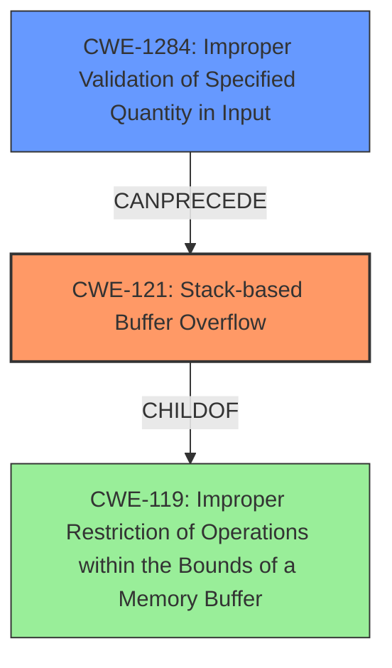

# Final Resolution for CVE-2021-33019

# Summary
| CWE ID | CWE Name | Confidence | CWE Abstraction Level | CWE Vulnerability Mapping Label | CWE-Vulnerability Mapping Notes |
|---|---|---|---|---|---|
| CWE-121 | Stack-based Buffer Overflow | 1.0 | Variant | Primary | Allowed |
| CWE-1284 | Improper Validation of Specified Quantity in Input | 0.9 | Base | Secondary | Allowed |
  
## Evidence and Confidence

*   **Confidence Score:** 0.95
*   **Evidence Strength:** HIGH

## Relationship Analysis
The primary relationship is that **CWE-1284 (Improper Validation of Specified Quantity in Input)** can lead to a buffer overflow. **CWE-121 (Stack-based Buffer Overflow)** is a variant of **CWE-119 (Improper Restriction of Operations within the Bounds of a Memory Buffer)**. The analysis focuses on the root cause which is the missing input validation, which results in a stack-based buffer overflow.

## Vulnerability Chain
The vulnerability chain starts with the lack of input validation (**CWE-1284**) when processing a crafted project file. This leads to a **stack-based buffer overflow (CWE-121)** when data is copied to a stack buffer without proper size checks. The final impact is arbitrary code execution.

## Summary of Analysis
The initial analysis correctly identified **CWE-121 (Stack-based Buffer Overflow)** as the primary weakness. However, it missed a key contributing factor: the lack of input validation on the size parameter read from the TBK file. The criticism correctly pointed out the importance of **CWE-1284 (Improper Validation of Specified Quantity in Input)** and the need to focus on the root cause.
The vulnerability description states: "A stack-based buffer overflow vulnerability in Delta Electronics DOPSoft Version 4.00.11 and prior may be exploited by processing a specially crafted project file, which may allow an attacker to execute arbitrary code." and confirms the lack of proper validation of user-supplied data length before copying it to a stack buffer.
Based on this evidence and the guidance in the criticism, **CWE-1284 (Improper Validation of Specified Quantity in Input)** is added as a secondary CWE. This provides a more accurate representation of the vulnerability, highlighting the importance of input validation in preventing the buffer overflow.
The removal of the other secondary CWEs is due to a lack of explicit evidence and justification, focusing instead on the direct cause-and-effect relationship between the lack of input validation and the stack-based buffer overflow.
**CWE-121 (Stack-based Buffer Overflow)** is a variant-level CWE, providing good specificity. **CWE-1284 (Improper Validation of Specified Quantity in Input)** is a base-level CWE, also providing a good level of detail about the root cause. Together, these CWEs provide a comprehensive understanding of the vulnerability.