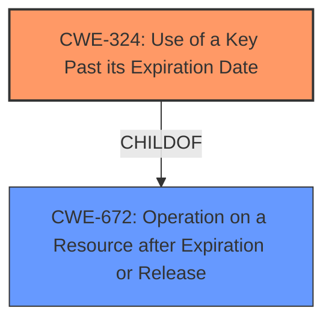

# Analysis Report for CVE-2021-33020

# Vulnerability Analysis Report: CVE-2021-33020

## Description

Philips Vue PACS versions 12.2.x.x and prior uses a cryptographic key or password past its expiration date, which diminishes its safety significantly by increasing the timing window for cracking attacks against that key.

## Vulnerability Description Key Phrases

**Weakness:** use cryptographic key or password past its expiration date
**Product:** Philips Vue PACS
**Version:** 12.2.x.x and prior

## Analysis (with Relationship Data)

# Summary
| CWE ID  | CWE Name                                                    | Confidence | CWE Abstraction Level | CWE Vulnerability Mapping Label | CWE-Vulnerability Mapping Notes |
| :-------- | :---------------------------------------------------------- | :--------- | :-------------------- | :------------------------------ | :------------------------------ |
| CWE-324 | Use of a Key Past its Expiration Date                       | 1.0        | Base                  | Allowed                         | Acceptable-Use                  |

## Evidence and Confidence

*   **Confidence Score:** 1.0
*   **Evidence Strength:** HIGH

- **Analysis and Justification:**
  - *Explanation:* The vulnerability description clearly states that "Philips Vue PACS versions 12.2.x.x and prior **uses a cryptographic key or password past its expiration date**, which diminishes its safety significantly by increasing the timing window for cracking attacks against that key." This directly matches the description of CWE-324 "Use of a Key Past its Expiration Date". The CVE Reference Links Content Summary confirms this by stating: "**Root Cause:** The software uses a cryptographic key or password past its expiration date" and "**Vulnerability:** Use of a key past its expiration date (CWE-324)." The CWE-324 is a Base level CWE which is the preferred level of abstraction. The Usage is "Allowed" with the rationale "This CWE entry is at the Base level of abstraction, which is a preferred level of abstraction for mapping to the root causes of vulnerabilities."

  - *Relationship Analysis:* CWE-324 has no direct relationships in the provided data.

- **Confidence Score:**
  - Confidence: 1.0 (Direct match from the vulnerability description and CVE reference).

---

## Criticism of Analysis

Okay, here's a review of the analysis, with a focus on the CWE specifications, mapping guidance, and potential mitigations.

**Overall Assessment:**

The analysis correctly identifies CWE-324 (Use of a Key Past its Expiration Date) as the primary weakness. The justification is sound, and the confidence score of 1.0 is appropriate. The analysis leverages the vulnerability description and CVE summary effectively.

**Detailed Review:**

*   **CWE-324 (Use of a Key Past its Expiration Date):**

    *   **Correctness:** The mapping to CWE-324 is accurate. The description and extended description of CWE-324 precisely match the vulnerability description. The fact that CVE-2021-33020 is listed as an example of CWE-324 in the CWE database further reinforces this identification.
    *   **Abstraction Level:** The analysis correctly notes that CWE-324 is a "Base" level CWE, which is the preferred level of abstraction.
    *   **Mapping Guidance:** The analysis considers the mapping guidance, correctly noting that "Usage: Allowed" because it's at the Base level.
    *   **Mitigations:** The analysis doesn't explicitly discuss mitigations in the summary table but includes the mitigation details in the full report. The primary mitigation listed in the CWE specification is:

        *   **Phase:** Architecture and Design
        *   **Description:**  Adequate consideration should be put in to the user interface in order to notify users previous to the key's expiration, to explain the importance of new key generation and to walk users through the process as painlessly as possible.

        This mitigation is relevant and applicable to the described vulnerability. It suggests a proactive approach to key management, emphasizing user education and ease of key rotation. The Philips Vue PACS system should ideally implement mechanisms to alert administrators about expiring keys and guide them through the renewal process.

**Review of Retriever Results (Other Potential CWEs):**

The retriever results suggest other CWEs that, while not the primary cause, might be related or contribute to the vulnerability.  It is important to understand why the analysis only used CWE-324.

*   **CWE-916 (Use of Password Hash With Insufficient Computational Effort):** This CWE is less directly related, but if the expired key is used to hash passwords or other sensitive data, and the hashing algorithm is weak, it could amplify the risk. However, there is no evidence to suggest that this is the case.
*   **CWE-1240 (Use of a Cryptographic Primitive with a Risky Implementation):**  Similar to CWE-916. If the expired key is used within a flawed cryptographic implementation, it compounds the risk. However, the primary issue is the expired key itself, not necessarily the underlying algorithm.
*   **CWE-321 (Use of Hard-coded Cryptographic Key):**  While the vulnerability doesn't explicitly state the key is hard-coded, it *could* be a contributing factor. If the expired key is also hard-coded, it becomes even more problematic, as there might be no built-in mechanism for updating it.  If there was evidence suggesting the key was hardcoded, it would have been useful to include it.
*   **CWE-203 (Observable Discrepancy) / CWE-208 (Observable Timing Discrepancy):**  These are unlikely to be directly related. The vulnerability description doesn't imply any timing-related issues or information leakage through observable discrepancies.
*   **CWE-613 (Insufficient Session Expiration):** This is unlikely as the vulnerability described has nothing to do with session management.
*   **CWE-328 (Use of Weak Hash):** As stated with CWE-916 and CWE-1240, it is less directly related, but if the expired key is used to hash passwords or other sensitive data, and the hashing algorithm is weak, it could amplify the risk. However, there is no evidence to suggest that this is the case.
*   **CWE-325 (Missing Cryptographic Step):** Not applicable. The issue is the expired key, not a missing step in a cryptographic process.
*   **CWE-327 (Use of a Broken or Risky Cryptographic Algorithm):** Similar to CWE-1240. It's indirectly relevant, but the expired key is the primary problem.

**Recommendations for Improvement:**

1.  **Acknowledge Potentially Related CWEs:**  In the analysis, briefly acknowledge the retriever results and explain *why* the other suggested CWEs (specifically, CWE-916, CWE-1240, and CWE-321) are *not* the primary focus, even if they might be indirectly related. This demonstrates a thorough assessment.
2.  **Consider Hard-coding Implication:** If there is any reason to suspect the key *might* be hard-coded, mention this possibility and its implications (i.e., it makes key rotation more difficult).  Even if there's no definitive proof, it's worth noting as a potential contributing factor.
3.  **Elaborate on Mitigation Implementation:** Expand on how the identified mitigation (user interface notifications and guided key rotation) could be practically implemented within the Philips Vue PACS system. For instance, describe the specific UI elements, logging mechanisms, or administrative workflows that would be necessary.
4.  **Relationship to other CWEs:** The relationship to CWE-672 (Operation on a Resource after Expiration or Release) could be mentioned. While CWE-324 is more specific, it is a child of CWE-672.

**Revised Summary Table (Example - incorporating some suggestions):**

| CWE ID  | CWE Name                                                    | Confidence | CWE Abstraction Level | CWE Vulnerability Mapping Label | CWE-Vulnerability Mapping Notes                                                                                                                                                                                                                                                                                                          |
| :-------- | :---------------------------------------------------------- | :--------- | :-------------------- | :------------------------------ | :------------------------------------------------------------------------------------------------------------------------------------------------------------------------------------------------------------------------------------------------------------------------------------------------------------------------------------- |
| CWE-324 | Use of a Key Past its Expiration Date                       | 1.0        | Base                  | Allowed                         | Acceptable-Use. Directly addresses the root cause of the vulnerability, as confirmed by the CVE description. While CWE-916, CWE-1240, and CWE-327 might be indirectly relevant if the expired key is used with weak hashing or algorithms, they are not the primary issue.  CWE-321 (Hardcoded key) is a potential but unconfirmed contributing factor. |

By addressing these points, the analysis can be made even more robust and demonstrate a deeper understanding of the vulnerability within the context of the CWE framework.

## Final Resolution

# Summary
| CWE ID  | CWE Name                                                    | Confidence | CWE Abstraction Level | CWE Vulnerability Mapping Label | CWE-Vulnerability Mapping Notes |
| :-------- | :---------------------------------------------------------- | :--------- | :-------------------- | :------------------------------ | :------------------------------ |
| CWE-324 | Use of a Key Past its Expiration Date                       | 1.0        | Base                  | Allowed                         | Acceptable-Use, Primary CWE                  |

## Evidence and Confidence

*   **Confidence Score:** 1.0
*   **Evidence Strength:** HIGH

## Relationship Analysis
The primary relationship considered was the parent-child relationship. While CWE-672 (Operation on a Resource after Expiration or Release) is a parent of CWE-324, CWE-324 is more specific and directly relates to the vulnerability description. There are no other relevant relationships based on the provided data.

## Vulnerability Chain
The vulnerability chain is straightforward:
1.  **ROOTCAUSE**: **CWE-324** (Use of a Key Past its Expiration Date) - The cryptographic key or password used by Philips Vue PACS has expired.
2.  Weakness: The expired key increases the timing window for cracking attacks.
3.  Impact: Potential compromise of sensitive data protected by the expired key.

## Summary of Analysis
The initial analysis correctly identified CWE-324 as the primary weakness. The vulnerability description states: "Philips Vue PACS versions 12.2.x.x and prior **uses a cryptographic key or password past its expiration date**, which diminishes its safety significantly by increasing the timing window for cracking attacks against that key." This statement is a direct match for the CWE-324 description.

The criticism raised valid points about acknowledging potentially related CWEs like CWE-916 (Use of Password Hash With Insufficient Computational Effort), CWE-1240 (Use of a Cryptographic Primitive with a Risky Implementation), and CWE-321 (Use of Hard-coded Cryptographic Key). However, these are not directly implicated by the vulnerability description. They might be relevant if the expired key was used in conjunction with a weak hashing algorithm or if the key was hard-coded, but there is no specific evidence to suggest either of these conditions.

CWE-324 is at the optimal level of specificity because it precisely describes the **rootcause** of the vulnerability. While CWE-672 is a parent CWE, it's more general. Therefore, CWE-324 is the most appropriate classification based on the available evidence and relationship analysis.

*Report generated on 2025-03-17 03:50:41*
