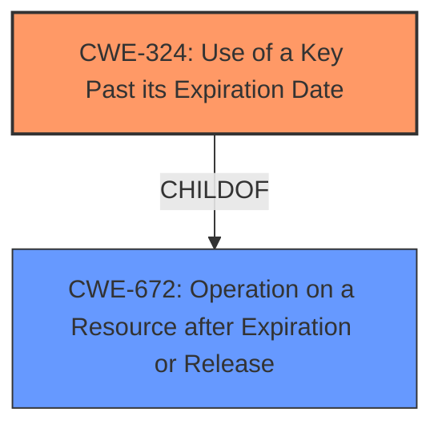

# Final Resolution for CVE-2021-33020

# Summary
| CWE ID  | CWE Name                                                    | Confidence | CWE Abstraction Level | CWE Vulnerability Mapping Label | CWE-Vulnerability Mapping Notes |
| :-------- | :---------------------------------------------------------- | :--------- | :-------------------- | :------------------------------ | :------------------------------ |
| CWE-324 | Use of a Key Past its Expiration Date                       | 1.0        | Base                  | Allowed                         | Acceptable-Use, Primary CWE                  |

## Evidence and Confidence

*   **Confidence Score:** 1.0
*   **Evidence Strength:** HIGH

## Relationship Analysis
The primary relationship considered was the parent-child relationship. While CWE-672 (Operation on a Resource after Expiration or Release) is a parent of CWE-324, CWE-324 is more specific and directly relates to the vulnerability description. There are no other relevant relationships based on the provided data.

## Vulnerability Chain
The vulnerability chain is straightforward:
1.  **ROOTCAUSE**: **CWE-324** (Use of a Key Past its Expiration Date) - The cryptographic key or password used by Philips Vue PACS has expired.
2.  Weakness: The expired key increases the timing window for cracking attacks.
3.  Impact: Potential compromise of sensitive data protected by the expired key.

## Summary of Analysis
The initial analysis correctly identified CWE-324 as the primary weakness. The vulnerability description states: "Philips Vue PACS versions 12.2.x.x and prior **uses a cryptographic key or password past its expiration date**, which diminishes its safety significantly by increasing the timing window for cracking attacks against that key." This statement is a direct match for the CWE-324 description.

The criticism raised valid points about acknowledging potentially related CWEs like CWE-916 (Use of Password Hash With Insufficient Computational Effort), CWE-1240 (Use of a Cryptographic Primitive with a Risky Implementation), and CWE-321 (Use of Hard-coded Cryptographic Key). However, these are not directly implicated by the vulnerability description. They might be relevant if the expired key was used in conjunction with a weak hashing algorithm or if the key was hard-coded, but there is no specific evidence to suggest either of these conditions.

CWE-324 is at the optimal level of specificity because it precisely describes the **rootcause** of the vulnerability. While CWE-672 is a parent CWE, it's more general. Therefore, CWE-324 is the most appropriate classification based on the available evidence and relationship analysis.