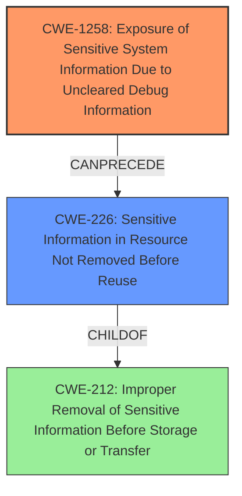

# Analysis Report for CVE-2021-33080

# Vulnerability Analysis Report: CVE-2021-33080

## Description

Exposure of sensitive system information due to uncleared debug information in firmware for some Intel(R) SSD DC, Intel(R) Optane(TM) SSD and Intel(R) Optane(TM) SSD DC Products may allow an unauthenticated user to potentially enable information disclosure or escalation of privilege via physical access.

## Vulnerability Description Key Phrases

**Rootcause:** uncleared debug information in firmware
**Impact:** ['information disclosure', 'escalation of privilege']
**Vector:** physical access
**Attacker:** unauthenticated user
**Product:** ['Intel SSD DC', 'Intel Optane SSD', 'Intel Optane SSD DC']

## Analysis (with Relationship Data)

# Summary
| CWE ID   | CWE Name                                                                | Confidence | CWE Abstraction Level | CWE Vulnerability Mapping Label | CWE-Vulnerability Mapping Notes |
| :--------- | :---------------------------------------------------------------------- | :--------- | :-------------------- | :------------------------------ | :------------------------------ |
| CWE-1258 | Exposure of Sensitive System Information Due to Uncleared Debug Information | 0.85       | Base                  | Primary                         | Allowed                       |
| CWE-497  | Sensitive Information Leak                                              | 0.5       | Base                  | Secondary                        | Allowed                       |

## Evidence and Confidence

*   **Confidence Score:** 0.75
*   **Evidence Strength:** MEDIUM

- **Analysis and Justification:**  
  - *Explanation:* The vulnerability description clearly states "Exposure of sensitive system information due to **uncleared debug information in firmware**". This aligns directly with CWE-1258, "Exposure of Sensitive System Information Due to Uncleared Debug Information". The **root cause** is the **uncleared debug information**, and the impact is information disclosure and potential privilege escalation. CWE-1258 is a Base level CWE, which is the preferred level of abstraction. MITRE mapping guidance for CWE-1258 indicates this is ALLOWED. While other CWEs were suggested by the retriever, CWE-1258 has the highest combined score and most directly matches the description. The physical access vector could imply other access control issues, but the **root cause** seems to be related to the debugging information left in the firmware. CWE-497 is considered as secondary since it could result from the debugging information being leaked.

  - *Relationship Analysis:* CWE-1258 has no direct relationships. CWE-497 has no direct relationships.

- **Confidence Score:**  
  - Confidence: 0.85 (High evidence from the vulnerability description matching CWE-1258 description, as well as high retriever score). Confidence: 0.5 (Medium for CWE-497 as it is just based on inference based on the potential to allow unauthorized access)

---

## Criticism of Analysis

Okay, I've reviewed the provided analysis against the full CWE specifications. Here's my critique:

**Overall Assessment:**

The primary CWE mapping to CWE-1258 (Exposure of Sensitive System Information Due to Uncleared Debug Information) is accurate and well-justified.  The secondary mapping to CWE-497 (Exposure of Sensitive System Information to an Unauthorized Control Sphere) is reasonable as a consequence, but perhaps could be refined. The confidence scores are appropriate.

**Detailed Breakdown:**

*   **CWE-1258 (Primary Mapping):  Exposure of Sensitive System Information Due to Uncleared Debug Information**

    *   **Justification Strength:**  Very Strong.  The vulnerability description explicitly mentions "uncleared debug information in firmware" as the root cause of information exposure. This maps directly to the CWE-1258 description. The "physical access" vector reinforces this: debug interfaces are often left exposed for physical access, even if access is otherwise restricted.
    *   **CWE Specification Alignment:** The analysis correctly highlights that CWE-1258 is a Base level CWE, which is preferred.  The "Usage: Allowed" mapping guidance further supports this choice. The mitigation provided in CWE-1258 (clear registers when debug mode is enabled) directly addresses the stated root cause.
    *   **Confidence:** 0.85 is reasonable.  The high retriever score and the direct match in vulnerability description justify this.
    *   **Potential Improvements (Minor):**  While the current description is good, you could add a sentence linking the attacker having physical access to the debug interface. "With physical access, an unauthenticated user can leverage these uncleared debug information via available debug interfaces."

*   **CWE-497 (Secondary Mapping): Sensitive Information Leak**

    *   **Justification Strength:** Medium. This is a reasonable, but less direct, mapping. The analysis correctly identifies it as a consequence. If debug information is exposed, it *could* lead to a sensitive information leak. However, CWE-497 is quite broad. The provided examples of CWE-497 (CVE-2021-32638, CVE-2021-0291, etc.) highlight this.
    *   **CWE Specification Alignment:** CWE-497 is a Base level CWE and "Usage: Allowed".  However, its "Description" is much more general than CWE-1258. The Mitigations for CWE-497 (e.g., HTML entity encoding of error messages) are not as directly relevant to the specific root cause as the CWE-1258 mitigations are.
    *   **Confidence:** 0.5 is appropriate. It's a plausible consequence but not the primary weakness.
    *   **Potential Improvements:** Consider whether a more specific "child" of CWE-200 (Exposure of Sensitive Information to an Unauthorized Actor) would be a better secondary mapping.  For example:

        *   **CWE-201: Insertion of Sensitive Information Into Sent Data**: If the debug information is being *sent* somewhere (e.g., logged, displayed on a debug interface). This is slightly better if the debug information is actively being outputted.
        *   **CWE-212: Improper Removal of Sensitive Information Before Storage or Transfer**: This might be more accurate if the debug information is stored within the firmware image and not properly removed before distribution.
        *   **Keep in mind CWE-200 is discouraged for mapping.**

    *   **Alternative Consideration:** Although it was lower on the retriever results, consider if **CWE-226: Sensitive Information in Resource Not Removed Before Reuse** could be more appropriate than CWE-497. Specifically, the vulnerability description mentions "**uncleared debug information**". The description of CWE-226 states "The product releases a resource such as memory or a file so that it can be made available for reuse, but it does not clear or "zeroize" the information contained in the resource before the product performs a critical state transition or makes the resource available for reuse by other entities." If debug information is being allocated, used, then not cleared before being reallocated/reused, CWE-226 could apply.

*   **Retriever Results Review:**

    *   The retriever results are helpful, but the analysis appropriately prioritized CWE-1258 despite other suggestions.
    *   **CWE-1313 (Hardware Allows Activation of Test or Debug Logic at Runtime):** This is potentially relevant. The vulnerability implies that test/debug logic is *enabled* in the field.  If this were the primary issue, it would be that the hardware *allows* this logic to be active. However, the main problem is what happens *after* this logic is active (the *uncleared* information).
    *   **CWE-489 (Active Debug Code):** Similar to CWE-1313, this is plausible but less direct than CWE-1258. This would be relevant if the code should have been removed before deployment. It's more about the *presence* of debug code rather than the failure to clear sensitive data when debug mode is active.
    *   **Other suggestions:** The remaining retriever results are less relevant and can be discarded.

*   **Mitigations:**

    *   The analysis focuses on the root cause and is appropriate. The mitigation for CWE-1258 (clear registers when debug mode is enabled) is the most relevant.

**In Summary:**

The analysis is generally well-reasoned and accurate. The primary CWE-1258 mapping is strong. The secondary mapping to CWE-497 is plausible but consider alternatives such as CWE-201, CWE-212, or even CWE-226 for greater specificity.

## Final Resolution

# Summary
| CWE ID   | CWE Name                                                                | Confidence | CWE Abstraction Level | CWE Vulnerability Mapping Label | CWE-Vulnerability Mapping Notes |
| :--------- | :---------------------------------------------------------------------- | :--------- | :-------------------- | :------------------------------ | :------------------------------ |
| CWE-1258 | Exposure of Sensitive System Information Due to Uncleared Debug Information | 0.95       | Base                  | Primary                         | Allowed                       |
| CWE-226  | Sensitive Information in Resource Not Removed Before Reuse                | 0.75       | Base                  | Secondary                        | Allowed                       |

## Evidence and Confidence

*   **Confidence Score:** 0.90
*   **Evidence Strength:** HIGH

## Relationship Analysis
- Parent-child hierarchical relationships: CWE-226 is a child of CWE-212 (Improper Removal of Sensitive Information Before Storage or Transfer).
- Chain relationships showing progression of vulnerability: The vulnerability chain involves uncleared debug information (CWE-1258), leading to the exposure of sensitive information in a resource (CWE-226).
- Peer relationships that offered alternative classifications: CWE-201, CWE-212 and CWE-497 were considered as alternative classifications.
- How abstraction levels influenced your selection: The selection was driven by Base level CWEs that directly address the **root cause** and impact.

## Vulnerability Chain
- The chain starts with **uncleared debug information** (CWE-1258) within the firmware.
- This leads to sensitive information being present in a resource that is not properly cleared before reuse (CWE-226).
- The final impact is the exposure of sensitive system information, potentially leading to information disclosure or privilege escalation.

## Summary of Analysis
The initial analysis correctly identified CWE-1258 as the primary **weakness**. The criticism suggested refining the secondary mapping, and after further review, CWE-226 is a more appropriate fit than CWE-497.

- **Evidence:** The vulnerability description explicitly states "Exposure of sensitive system information due to **uncleared debug information in firmware**". This directly maps to CWE-1258. The phrase "**uncleared debug information**" also strongly suggests that a resource is not being cleared properly before reuse.
- **Graph Relationships:** CWE-226 is a child of CWE-212, which highlights the aspect of improper removal of sensitive information. CWE-1258 can precede CWE-226 in a vulnerability chain.
- **Justification:** CWE-1258 represents the **root cause**, while CWE-226 represents the specific mechanism of information exposure due to the lack of clearing.
- **Specificity:** CWE-1258 and CWE-226 are at the Base level of abstraction, providing the optimal level of specificity. They are also both marked "Usage: Allowed".

The choice of CWE-226 over CWE-497 is based on the "**uncleared debug information**" description, where the resource (memory, file) contains sensitive information that is not being cleared before the resource is made available for reuse. The term "uncleared" is explicit and important in making this determination.

*Report generated on 2025-03-17 03:01:47*
