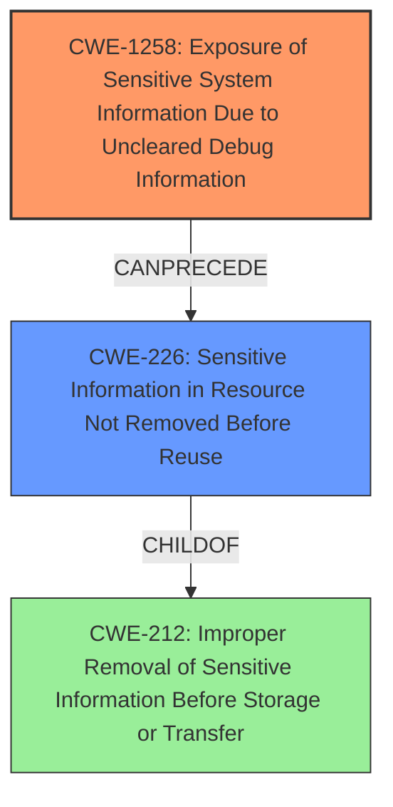

# Final Resolution for CVE-2021-33080

# Summary
| CWE ID   | CWE Name                                                                | Confidence | CWE Abstraction Level | CWE Vulnerability Mapping Label | CWE-Vulnerability Mapping Notes |
| :--------- | :---------------------------------------------------------------------- | :--------- | :-------------------- | :------------------------------ | :------------------------------ |
| CWE-1258 | Exposure of Sensitive System Information Due to Uncleared Debug Information | 0.95       | Base                  | Primary                         | Allowed                       |
| CWE-226  | Sensitive Information in Resource Not Removed Before Reuse                | 0.75       | Base                  | Secondary                        | Allowed                       |

## Evidence and Confidence

*   **Confidence Score:** 0.90
*   **Evidence Strength:** HIGH

## Relationship Analysis
- Parent-child hierarchical relationships: CWE-226 is a child of CWE-212 (Improper Removal of Sensitive Information Before Storage or Transfer).
- Chain relationships showing progression of vulnerability: The vulnerability chain involves uncleared debug information (CWE-1258), leading to the exposure of sensitive information in a resource (CWE-226).
- Peer relationships that offered alternative classifications: CWE-201, CWE-212 and CWE-497 were considered as alternative classifications.
- How abstraction levels influenced your selection: The selection was driven by Base level CWEs that directly address the **root cause** and impact.

## Vulnerability Chain
- The chain starts with **uncleared debug information** (CWE-1258) within the firmware.
- This leads to sensitive information being present in a resource that is not properly cleared before reuse (CWE-226).
- The final impact is the exposure of sensitive system information, potentially leading to information disclosure or privilege escalation.

## Summary of Analysis
The initial analysis correctly identified CWE-1258 as the primary **weakness**. The criticism suggested refining the secondary mapping, and after further review, CWE-226 is a more appropriate fit than CWE-497.

- **Evidence:** The vulnerability description explicitly states "Exposure of sensitive system information due to **uncleared debug information in firmware**". This directly maps to CWE-1258. The phrase "**uncleared debug information**" also strongly suggests that a resource is not being cleared properly before reuse.
- **Graph Relationships:** CWE-226 is a child of CWE-212, which highlights the aspect of improper removal of sensitive information. CWE-1258 can precede CWE-226 in a vulnerability chain.
- **Justification:** CWE-1258 represents the **root cause**, while CWE-226 represents the specific mechanism of information exposure due to the lack of clearing.
- **Specificity:** CWE-1258 and CWE-226 are at the Base level of abstraction, providing the optimal level of specificity. They are also both marked "Usage: Allowed".

The choice of CWE-226 over CWE-497 is based on the "**uncleared debug information**" description, where the resource (memory, file) contains sensitive information that is not being cleared before the resource is made available for reuse. The term "uncleared" is explicit and important in making this determination.