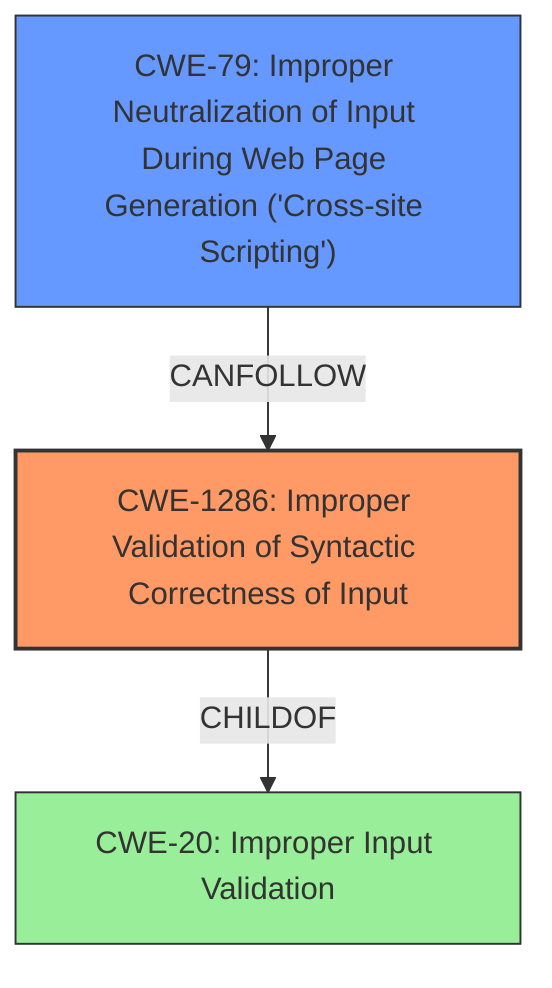

# Analysis Report for CVE-2021-33195

# Vulnerability Analysis Report: CVE-2021-33195

## Description

Go before 1.15.13 and 1.16.x before 1.16.5 has functions for DNS lookups that do not validate replies from DNS servers, and thus a return value may contain an unsafe injection (e.g., XSS) that does not conform to the RFC1035 format.

## Vulnerability Description Key Phrases

**Weakness:** unsafe injection
**Impact:** cross-site scripting
**Product:** Go
**Version:** before 1.15.13 and 1.16.x before 1.16.5
**Component:** DNS lookup functions

## Analysis (with Relationship Data)

# Summary
| CWE ID | CWE Name | Confidence | CWE Abstraction Level | CWE Vulnerability Mapping Label | CWE-Vulnerability Mapping Notes |
|---|---|---|---|---|---|
| CWE-20 | Improper Input Validation | 0.85 | Class | Primary | Allowed |
| CWE-79 | Improper Neutralization of Input During Web Page Generation ('Cross-site Scripting') | 0.70 | Base | Secondary | Allowed |

## Evidence and Confidence

*   **Confidence Score:** 0.80
*   **Evidence Strength:** HIGH

- **Analysis and Justification:**  
  - *Explanation:* The vulnerability lies in the Go programming language's DNS lookup functions (**net.Lookup{Addr,CNAME,Host}**), which do not properly validate responses from DNS servers. This **lack of validation** allows for the possibility of **unsafe injection**, potentially leading to XSS or other vulnerabilities if the returned values are used in an unsanitized context. The primary weakness is identified as **CWE-20 (Improper Input Validation)**, as the root cause stems from the failure to validate the DNS responses before using them. The vulnerability description and CVE reference links consistently emphasize the **lack of input sanitization** and **improper validation of hostnames**. Although the vulnerability could lead to XSS, mapping directly to **CWE-79** is less precise as the immediate cause is the missing validation step.
  
  - *Relationship Analysis:* **CWE-20** is a class-level weakness. Given that the issue involves a failure to validate DNS responses, it could be argued that a more specific CWE exists. However, the core issue is the general failure to validate external input. **CWE-79** is a child of **CWE-74 (Improper Neutralization of Special Elements)**, highlighting that the underlying problem is a lack of proper handling of special elements.

- **Confidence Score:**  
  - *Example:* Confidence: 0.85 (High evidence from technical description and CVE reference materials)

---
- **Analysis and Justification:**  
  - *Explanation:* A secondary CWE that can arise from this vulnerability is **CWE-79 (Improper Neutralization of Input During Web Page Generation ('Cross-site Scripting'))**. If the improperly validated DNS responses are used in web page output without proper sanitization, XSS can occur. While **CWE-20** captures the root cause (missing validation), **CWE-79** describes a potential impact if the invalid data is used in a web context. The vulnerability description mentions XSS as an example of an **unsafe injection**, supporting this mapping.

  - *Relationship Analysis:* **CWE-79** is a base-level CWE, which is a preferred level of abstraction. It is a child of **CWE-74 (Improper Neutralization of Special Elements)**, which is a class-level CWE. The relationship analysis reveals that **CWE-79 CanFollow CWE-20**, as improper input validation can lead to XSS vulnerabilities if the unvalidated input is used in web page generation.

- **Confidence Score:**  
  - *Example:* Confidence: 0.70 (Supporting evidence that XSS is an impact but not a direct root cause)

---

## Criticism of Analysis

Okay, I've reviewed the provided analysis and the full CWE specifications for the listed weaknesses. Here's a critique:

**Overall Assessment:**

The analysis identifies `CWE-20: Improper Input Validation` as the primary weakness, and `CWE-79: Improper Neutralization of Input During Web Page Generation ('Cross-site Scripting')` as a secondary weakness. This is a reasonable starting point, and the justification provided shows a good understanding of the vulnerability. However, the analysis could be more precise by considering more specific CWEs under `CWE-20` and refining the relationship between the root cause and the potential impact.

**Detailed Critique:**

1.  **CWE-20: Improper Input Validation (Primary)**

    *   **Strengths:**
        *   Correctly identifies the root cause as a lack of validation on DNS responses.
        *   The explanation clearly describes how the vulnerability stems from the failure to validate DNS responses before they are used.
        *   The confidence score (0.85) is justified by the consistent emphasis on input sanitization issues within the CVE descriptions.
    *   **Weaknesses:**
        *   `CWE-20` is a broad, class-level CWE. The CWE specification discourages using it when more specific weaknesses are applicable. As the specification notes: *"CWE-20 is commonly misused in low-information vulnerability reports when lower-level CWEs could be used instead"*
        *   **Specific Alternative CWEs to Consider:**
            *   **CWE-1286: Improper Validation of Syntactic Correctness of Input:** The DNS response is expected to adhere to a specific syntax (RFC 1035).  Since the issue is about a name not being a valid domain name (invalid characters, length, etc) this is more precise than CWE-20.
            *   **CWE-1287: Improper Validation of Specified Type of Input:** The DNS lookup functions are expected to return hostname strings; however, the return values can be arbitrary values that don't conform to the expected "hostname" type.

    *   **Mitigation Considerations:** The mitigations listed for `CWE-20` are general and useful, but mitigations specific to DNS validation are missing. The analysis should mention DNS-specific validation techniques, such as using `isDomainName` as suggested in the CVE descriptions.

2.  **CWE-79: Improper Neutralization of Input During Web Page Generation ('Cross-site Scripting') (Secondary)**

    *   **Strengths:**
        *   Correctly identifies that `CWE-79` is a possible consequence if the unvalidated DNS responses are used in a web context.
        *   The confidence score (0.70) acknowledges that XSS is a potential *impact*, not the direct root cause.
    *   **Weaknesses:**
        *   While XSS is a possible impact, it's conditional on how the data is used.  The direct impact of the lack of validation is broader than just XSS; it could lead to other injection-related problems (e.g., if the invalid data is used in a command).
        *   The *CanFollow* relationship should be CWE-20 CanLeadTo CWE-79.

    *   **Mitigation Considerations:**
        *   The analysis does not explicitly address when `CWE-79` *wouldn't* be relevant. For example, if the application stores the DNS response in a database *without* using it in a web page, `CWE-79` wouldn't apply.
        * The analysis should call out the need for escaping and encoding the returned hostnames before using them in a web page.

3.  **Top Combined Results Review:**

    * **CWE-115 Misinterpretation of Input** Should probably be considered as a possible alternative to CWE-20 since the input from the DNS server is being misinterpreted as a valid domain name. However, the description says that this CWE is a research gap and needs further study.
    * **CWE-113 Improper Neutralization of CRLF Sequences in HTTP Headers** Is not really relevant. CRLF injection is very different.
    * **CWE-1286 Improper Validation of Syntactic Correctness of Input** Is relevant as described above.
    * **CWE-295 Improper Certificate Validation** Is not relevant. The DNS response doesn't include a certificate.
    * **CWE-917 Improper Neutralization of Special Elements used in an Expression Language Statement ('Expression Language Injection')** Is not relevant. Expression Language is different.
    * **CWE-79  Improper Neutralization of Input During Web Page Generation ('Cross-site Scripting')** Correct but a secondary effect, as described above.
    * **CWE-1336 Improper Neutralization of Special Elements Used in a Template Engine** Is not relevant, template engines are different.
    * **CWE-95  Improper Neutralization of Directives in Dynamically Evaluated Code ('Eval Injection')** Is not really relevant, dynamic code evaluation is different.
    * **CWE-22 Improper Limitation of a Pathname to a Restricted Directory ('Path Traversal')** Is not relevant.
    * **CWE-502  Deserialization of Untrusted Data** Is not relevant.

**Recommendations:**

1.  **Refine the Primary CWE:** Replace `CWE-20` with `CWE-1286` and/or `CWE-1287`. This will provide a more specific and accurate classification of the weakness, and reduce the misusage of CWE-20 as a general catch-all.
2.  **Qualify the Impact of CWE-79:** Clearly state the conditions under which `CWE-79` arises (specifically, when the invalid DNS data is used in a web page without proper sanitization). Emphasize that `CWE-79` is a potential consequence, not the direct root cause.
3.  **Mitigation Specificity:**  Add specific mitigation steps related to DNS response validation, such as using the `isDomainName` function (or equivalent) to check the validity of domain names.
4.  **Relationships:** Clarify the relationship between `CWE-20` and `CWE-79` using *CanLeadTo* instead of *CanFollow*.

By implementing these recommendations, the analysis would become more precise and useful for remediation efforts.

## Final Resolution

# Summary
| CWE ID | CWE Name | Confidence | CWE Abstraction Level | CWE Vulnerability Mapping Label | CWE-Vulnerability Mapping Notes |
|---|---|---|---|---|---|
| CWE-1286 | Improper Validation of Syntactic Correctness of Input | 0.85 | Base | Primary | Allowed |
| CWE-79 | Improper Neutralization of Input During Web Page Generation ('Cross-site Scripting') | 0.70 | Base | Secondary | Allowed |

## Evidence and Confidence

*   **Confidence Score:** 0.85
*   **Evidence Strength:** HIGH

## Relationship Analysis
The primary weakness is now classified as CWE-1286, a Base-level CWE, which is more specific than the original CWE-20. This decision is based on the fact that the DNS response is expected to adhere to a specific syntax, and the vulnerability stems from not validating this syntax. CWE-79 remains a secondary concern as a potential impact.

## Vulnerability Chain
The vulnerability chain starts with the **ROOTCAUSE** **CWE-1286 (Improper Validation of Syntactic Correctness of Input)**, where the DNS response is not validated for syntactic correctness. This leads to a weakness where the invalid DNS data is used in a web page without proper sanitization, resulting in **CWE-79 (Improper Neutralization of Input During Web Page Generation ('Cross-site Scripting'))**. The missing link is the sanitization step, which would prevent the XSS vulnerability.

## Summary of Analysis
The initial analysis identified **CWE-20 (Improper Input Validation)** as the primary weakness and **CWE-79 (Improper Neutralization of Input During Web Page Generation ('Cross-site Scripting'))** as a secondary weakness. The criticism correctly pointed out that **CWE-20** is a broad, class-level CWE and suggested more specific alternatives.

The assessment is now updated to reflect the more specific **CWE-1286 (Improper Validation of Syntactic Correctness of Input)** as the primary weakness. This decision is based on the vulnerability description stating that the DNS lookup functions do not validate replies from DNS servers, and thus a return value may contain an unsafe injection that does not conform to the RFC1035 format. This directly aligns with **CWE-1286**, which describes a product receiving input that is expected to be well-formed but does not validate that the input complies with the syntax. The use of **CWE-1286** provides a more precise classification of the weakness compared to the broader **CWE-20**.

The secondary weakness, **CWE-79 (Improper Neutralization of Input During Web Page Generation ('Cross-site Scripting'))**, remains relevant as a potential impact if the improperly validated DNS responses are used in a web context without proper sanitization.

The graph relationships influenced the decision by highlighting the hierarchical relationship between **CWE-20** and **CWE-1286**, with **CWE-1286** being a more specific child of **CWE-20**. The chain relationship also shows how **CWE-1286** can lead to **CWE-79** if the invalid input is used in a web context.

The selected CWEs are at the optimal level of specificity because **CWE-1286** directly addresses the lack of syntactic validation of DNS responses, and **CWE-79** accurately describes the potential impact of XSS if the invalid data is used in a web context. This provides a clear and precise classification of the vulnerability for remediation efforts.

*Report generated on 2025-03-16 17:14:52*
