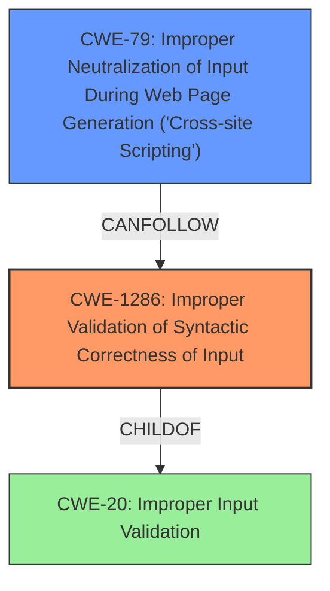

# Final Resolution for CVE-2021-33195

# Summary
| CWE ID | CWE Name | Confidence | CWE Abstraction Level | CWE Vulnerability Mapping Label | CWE-Vulnerability Mapping Notes |
|---|---|---|---|---|---|
| CWE-1286 | Improper Validation of Syntactic Correctness of Input | 0.85 | Base | Primary | Allowed |
| CWE-79 | Improper Neutralization of Input During Web Page Generation ('Cross-site Scripting') | 0.70 | Base | Secondary | Allowed |

## Evidence and Confidence

*   **Confidence Score:** 0.85
*   **Evidence Strength:** HIGH

## Relationship Analysis
The primary weakness is now classified as CWE-1286, a Base-level CWE, which is more specific than the original CWE-20. This decision is based on the fact that the DNS response is expected to adhere to a specific syntax, and the vulnerability stems from not validating this syntax. CWE-79 remains a secondary concern as a potential impact.

## Vulnerability Chain
The vulnerability chain starts with the **ROOTCAUSE** **CWE-1286 (Improper Validation of Syntactic Correctness of Input)**, where the DNS response is not validated for syntactic correctness. This leads to a weakness where the invalid DNS data is used in a web page without proper sanitization, resulting in **CWE-79 (Improper Neutralization of Input During Web Page Generation ('Cross-site Scripting'))**. The missing link is the sanitization step, which would prevent the XSS vulnerability.

## Summary of Analysis
The initial analysis identified **CWE-20 (Improper Input Validation)** as the primary weakness and **CWE-79 (Improper Neutralization of Input During Web Page Generation ('Cross-site Scripting'))** as a secondary weakness. The criticism correctly pointed out that **CWE-20** is a broad, class-level CWE and suggested more specific alternatives.

The assessment is now updated to reflect the more specific **CWE-1286 (Improper Validation of Syntactic Correctness of Input)** as the primary weakness. This decision is based on the vulnerability description stating that the DNS lookup functions do not validate replies from DNS servers, and thus a return value may contain an unsafe injection that does not conform to the RFC1035 format. This directly aligns with **CWE-1286**, which describes a product receiving input that is expected to be well-formed but does not validate that the input complies with the syntax. The use of **CWE-1286** provides a more precise classification of the weakness compared to the broader **CWE-20**.

The secondary weakness, **CWE-79 (Improper Neutralization of Input During Web Page Generation ('Cross-site Scripting'))**, remains relevant as a potential impact if the improperly validated DNS responses are used in a web context without proper sanitization.

The graph relationships influenced the decision by highlighting the hierarchical relationship between **CWE-20** and **CWE-1286**, with **CWE-1286** being a more specific child of **CWE-20**. The chain relationship also shows how **CWE-1286** can lead to **CWE-79** if the invalid input is used in a web context.

The selected CWEs are at the optimal level of specificity because **CWE-1286** directly addresses the lack of syntactic validation of DNS responses, and **CWE-79** accurately describes the potential impact of XSS if the invalid data is used in a web context. This provides a clear and precise classification of the vulnerability for remediation efforts.